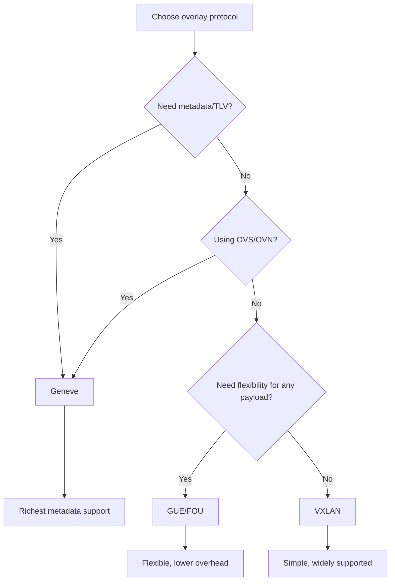

# How to Configure GUE Overlay with IPv6

Author: [nawazdhandala](https://www.github.com/nawazdhandala)

Tags: GUE, IPv6, Overlay, Linux, Networking, Tunnel

Description: Configure Generic UDP Encapsulation (GUE) tunnels over IPv6 for lightweight overlay networking with kernel support on Linux.

## GUE Overview

Generic UDP Encapsulation (GUE) is a lightweight encapsulation standard that tunnels any network protocol in UDP. Unlike VXLAN and Geneve, GUE operates at a lower level — it can carry IPv4, IPv6, or any other protocol in its payload.

Key GUE characteristics:
- Lightweight: minimal header overhead
- Protocol-agnostic: carries any IP protocol
- Checksum optional: avoids checksum overhead on trusted networks
- IPv6 underlay: supported on Linux via the `fou` (Foo-over-UDP) module

## Creating GUE Tunnels on Linux

```bash
# Load Foo-over-UDP module (provides GUE)
modprobe fou

# Create a GUE tunnel: IPv4-in-GUE over IPv6 underlay
# Step 1: Create the tunnel interface
ip link add name gue1 type ipip \
    remote 2001:db8:2::1 \
    local 2001:db8:1::1 \
    encap gue \
    encap-sport auto \
    encap-dport 6080

ip link set gue1 up
ip addr add 10.10.0.1/30 dev gue1
ip link set gue1 mtu 1430

echo "GUE tunnel created"
```

## FOU (Foo over UDP) Receiver Setup

The receiving side needs to configure the UDP listener:

```bash
# On the receiving host: tell kernel to expect GUE on UDP port 6080
ip fou add port 6080 gue

# Verify FOU configuration
ip fou show

# Expected output:
# port 6080 gue
```

## IPv6-in-IPv6 via GUE

Tunnel IPv6 payload over IPv6 underlay using GUE:

```bash
# IPv6-in-IPv6 tunnel via GUE
ip link add name gue6 type ip6tnl \
    remote 2001:db8:2::1 \
    local 2001:db8:1::1 \
    mode ip6ip6 \
    encap gue \
    encap-sport auto \
    encap-dport 6080

ip link set gue6 up
ip -6 addr add 2001:db8:overlay::1/64 dev gue6
ip link set gue6 mtu 1422  # 1500 - 40 (outer IPv6) - 8 (UDP) - 4 (GUE base) - 24 (additional)

echo "IPv6-in-IPv6 GUE tunnel ready"
```

## GUE Overhead Analysis

```
GUE over IPv6 overhead breakdown:

  Outer Ethernet:  14 bytes
  Outer IPv6:      40 bytes
  Outer UDP:        8 bytes
  GUE header:       4 bytes (base, no options)
  ─────────────────────────
  Minimum overhead: 66 bytes

  GUE with type field + checksum: +4 bytes

Comparison:
  VXLAN/IPv6:   62 bytes (fixed)
  Geneve/IPv6:  70 bytes (base, no options)
  GUE/IPv6:     62-70 bytes (depends on options)
```

## GUE vs VXLAN vs Geneve Selection



## Performance Testing GUE over IPv6

```bash
# Test throughput through GUE tunnel
# Install iperf3 first
apt-get install -y iperf3

# On server side (remote host)
iperf3 -s -B 10.10.0.2 -p 5201

# On client side
iperf3 -c 10.10.0.2 -p 5201 -t 30 -P 4

# Check CPU usage from GUE encap
perf stat -e cpu-clock \
    iperf3 -c 10.10.0.2 -t 10 &>/dev/null

# Verify no fragmentation occurring
nstat -z | grep Ip6FragCreates
```

## Monitoring and Debugging

```bash
# Capture GUE/FOU traffic on IPv6 underlay
tcpdump -i eth0 -n 'ip6 and udp port 6080'

# Check tunnel statistics
ip -s link show gue1

# Test connectivity
ping -I gue1 10.10.0.2

# Check FOU port configuration
ip fou show
```

## Conclusion

GUE/FOU provides lightweight encapsulation for overlay networking over IPv6. The Linux kernel supports GUE through the `fou` module and `ipip`/`ip6tnl` tunnel types with `encap gue`. GUE has the lowest base overhead of the three major overlay protocols. It is best suited for simple overlays where VXLAN's Ethernet semantics aren't needed and Geneve's TLV extensions aren't required. The receiving host must configure a FOU port with `ip fou add port 6080 gue` to accept GUE tunnels.
