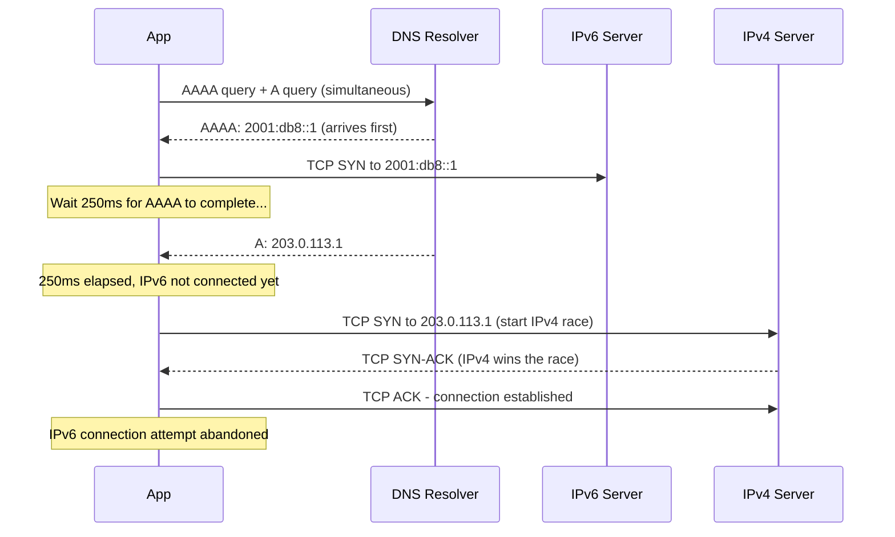

# How to Understand Happy Eyeballs Algorithm (RFC 8305)

Author: [nawazdhandala](https://www.github.com/nawazdhandala)

Tags: IPv6, Happy Eyeballs, RFC 8305, Dual-Stack, Client Networking

Description: A detailed explanation of the Happy Eyeballs v2 algorithm (RFC 8305) that enables dual-stack clients to prefer IPv6 while gracefully falling back to IPv4 without user-visible delays.

## What Is Happy Eyeballs?

Happy Eyeballs (named because it keeps the "eyes" — user experience — happy) is a connection establishment algorithm for dual-stack clients. Defined in RFC 8305, it allows clients to try both IPv4 and IPv6 connections simultaneously and use whichever succeeds first, with a slight preference for IPv6.

Without Happy Eyeballs, a broken IPv6 path could cause 20–75 second connection timeouts before falling back to IPv4 — an unacceptable user experience.

## The Problem It Solves

When a client has both A and AAAA records for a hostname:
- **Old behavior**: Try IPv6, wait for timeout (20s+), then try IPv4
- **Happy Eyeballs**: Try both nearly simultaneously, use the first success

## Happy Eyeballs v2 Algorithm (RFC 8305)



## Key Algorithm Parameters

**Resolution Delay**: When AAAA is received but A is not yet available, wait a short time (50ms by default) before using A. This gives IPv6 a chance to succeed first.

**Connection Attempt Delay**: After starting an IPv6 connection attempt, wait **250ms** (the "Happy Eyeballs Delay") before starting the IPv4 connection attempt in parallel.

**Address Sorting**: RFC 8305 builds on RFC 6724 address selection. Addresses are sorted before connection attempts to prefer:
1. IPv6 over IPv4 (when equivalent connectivity is expected)
2. Addresses in the same scope (global > site-local > link-local)
3. Avoid deprecated addresses

## Practical Example: curl with Happy Eyeballs

```bash
# curl implements Happy Eyeballs by default
# Watch which address is used for connection
curl -v https://example.com 2>&1 | grep "Trying\|Connected"

# Force IPv6 only (disable Happy Eyeballs fallback)
curl -6 https://example.com

# Force IPv4 only
curl -4 https://example.com

# Show timing information to see connection delays
curl -w "@curl-timing.txt" -o /dev/null -s https://example.com
```

## Happy Eyeballs in Node.js

Node.js implements Happy Eyeballs in its DNS module:

```javascript
// Node.js automatically uses Happy Eyeballs for HTTP/HTTPS
// The dns.lookup() function with 'family: 0' enables it

const http = require('http');
const dns = require('dns');

// Configure DNS lookup to prefer IPv6 (Happy Eyeballs)
const agent = new http.Agent({
    family: 0,  // 0 = both families, prefers IPv6
});

http.get({
    host: 'example.com',
    agent: agent,
    family: 0  // Enable Happy Eyeballs
}, (res) => {
    console.log(`Connected via: ${res.socket.remoteFamily}`);
    console.log(`Remote address: ${res.socket.remoteAddress}`);
    res.destroy();
});
```

## Happy Eyeballs in Python

Python's `socket` module supports Happy Eyeballs since Python 3.8 via `asyncio`:

```python
import asyncio

async def connect_happy_eyeballs(host, port):
    """Connect using Happy Eyeballs - prefers IPv6, falls back to IPv4"""

    # Python asyncio implements RFC 8305 Happy Eyeballs
    # create_connection tries both IPv4 and IPv6 simultaneously
    reader, writer = await asyncio.open_connection(
        host,
        port,
        # happy_eyeballs_delay is the 250ms delay before starting IPv4
        happy_eyeballs_delay=0.25  # 250ms delay (RFC 8305 recommendation)
    )

    # Print which address family was used
    sock = writer.get_extra_info('socket')
    print(f"Connected via: {sock.family.name}")
    print(f"Remote address: {writer.get_extra_info('peername')}")
    writer.close()

asyncio.run(connect_happy_eyeballs('example.com', 80))
```

## Monitoring Happy Eyeballs Behavior

```bash
# Use strace to see system calls during connection establishment
strace -e trace=connect,socket,getaddrinfo curl https://example.com 2>&1

# Use tcpdump to observe which protocol wins
tcpdump -n -i eth0 'host example.com' &
curl https://example.com
fg  # then Ctrl+C

# Check if IPv6 or IPv4 was used
curl -w "%{remote_ip}\n" -o /dev/null -s https://example.com
```

## When Happy Eyeballs Fails to Help

Happy Eyeballs cannot help when:
1. **IPv6 black hole**: SYN sent, no response, connection appears to hang for 250ms+ before IPv4 wins
2. **Very slow DNS**: AAAA query takes >1 second (longer than Happy Eyeballs delay)
3. **Application not implementing HE**: Older apps may still do sequential fallback

## Summary

Happy Eyeballs (RFC 8305) improves dual-stack connection reliability by racing IPv6 and IPv4 connections, with a 250ms head start for IPv6. It is implemented in modern browsers, curl, Node.js, Python asyncio, and Go's net package. Understanding Happy Eyeballs explains why dual-stack deployments are safe from a user experience perspective even when some IPv6 paths are broken.
