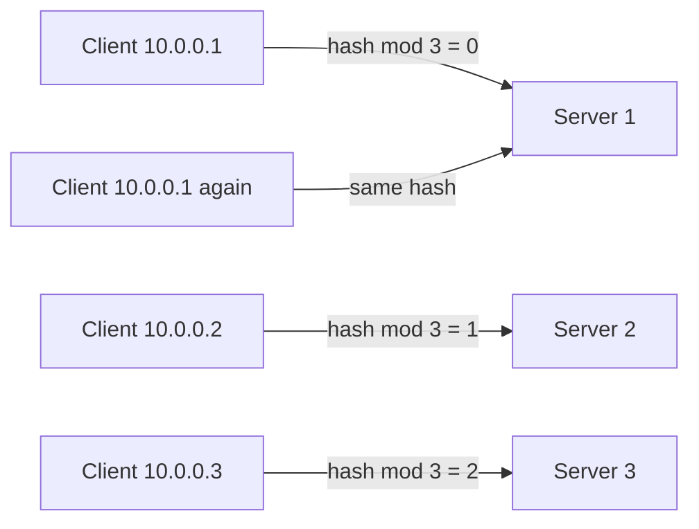

# How to Set Up HAProxy with IPv4 Source Address Persistence

Author: [nawazdhandala](https://www.github.com/nawazdhandala)

Tags: HAProxy, IPv4, Session Persistence, Source IP, Load Balancing, Sticky Sessions

Description: Learn how to configure HAProxy to route all requests from the same IPv4 source address to the same backend server using source address persistence.

---

Source address persistence (also called IP-based sticky sessions) routes all connections from the same client IPv4 address to the same backend server. This is useful for stateful applications that don't support distributed session storage.

## How Source Persistence Works

HAProxy hashes the client IPv4 address and maps it consistently to one backend server. The same client always lands on the same server unless that server goes down.



## Method 1: balance source (Hash-Based)

The simplest approach - no stick table required. HAProxy hashes the source IP and maps it to a server.

```haproxy
backend app_servers
    # Distribute clients by source IP hash
    balance source

    server app1 10.0.1.10:8080 check
    server app2 10.0.1.11:8080 check
    server app3 10.0.1.12:8080 check
```

**Limitation:** If a server goes down, the hash changes and clients may be rerouted.

## Method 2: Stick Tables (More Reliable)

Stick tables record which server a client was assigned to, surviving backend changes gracefully.

```haproxy
backend app_servers
    balance roundrobin

    # Stick table: keyed on IPv4 source, 1M entries, 2-hour TTL
    stick-table type ip size 1m expire 2h

    # Record the assigned server on the first request
    stick on src

    # On subsequent requests, look up and use the recorded server
    stick match src

    server app1 10.0.1.10:8080 check
    server app2 10.0.1.11:8080 check
    server app3 10.0.1.12:8080 check
```

## Handling Failover

When a server goes down, HAProxy can redirect its stuck clients to a new server and update the stick table.

```haproxy
backend app_servers
    balance roundrobin
    stick-table type ip size 1m expire 2h
    stick on src

    # option redispatch: if the selected server is down, pick a new one
    option redispatch

    server app1 10.0.1.10:8080 check
    server app2 10.0.1.11:8080 check
```

## TCP Mode Source Persistence

For non-HTTP TCP services (e.g., database connections):

```haproxy
frontend db_frontend
    bind 0.0.0.0:5432
    mode tcp
    default_backend pg_servers

backend pg_servers
    mode tcp
    balance source          # Hash-based source persistence for TCP
    server db1 10.0.2.10:5432 check
    server db2 10.0.2.11:5432 check
```

## Verifying Persistence

```bash
# Send multiple requests and confirm they hit the same backend

for i in $(seq 1 5); do curl -s http://192.168.1.10/ | grep "Server:"; done

# Check the stick table to see which server is recorded for your IP
echo "show table app_servers" | socat stdio /var/run/haproxy/admin.sock | grep "$(curl -s ifconfig.me)"
```

## Key Takeaways

- `balance source` is simple but redistributes clients when the backend pool changes.
- Stick tables are more resilient; they remember assignments even after pool changes.
- Use `option redispatch` so clients stuck to a failed server are automatically reassigned.
- For TCP backends (databases, LDAP), `balance source` in TCP mode provides simple IP affinity.
