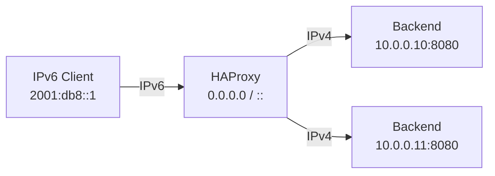

# How to Configure HAProxy IPv6-to-IPv4 Gateway

Author: [nawazdhandala](https://www.github.com/nawazdhandala)

Tags: HAProxy, IPv6, IPv4, Gateway, Dual Stack, Networking, Translation

Description: Learn how to configure HAProxy as an IPv6-to-IPv4 gateway that accepts connections from IPv6 clients and forwards them to IPv4-only backend servers.

---

Many backend services only support IPv4. An IPv6-to-IPv4 gateway at the HAProxy layer lets you accept modern IPv6 client connections while continuing to communicate with legacy IPv4 backends without modifying those services.

## Use Case



HAProxy accepts the IPv6 connection and opens a new IPv4 connection to the backend.

## Frontend: Listen on IPv6 (and IPv4)

```haproxy
# /etc/haproxy/haproxy.cfg

global
    log /dev/log local0
    maxconn 20000

defaults
    mode http
    timeout connect 5s
    timeout client  30s
    timeout server  30s
    option httplog

#----------------------------------------------
# Frontend: accept IPv4 and IPv6 connections
# ':::80' binds to all IPv6 addresses (and IPv4
# via mapped addresses on Linux by default)
#----------------------------------------------
frontend http_dual
    bind :::80 v4v6       # Accept both IPv6 and IPv4-mapped IPv6
    default_backend ipv4_backends

#----------------------------------------------
# Backend: connect to IPv4-only servers
#----------------------------------------------
backend ipv4_backends
    balance roundrobin
    # All backend servers are IPv4 addresses
    server app1 10.0.0.10:8080 check
    server app2 10.0.0.11:8080 check
```

The `v4v6` flag on the `bind` directive enables `IPV6_V6ONLY=0`, allowing the same socket to accept both IPv4 and IPv6 connections.

## Preserving the Original Client IPv6 Address

When forwarding to IPv4 backends, include the original IPv6 client address in the `X-Forwarded-For` header.

```haproxy
frontend http_dual
    bind :::80 v4v6
    option forwardfor       # Add X-Forwarded-For with original client IP (IPv6)
    default_backend ipv4_backends
```

## IPv6-Only Frontend Forwarding to IPv4 Backends

For strict IPv6-only ingress:

```haproxy
frontend ipv6_only
    # Bind only to an IPv6 address; reject IPv4 connections
    bind 2001:db8::1:80
    default_backend ipv4_backends

backend ipv4_backends
    balance roundrobin
    server srv1 10.0.0.20:80 check
    server srv2 10.0.0.21:80 check
```

## HTTPS Termination for IPv6 Clients

```haproxy
frontend https_dual
    bind :::443 v4v6 ssl crt /etc/ssl/haproxy.pem
    option forwardfor
    http-request set-header X-Forwarded-Proto https
    default_backend ipv4_backends
```

## Verifying the Configuration

```bash
# Validate the config
haproxy -c -f /etc/haproxy/haproxy.cfg

# Confirm HAProxy listens on IPv6 and IPv4 ports
ss -tlnp | grep haproxy

# Test from an IPv6 client
curl -6 http://[2001:db8::1]/

# Test from an IPv4 client (via v4v6 mapping)
curl -4 http://192.168.1.10/
```

## Key Takeaways

- Use `bind :::80 v4v6` to accept both IPv6 and IPv4 connections on a single socket.
- Backends remain unchanged — HAProxy opens new IPv4 connections to them.
- Use `option forwardfor` to preserve the client's original IPv6 address in logs and application headers.
- For IPv6-only ingress, bind to a specific IPv6 address without the `v4v6` flag.
