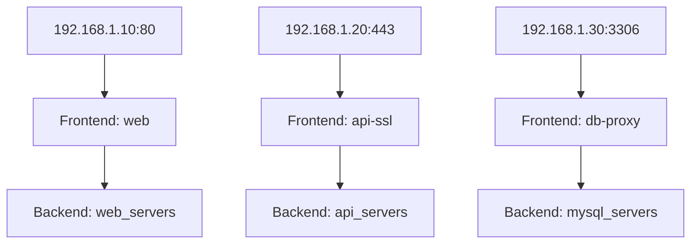

# How to Configure Multiple HAProxy Frontends on Different IPv4 Addresses

Author: [nawazdhandala](https://www.github.com/nawazdhandala)

Tags: HAProxy, IPv4, Frontend, Load Balancing, Networking, Configuration

Description: Learn how to configure multiple HAProxy frontend sections, each bound to a different IPv4 address, to serve different applications from the same server.

---

HAProxy frontends define the listening addresses and ports. By binding each frontend to a different IPv4 address, you can segment traffic for multiple services on a single server without port conflicts.

## Architecture Overview



## Full HAProxy Configuration

```haproxy
# /etc/haproxy/haproxy.cfg

global
    log /dev/log local0
    maxconn 50000
    user haproxy
    group haproxy
    daemon

defaults
    log     global
    mode    http
    option  httplog
    option  dontlognull
    timeout connect 5s
    timeout client  30s
    timeout server  30s

#-----------------------------------------------------------
# Frontend 1: HTTP web traffic on the first IPv4 address
#-----------------------------------------------------------
frontend web
    bind 192.168.1.10:80
    default_backend web_servers

#-----------------------------------------------------------
# Frontend 2: HTTPS API traffic on the second IPv4 address
#-----------------------------------------------------------
frontend api-ssl
    bind 192.168.1.20:443 ssl crt /etc/ssl/api.pem
    mode http
    default_backend api_servers

#-----------------------------------------------------------
# Frontend 3: TCP MySQL proxy on the third IPv4 address
#-----------------------------------------------------------
frontend db-proxy
    bind 192.168.1.30:3306
    mode tcp
    default_backend mysql_servers

#-----------------------------------------------------------
# Backends
#-----------------------------------------------------------
backend web_servers
    balance roundrobin
    server web1 10.0.1.10:80 check
    server web2 10.0.1.11:80 check

backend api_servers
    balance leastconn
    server api1 10.0.2.10:8080 check
    server api2 10.0.2.11:8080 check

backend mysql_servers
    mode tcp
    balance roundrobin
    server db1 10.0.3.10:3306 check
    server db2 10.0.3.11:3306 check
```

## Binding a Frontend to Multiple Ports on the Same IP

```haproxy
frontend http-and-alt
    # HAProxy supports multiple bind lines in a single frontend
    bind 192.168.1.10:80
    bind 192.168.1.10:8080
    default_backend web_servers
```

## Validating the Configuration

```bash
# Validate haproxy.cfg syntax without starting the service
haproxy -c -f /etc/haproxy/haproxy.cfg

# Reload HAProxy without dropping existing connections
systemctl reload haproxy

# Verify HAProxy is listening on the expected addresses
ss -tlnp | grep haproxy
```

## Viewing Stats per Frontend

Enable the HAProxy stats page to monitor per-frontend metrics.

```haproxy
frontend stats
    bind 127.0.0.1:8404
    stats enable
    stats uri /stats
    stats refresh 10s
    stats auth admin:secret
```

```bash
# View stats in text form from the CLI
echo "show stat" | socat stdio /var/run/haproxy/admin.sock | cut -d',' -f1,2,18
```

## Key Takeaways

- Each `frontend` section can `bind` to a distinct IPv4 address and port.
- Mixing HTTP and TCP frontends on the same HAProxy instance is possible by setting `mode tcp` on TCP frontends.
- Use `haproxy -c -f` to validate configuration before reloading.
- Reload (not restart) HAProxy to apply changes without dropping existing sessions.
