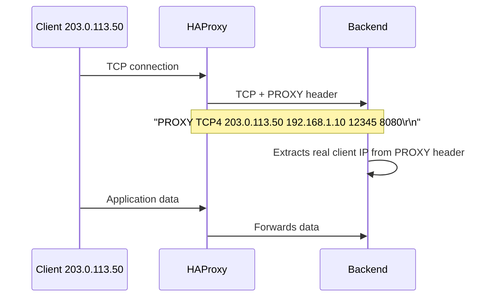

# How to Forward Client IPv4 Addresses with the PROXY Protocol in HAProxy

Author: [nawazdhandala](https://www.github.com/nawazdhandala)

Tags: HAProxy, PROXY Protocol, IPv4, Client IP, TCP, Networking

Description: Use the PROXY protocol in HAProxy to forward the original client IPv4 address to backend servers that handle TCP connections without HTTP headers.

## Introduction

The PROXY protocol is a header prepended to TCP connections that carries the original client IP and port. Unlike `X-Forwarded-For` (which only works for HTTP), the PROXY protocol works for any TCP-based application: MySQL, PostgreSQL, Redis, SMTP, and others.

## PROXY Protocol Overview



## Sending PROXY Protocol from HAProxy

Add `send-proxy` or `send-proxy-v2` to backend server definitions:

```haproxy
# /etc/haproxy/haproxy.cfg

frontend http_in
    bind 203.0.113.10:80
    mode tcp
    default_backend app_servers

backend app_servers
    mode tcp

    # Version 1 (text format): widely supported
    server app1 192.168.1.10:8080 check send-proxy

    # Version 2 (binary format): more efficient, preferred for modern systems
    server app2 192.168.1.11:8080 check send-proxy-v2
```

## Accepting PROXY Protocol at HAProxy Frontend

When HAProxy itself is behind another load balancer sending PROXY protocol:

```haproxy
frontend external_lb
    # Accept PROXY protocol from upstream load balancer
    bind 203.0.113.10:80 accept-proxy

    # Now $src in ACLs and $REMOTE_ADDR contains the real client IP
    mode http
    option forwardfor   # Also add X-Forwarded-For for HTTP backends

    default_backend app_servers
```

## HTTP Mode with PROXY Protocol to Backends

For HTTP mode, you can use PROXY protocol to backends while also having `X-Forwarded-For`:

```haproxy
frontend https_in
    bind 203.0.113.10:443 ssl crt /etc/haproxy/certs/bundle.pem
    mode http

    option forwardfor   # HTTP X-Forwarded-For header
    default_backend web_servers

backend web_servers
    mode http

    # Also send PROXY protocol v2 (dual: XFF for app, PROXY for logging)
    server web1 192.168.1.10:8080 check send-proxy-v2
    server web2 192.168.1.11:8080 check send-proxy-v2
```

## Nginx Backend Configuration to Accept PROXY Protocol

Configure Nginx backends to read the PROXY protocol header:

```nginx
# Nginx: accept PROXY protocol and use real_ip from it
server {
    listen 8080 proxy_protocol;

    # Use the IP from PROXY protocol header
    set_real_ip_from 192.168.1.0/24;   # HAProxy's IP
    real_ip_header proxy_protocol;

    location / {
        # $remote_addr now contains the original client IP
        proxy_pass http://app_backend;
    }
}
```

## Verifying PROXY Protocol Is Working

```bash
# Manually test PROXY protocol v1
# Connect to backend and prepend PROXY header
echo -e "PROXY TCP4 203.0.113.50 192.168.1.10 12345 8080\r\n\
GET / HTTP/1.0\r\nHost: example.com\r\n\r\n" | \
  nc 192.168.1.10 8080

# Use haproxy's built-in check
echo "show servers state" | sudo socat stdio /run/haproxy/admin.sock

# Check backend logs to see if real client IPs appear
ssh 192.168.1.10 "tail -f /var/log/nginx/access.log"
# IPs should show 203.0.113.50, not HAProxy's IP
```

## Conclusion

The PROXY protocol is the correct way to pass client IPv4 addresses to non-HTTP backends. Use `send-proxy-v2` (binary, efficient) on server lines in backends that support it, and `accept-proxy` on bind lines when receiving PROXY protocol from upstream. Always configure the receiving service (Nginx, Postgres, etc.) to trust and parse the PROXY header—otherwise connections may fail or real IPs won't be extracted.
