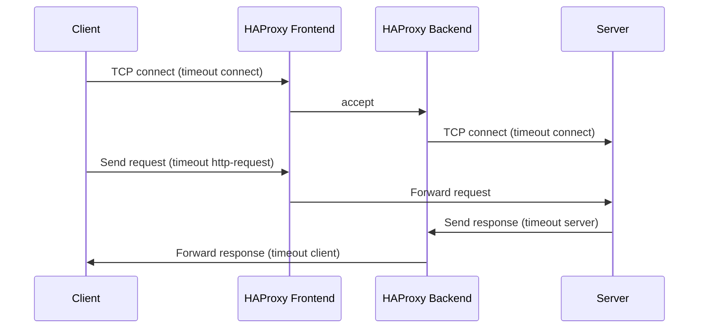

# How to Configure HAProxy Timeouts for IPv4 Frontend and Backend Connections

Author: [nawazdhandala](https://www.github.com/nawazdhandala)

Tags: HAProxy, Timeouts, IPv4, Configuration, Performance, Networking

Description: Learn how to configure HAProxy timeout directives for frontend and backend connections to prevent hung connections and optimize resource use on IPv4 networks.

---

HAProxy has several timeout directives that control how long it waits at each stage of a connection lifecycle. Incorrect timeouts lead to premature disconnections, resource exhaustion, or slow error recovery.

## The HAProxy Connection Lifecycle



## Timeout Reference

| Directive | Applies To | Description |
|-----------|-----------|-------------|
| `timeout connect` | Backend | Max time to establish TCP connection to backend |
| `timeout client` | Frontend | Max inactivity on client side |
| `timeout server` | Backend | Max inactivity on server side |
| `timeout http-request` | Frontend | Max time to receive a full HTTP request |
| `timeout http-keep-alive` | Frontend | Max idle time between keep-alive requests |
| `timeout queue` | Backend | Max time a request waits in the backend queue |
| `timeout tunnel` | Frontend/Backend | Timeout for WebSocket/tunnel connections |

## Recommended Configuration

```haproxy
# /etc/haproxy/haproxy.cfg

defaults
    mode http
    log global

    # Time to establish TCP connection to a backend server
    # Keep short; backends on the same LAN connect in milliseconds
    timeout connect 3s

    # Max inactivity from the client side
    # For interactive HTTP, 30-60s is typical
    timeout client  30s

    # Max inactivity from the backend server side
    # Match your application's slow query / processing time
    timeout server  60s

    # Max time to receive a complete HTTP request from the client
    # Prevents slow-header attacks (Slowloris)
    timeout http-request 10s

    # Max idle time between requests on a keep-alive connection
    # Short value frees connections faster; 0 disables keep-alive
    timeout http-keep-alive 5s

    # Max time a connection can wait in the backend queue
    timeout queue 10s

frontend http_in
    bind 0.0.0.0:80
    default_backend app_servers

backend app_servers
    balance roundrobin
    server app1 10.0.0.1:8080 check
    server app2 10.0.0.2:8080 check
```

## WebSocket / Long-Lived Connections

For WebSocket or streaming connections, the default timeouts will terminate the tunnel. Use `timeout tunnel` instead.

```haproxy
backend websocket_backend
    timeout connect 3s
    timeout client  0      # No client timeout for tunnels
    timeout server  0      # No server timeout for tunnels
    timeout tunnel  1h     # Close tunnels after 1 hour of inactivity

    server ws1 10.0.0.5:8080 check
```

## Per-Frontend and Per-Backend Overrides

Timeouts in `defaults` apply everywhere. Override them in specific sections:

```haproxy
backend slow_api
    # This API can take up to 5 minutes to respond
    timeout server 5m
    server api1 10.0.1.10:9000 check
```

## Key Takeaways

- `timeout connect` should be short (2-5s); backends on the same network respond in milliseconds.
- `timeout client` and `timeout server` should match your application's expected response time.
- Set `timeout http-request` to 5-15s to defend against Slowloris attacks.
- Use `timeout tunnel` with large or zero values for WebSocket and SSE connections.
