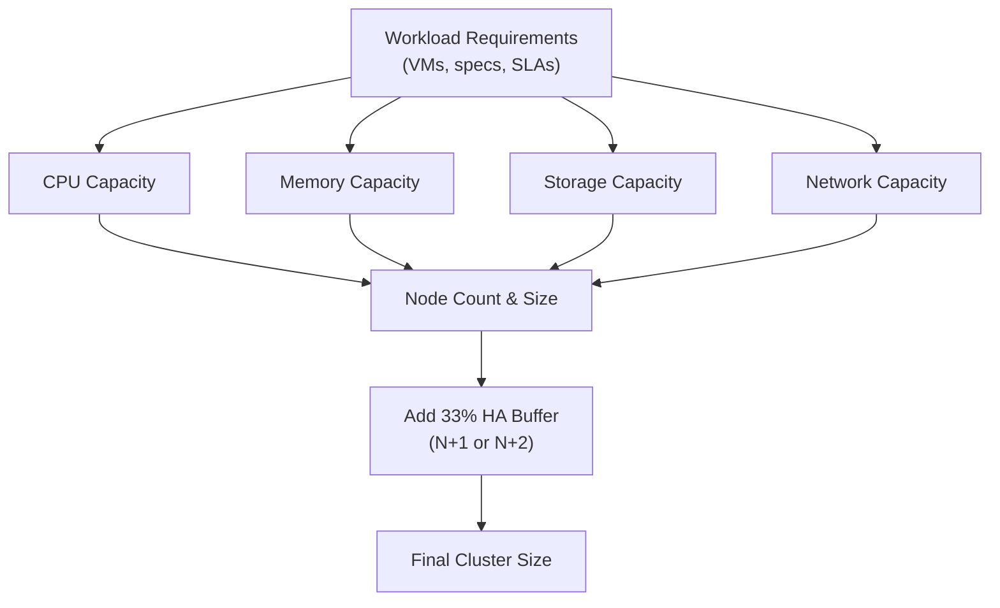

# How to Plan Harvester Capacity

Author: [nawazdhandala](https://www.github.com/nawazdhandala)

Tags: Harvester, Kubernetes, Virtualization, HCI, Capacity Planning, Performance

Description: A comprehensive guide to capacity planning for Harvester HCI clusters, covering CPU, memory, storage, and network sizing for VM workloads.

## Introduction

Capacity planning for Harvester requires understanding both the current workload requirements and anticipated growth. Unlike traditional virtualization platforms, Harvester combines compute, storage, and network in a single platform, so capacity decisions are interconnected. This guide provides frameworks and calculations for sizing your Harvester cluster correctly.

## Capacity Planning Framework



## Step 1: Inventory Your VM Workloads

Start by documenting all planned VMs:

```bash
# If migrating from an existing environment, export VM inventory

# For VMware:
# govc find / -type m | xargs -I {} govc vm.info {} > vm-inventory.txt

# Create a capacity planning spreadsheet
# Format: VM_NAME | vCPU | RAM_GB | DISK_GB | NETWORK_MBPS | IOPS

cat > vm-inventory.csv << 'EOF'
vm_name,vcpu,ram_gb,disk_gb,network_mbps,iops,priority
web-server-01,4,8,50,1000,500,high
web-server-02,4,8,50,1000,500,high
database-primary,16,64,500,10000,10000,critical
database-replica,16,64,500,5000,5000,critical
cache-server,4,32,20,5000,2000,high
app-server-01,8,16,100,2000,1000,medium
app-server-02,8,16,100,2000,1000,medium
batch-worker-01,8,8,100,500,200,low
batch-worker-02,8,8,100,500,200,low
dev-server,4,8,50,500,100,low
EOF

# Calculate totals
awk -F',' 'NR>1 {cpu+=$2; ram+=$3; disk+=$4} END {
    print "Total vCPU:", cpu
    print "Total RAM (GB):", ram
    print "Total Disk (GB):", disk
}' vm-inventory.csv
```

## Step 2: Calculate CPU Capacity

```text
CPU Capacity Formula:
  Total physical cores needed = (Total vCPU) / (CPU overcommit ratio)

For production workloads:
  - CPU overcommit ratio: 2:1 to 4:1 (depending on workload type)
  - Batch/dev workloads: up to 8:1
  - Database/realtime: 1:1 to 2:1

Example calculation:
  Total vCPU: 100
  Average overcommit: 3:1
  Physical cores needed: 100 / 3 = 34 cores

  Per node (3-node cluster): 34 / 3 = 12 cores/node
  Add HA buffer (N+1 - lose 1 node): 34 / 2 = 17 cores/node
  Node selection: 20-core processors (e.g., Xeon Gold 6256)
```

```bash
# Calculate CPU requirements
TOTAL_VCPU=100
OVERCOMMIT_RATIO=3
HA_NODES=3  # 3 nodes, survive 1 failure
REQUIRED_PHYSICAL=$((TOTAL_VCPU / OVERCOMMIT_RATIO))
PER_NODE=$(( (REQUIRED_PHYSICAL * HA_NODES) / (HA_NODES - 1) ))
echo "Minimum physical cores per node: ${PER_NODE}"
```

## Step 3: Calculate Memory Capacity

Memory overcommit is riskier than CPU overcommit - VMs will be killed if the host runs out of memory (OOM). Conservative memory planning is recommended:

```text
Memory Capacity Formula:
  Total physical RAM needed = (Total VM RAM) + (System overhead) + (HA buffer)

System overhead per node:
  - OS and system services: ~4-8 GB
  - Kubernetes and Harvester components: ~8-16 GB
  - Longhorn per node: ~2-4 GB
  - Total overhead: ~16-24 GB

Memory overcommit (use with caution):
  - Conservative: 1:1 (no overcommit)
  - Moderate: 1.2:1 (20% overcommit with swap or balloon driver)
  - Do NOT overcommit for databases or memory-intensive apps
```

```bash
# Memory capacity calculator
TOTAL_VM_RAM=300  # GB - sum of all VM RAM
OVERHEAD_PER_NODE=20  # GB - system overhead
NUM_NODES=3

# No overcommit scenario
REQUIRED_RAM_NO_OC=$((TOTAL_VM_RAM + (OVERHEAD_PER_NODE * NUM_NODES)))
PER_NODE_NO_OC=$((REQUIRED_RAM_NO_OC / NUM_NODES))

# With N+1 HA (survive 1 node failure)
PER_NODE_HA=$((REQUIRED_RAM_NO_OC / (NUM_NODES - 1)))

echo "RAM per node (no overcommit): ${PER_NODE_NO_OC} GB"
echo "RAM per node (N+1 HA): ${PER_NODE_HA} GB"
echo "Select node with: $((PER_NODE_HA + 16)) GB RAM (round up)"
```

## Step 4: Calculate Storage Capacity

```text
Storage Capacity Formula:
  Total storage needed = (Sum of VM disk sizes) * (Replica count) * (Overprovisioning factor)

For a 3-replica Longhorn configuration:
  VM disks: 500 GB total
  Replicas: 3x
  Raw needed: 500 GB * 3 = 1.5 TB

  Additional factors:
  - Snapshots: 20% overhead
  - OS disk: 250 GB per node (not counted in VM storage)
  - System volume: 100 GB per node

  Total per node: 1.5 TB / 3 nodes = 500 GB per node + buffer

  Recommendation: Use 800 GB - 1 TB NVMe per node for this workload
```

```bash
# Storage calculator
TOTAL_VM_DISK=500  # GB
LONGHORN_REPLICAS=3
SNAPSHOT_OVERHEAD=1.2   # 20% extra for snapshots
SAFETY_BUFFER=1.3       # 30% free space buffer
NUM_NODES=3

TOTAL_RAW=$((TOTAL_VM_DISK * LONGHORN_REPLICAS))
WITH_SNAPSHOTS=$(echo "${TOTAL_RAW} * ${SNAPSHOT_OVERHEAD}" | bc)
WITH_BUFFER=$(echo "${WITH_SNAPSHOTS} * ${SAFETY_BUFFER}" | bc)
PER_NODE=$(echo "${WITH_BUFFER} / ${NUM_NODES}" | bc)

echo "Total VM disk: ${TOTAL_VM_DISK} GB"
echo "Total raw storage (3x replicas): ${TOTAL_RAW} GB"
echo "With snapshot overhead: ${WITH_SNAPSHOTS} GB"
echo "With safety buffer: ${WITH_BUFFER} GB"
echo "Storage per node: ${PER_NODE} GB"
```

## Step 5: Calculate Network Bandwidth

```text
Network Bandwidth Planning:

  Management network: 1 GbE is typically sufficient
  Storage network: Calculate Longhorn replication bandwidth
    - Worst case: 3 nodes failing simultaneously means full re-replication
    - Target: Complete re-replication within 2-4 hours
    - For 1 TB of data: 1 TB / 3 hours = ~740 Mbps sustained
    - Recommendation: 10 GbE for storage network

  VM network: Based on aggregate VM bandwidth requirements
    - Sum all VM network allocations
    - Apply utilization factor (VMs rarely all at peak simultaneously)
    - Recommendation: 10-25 GbE depending on workload
```

## Step 6: Sizing Worksheet

```bash
# Complete capacity planning worksheet
cat << 'WORKSHEET'
===========================================
HARVESTER CAPACITY PLANNING WORKSHEET
===========================================

WORKLOAD SUMMARY
  Total VMs:                 _____
  Total vCPU:                _____
  Total VM RAM (GB):         _____
  Total VM Disk (GB):        _____

CPU SIZING
  vCPU / Physical ratio:     _____ : 1
  Physical cores needed:     _____
  Physical cores per node:   _____  (divide by HA factor)
  Processor model:           _____  cores per socket
  Sockets per node:          _____

MEMORY SIZING
  Total VM RAM (GB):         _____
  System overhead (GB):      _____  per node
  Total required (GB):       _____
  HA-adjusted per node (GB): _____
  RAM per node (rounded):    _____  GB

STORAGE SIZING
  Total VM disk (GB):        _____
  Longhorn replicas:         _____
  Snapshot overhead:         _____  % (e.g., 20%)
  Safety buffer:             _____  % (e.g., 30%)
  Storage per node (GB):     _____
  NVMe capacity per node:    _____  GB or TB

NETWORK SIZING
  Management NIC:            1 GbE or 10 GbE
  Storage NIC:               10 GbE (minimum)
  VM NIC:                    10 GbE or 25 GbE

FINAL CLUSTER SIZE
  Minimum nodes for HA:      3
  Recommended node count:    _____  (3, 5, or 7)
  Node specification:
    CPU:  _____  cores
    RAM:  _____  GB
    NVMe: _____  TB
    NICs: 3x (management + storage + VM)
WORKSHEET
```

## Step 7: Monitor and Right-Size Over Time

After deployment, monitor actual utilization to validate and refine your sizing:

```bash
# Check actual cluster utilization
export KUBECONFIG=/etc/rancher/rke2/rke2.yaml

# CPU utilization
kubectl top nodes

# Memory utilization
kubectl describe nodes | grep -A 4 "Allocated resources"

# Storage utilization
kubectl get nodes.longhorn.io -n longhorn-system \
    -o custom-columns='NODE:.metadata.name,USED:.status.diskStatus.default-disk-1.storageScheduled,MAX:.status.diskStatus.default-disk-1.storageMaximum'

# VM density
kubectl get vmi -A | wc -l
echo "VMs per node (average): $(kubectl get vmi -A | wc -l)/$(kubectl get nodes | wc -l)"

# Generate utilization report
kubectl top nodes --sort-by=cpu
kubectl top nodes --sort-by=memory
```

## Conclusion

Effective capacity planning for Harvester requires careful consideration of CPU, memory, storage, and network requirements - all of which are interconnected. The most common mistakes are underestimating memory (leading to OOM events), underestimating storage (leading to no space for replicas or growth), and failing to account for the HA overhead (needing to sustain full workloads on N-1 nodes). Use the worksheet to calculate your requirements systematically, add appropriate buffers, and monitor actual utilization post-deployment to refine future capacity additions. Plan for at least 12-18 months of growth in your initial sizing.
