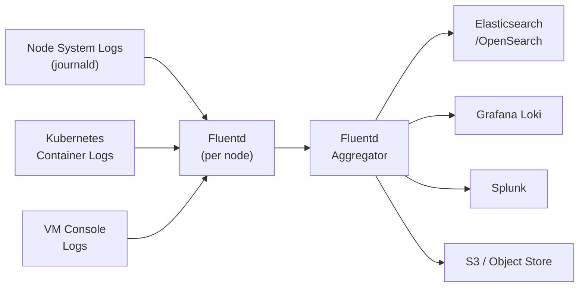

# How to Configure Harvester Logging

Author: [nawazdhandala](https://www.github.com/nawazdhandala)

Tags: Harvester, Kubernetes, Virtualization, HCI, Logging, Observability

Description: Learn how to configure centralized logging in Harvester to collect, aggregate, and forward logs from cluster components and virtual machines.

## Introduction

Centralized logging in Harvester enables you to collect logs from all cluster components — Kubernetes, VMs, system services, and applications — in one place for troubleshooting, auditing, and compliance. Harvester supports log forwarding through its integrated logging subsystem built on Banzai Cloud Logging Operator, which can send logs to various backends including Elasticsearch, Loki, Splunk, and any Fluentd-compatible endpoint.

## Logging Architecture



## Step 1: Enable Logging in Harvester

### Via the UI

1. Navigate to **Advanced** → **Monitoring & Logging**
2. Click **Enable Logging**
3. Click **Save**

### Via kubectl

```bash
# Enable Harvester logging subsystem
kubectl apply -f - <<EOF
apiVersion: harvesterhci.io/v1beta1
kind: Setting
metadata:
  name: harvester-logging
  namespace: harvester-system
spec:
  value: "enabled"
EOF

# Verify logging pods are running
kubectl get pods -n cattle-logging-system
```

## Step 2: Configure Log Output to Elasticsearch

### Create an Elasticsearch ClusterOutput

```yaml
# elasticsearch-output.yaml
# Forward all cluster logs to Elasticsearch

apiVersion: logging.banzaicloud.io/v1beta1
kind: ClusterOutput
metadata:
  name: elasticsearch-output
  namespace: cattle-logging-system
spec:
  elasticsearch:
    # Elasticsearch cluster URL
    host: elasticsearch.monitoring.svc.cluster.local
    port: 9200
    # Index naming (adds date suffix for log rotation)
    logstash_format: true
    logstash_prefix: harvester
    # Buffer configuration for reliable delivery
    buffer:
      flush_interval: 60s
      chunk_limit_size: 10MB
      total_limit_size: 10GB
      retry_max_interval: 30
      retry_forever: true
    # For secured Elasticsearch:
    # user: elastic
    # password_secret:
    #   name: elasticsearch-credentials
    #   key: password
    # ssl_version: TLSv1_2
```

```bash
kubectl apply -f elasticsearch-output.yaml

# Verify the output was created
kubectl get clusteroutput -n cattle-logging-system
```

## Step 3: Configure Log Output to Grafana Loki

```yaml
# loki-output.yaml
# Forward logs to Grafana Loki for integration with Grafana dashboards

apiVersion: logging.banzaicloud.io/v1beta1
kind: ClusterOutput
metadata:
  name: loki-output
  namespace: cattle-logging-system
spec:
  loki:
    # Loki endpoint URL
    url: http://loki.monitoring.svc.cluster.local:3100
    # Labels to add to all log entries
    extra_labels:
      cluster: harvester-prod
      environment: production
    # Strip null labels from logs
    remove_keys:
      - kubernetes_namespace_labels
    buffer:
      flush_interval: 30s
      chunk_limit_size: 5MB
```

```bash
kubectl apply -f loki-output.yaml
```

## Step 4: Create a ClusterFlow to Route Logs

A ClusterFlow defines which logs to collect and which output to send them to:

```yaml
# all-logs-flow.yaml
# Route all Harvester system logs to the output

apiVersion: logging.banzaicloud.io/v1beta1
kind: ClusterFlow
metadata:
  name: all-harvester-logs
  namespace: cattle-logging-system
spec:
  # Match all logs (can be filtered)
  match:
    - select: {}  # Select all logs
  # Apply filters
  filters:
    # Add Kubernetes metadata to logs
    - kube_events_timestamp: {}
    # Parse JSON logs automatically
    - parser:
        parse:
          type: json
          time_format: "%Y-%m-%dT%H:%M:%S.%NZ"
          time_key: time
    # Remove noisy system logs
    - grep:
        exclude:
          - key: message
            pattern: "health check"
  # Send to outputs
  globalOutputRefs:
    - elasticsearch-output
    - loki-output
```

```bash
kubectl apply -f all-logs-flow.yaml
```

## Step 5: Configure Application-Specific Log Flows

For targeted log routing per namespace or application:

```yaml
# vm-logs-flow.yaml
# Collect logs specifically from VM workload namespaces

apiVersion: logging.banzaicloud.io/v1beta1
kind: Flow
metadata:
  name: production-vm-logs
  namespace: production
spec:
  # Match logs from the production namespace
  match:
    - select:
        labels:
          environment: production
  filters:
    # Add log severity level based on content
    - record_transformer:
        records:
          - cluster: harvester-prod
          - log_type: vm-application
    # Enrich with VM name from labels
    - kube_metadata: {}
  # Output reference (must be in same namespace, or use ClusterOutput)
  globalOutputRefs:
    - elasticsearch-output
```

## Step 6: Configure Node-Level System Log Collection

Collect system logs from the Harvester OS (journald logs):

```yaml
# node-logs-flow.yaml
# Collect OS-level logs from Harvester nodes

apiVersion: logging.banzaicloud.io/v1beta1
kind: ClusterFlow
metadata:
  name: node-system-logs
  namespace: cattle-logging-system
spec:
  match:
    - select:
        labels:
          app.kubernetes.io/name: "node-journal-log"
  filters:
    # Filter for important system events
    - grep:
        regexp:
          - key: SYSTEMD_UNIT
            pattern: "rke2|kubelet|longhorn|harvester|NetworkManager"
    - record_transformer:
        records:
          - log_type: system
          - cluster: harvester-prod
  globalOutputRefs:
    - elasticsearch-output
```

## Step 7: Configure Log Retention and Rotation

```yaml
# log-retention.yaml
# Configure Elasticsearch index lifecycle for log retention

# Apply this in Elasticsearch (Kibana Dev Tools or API):
# PUT _ilm/policy/harvester-logs-policy
# {
#   "policy": {
#     "phases": {
#       "hot": {
#         "actions": {
#           "rollover": {
#             "max_size": "10gb",
#             "max_age": "1d"
#           }
#         }
#       },
#       "delete": {
#         "min_age": "30d",
#         "actions": {
#           "delete": {}
#         }
#       }
#     }
#   }
# }
```

## Step 8: Verify Log Collection

```bash
# Check that log collectors are running on each node
kubectl get pods -n cattle-logging-system

# Check FluentD pod logs for any collection errors
kubectl logs -n cattle-logging-system \
    $(kubectl get pods -n cattle-logging-system -l app=fluentd -o name | head -1) \
    --tail=50

# Verify ClusterFlows are active
kubectl get clusterflow -n cattle-logging-system

# Check ClusterOutputs are connected
kubectl get clusteroutput -n cattle-logging-system
kubectl describe clusteroutput elasticsearch-output -n cattle-logging-system | \
    grep -A 5 "Status:"

# Test by creating a log entry and checking Elasticsearch/Loki
kubectl run test-logger -n default --image=busybox --rm -it -- \
    sh -c 'for i in $(seq 1 10); do echo "Test log entry $i from Harvester"; sleep 1; done'
```

## Step 9: Forwarding to External Syslog

For legacy systems or compliance requirements, forward to syslog:

```yaml
# syslog-output.yaml
apiVersion: logging.banzaicloud.io/v1beta1
kind: ClusterOutput
metadata:
  name: syslog-output
  namespace: cattle-logging-system
spec:
  forward:
    # Syslog/Fluentd forward to external collector
    servers:
      - host: syslog.company.com
        port: 24224
    # Use TLS for security
    tls:
      enabled: true
      cert_path: /fluentd/tls/cert.pem
      private_key_path: /fluentd/tls/key.pem
      ca_path: /fluentd/tls/ca.pem
    buffer:
      flush_interval: 30s
```

## Conclusion

Centralized logging transforms Harvester from a collection of nodes and VMs into an observable system where you can trace issues across components, audit access, and prove compliance. By routing logs to Elasticsearch/Loki for real-time search and analysis, and configuring retention policies for long-term storage, you build a comprehensive audit trail. The FluentD-based logging operator in Harvester provides flexible routing with filters, so you can send different types of logs to different backends based on your organization's requirements.
