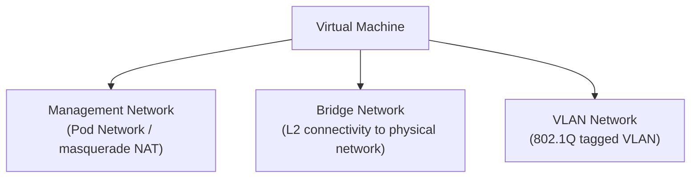

# How to Configure VM Networks in Harvester

Author: [nawazdhandala](https://www.github.com/nawazdhandala)

Tags: Harvester, Kubernetes, Virtualization, HCI, Networking, Multus

Description: A comprehensive guide to configuring virtual machine networks in Harvester using Multus CNI, bridge networks, and VLAN configurations.

## Introduction

Networking in Harvester is powered by Multus CNI, which allows VMs to connect to multiple networks simultaneously. VMs can have a management network interface (handled by the Kubernetes pod network) and one or more additional interfaces connected to physical or VLAN networks. Understanding Harvester's network model is essential for designing VM connectivity that meets your workload requirements.

## Harvester Network Types

Harvester supports three types of VM networks:



| Network Type | Use Case | IP Assignment |
|---|---|---|
| Management (pod) | VM → cluster egress, initial setup | NAT via masquerade |
| Bridge | Direct L2 access to physical network | DHCP or static |
| VLAN | Isolated tenant networks | DHCP or static |

## Step 1: Understand the Physical Network Configuration

Before creating VM networks, understand your physical infrastructure:

```bash
# View the current cluster network configuration

kubectl get clusternetwork -A

# View network configurations (defines which NICs are used)
kubectl get networkattachmentdefinition -A

# Check physical node interfaces
# SSH into a node and run:
ip link show
bridge link show
```

## Step 2: Create a Cluster Network

A ClusterNetwork defines a group of physical NICs across all nodes used for VM traffic:

```yaml
# cluster-network-vlan.yaml
# Defines a cluster-wide network using the secondary NIC (eth1)

apiVersion: network.harvesterhci.io/v1beta1
kind: ClusterNetwork
metadata:
  name: vlan-network
spec:
  # Human-readable description
  description: "VLAN network using eth1 on all nodes"
  # Whether to enable MTU configuration
  enable: true
  mtu: 1500
```

```bash
kubectl apply -f cluster-network-vlan.yaml
```

### Configure the Network on Each Node

```yaml
# node-network-config.yaml
# Configures the physical NIC mapping on a specific node

apiVersion: network.harvesterhci.io/v1beta1
kind: NodeNetwork
metadata:
  name: harvester-node-01-network
  namespace: harvester-system
spec:
  nodeName: harvester-node-01
  # Map the cluster network to a physical NIC
  nic: eth1
  clusterNetwork: vlan-network
```

```bash
kubectl apply -f node-network-config.yaml
```

## Step 3: Create a VM Network (NetworkAttachmentDefinition)

VM Networks are Multus `NetworkAttachmentDefinition` resources:

### Untagged (Bridge) Network

```yaml
# bridge-network.yaml
# Untagged bridge network - VM connects directly to the physical L2 network

apiVersion: "k8s.cni.cncf.io/v1"
kind: NetworkAttachmentDefinition
metadata:
  name: physical-bridge-100
  namespace: default
  labels:
    # Link to the cluster network
    network.harvesterhci.io/clusternetwork: vlan-network
  annotations:
    network.harvesterhci.io/route: |
      {
        "mode": "auto",
        "serverIPAddr": "",
        "cidr": "",
        "gateway": ""
      }
spec:
  config: |
    {
      "cniVersion": "0.3.1",
      "name": "physical-bridge-100",
      "type": "bridge",
      "bridge": "mgmt-br",
      "promiscMode": true,
      "vlan": 0,
      "ipam": {}
    }
```

### VLAN Network

```yaml
# vlan-100-network.yaml
# VLAN 100 network for application workloads

apiVersion: "k8s.cni.cncf.io/v1"
kind: NetworkAttachmentDefinition
metadata:
  name: vlan-100
  namespace: default
  labels:
    network.harvesterhci.io/clusternetwork: vlan-network
spec:
  config: |
    {
      "cniVersion": "0.3.1",
      "name": "vlan-100",
      "type": "bridge",
      "bridge": "mgmt-br",
      "promiscMode": true,
      "vlan": 100,
      "ipam": {}
    }
```

```bash
kubectl apply -f vlan-100-network.yaml
```

## Step 4: Create a VM Network via the UI

1. Navigate to **Networks** → **VM Networks**
2. Click **Create**
3. Fill in:
   - **Name**: `vlan-100-app-network`
   - **Namespace**: `default`
   - **Cluster Network**: select `vlan-network`
   - **VLAN ID**: `100`
4. Click **Create**

## Step 5: Attach a Network to a VM

### Via the UI

When creating or editing a VM:
1. Go to the **Networks** tab
2. Click **Add Network**
3. Select the network from the dropdown
4. Configure the MAC address (optional - auto-generated if left blank)

### Via kubectl

```yaml
# vm-with-networks.yaml
# VM with management network + VLAN network

apiVersion: kubevirt.io/v1
kind: VirtualMachine
metadata:
  name: app-server-01
  namespace: default
spec:
  running: true
  template:
    spec:
      domain:
        cpu:
          cores: 4
        resources:
          requests:
            memory: 8Gi
        machine:
          type: q35
        devices:
          interfaces:
            # Primary interface - management network (NAT)
            - name: default
              model: virtio
              masquerade: {}
            # Secondary interface - VLAN 100 (bridge)
            - name: vlan100
              model: virtio
              bridge: {}
      # Network definitions must match interfaces
      networks:
        - name: default
          pod: {}
        - name: vlan100
          multus:
            # References the NetworkAttachmentDefinition
            networkName: default/vlan-100
      volumes:
        - name: rootdisk
          persistentVolumeClaim:
            claimName: app-server-01-root
        - name: cloudinit
          cloudInitNoCloud:
            userData: |
              #cloud-config
              # Configure the second NIC statically
              write_files:
                - path: /etc/netplan/60-vlan100.yaml
                  content: |
                    network:
                      version: 2
                      ethernets:
                        enp2s0:
                          addresses:
                            - 10.100.0.10/24
                          routes:
                            - to: 10.100.0.0/24
                              via: 10.100.0.1
              runcmd:
                - netplan apply
```

## Step 6: Verify VM Network Connectivity

```bash
# Access the VM console (requires virtctl)
virtctl console app-server-01 -n default

# Inside the VM, check network interfaces
ip addr show
ip route show

# Test connectivity on each network
ping -c 3 8.8.8.8               # Test management NAT
ping -c 3 10.100.0.1             # Test VLAN 100 gateway
```

## Network Troubleshooting

```bash
# Check if NetworkAttachmentDefinition is correctly configured
kubectl get network-attachment-definitions -n default -o yaml

# Check the VM pod's network annotations
kubectl get pod -n default -l vm.kubevirt.io/name=app-server-01 \
    -o jsonpath='{.items[0].metadata.annotations}' | jq .

# Check Multus logs for CNI errors
kubectl logs -n kube-system \
    $(kubectl get pods -n kube-system -l app=multus -o name | head -1) \
    --tail=50
```

## Conclusion

Harvester's network model, powered by Multus CNI, provides the flexibility to connect VMs to both Kubernetes-managed and physical networks simultaneously. By creating ClusterNetworks for your physical NICs and NetworkAttachmentDefinitions for your VLAN segments, you can design a network topology that meets the isolation, performance, and connectivity requirements of your workloads. The Kubernetes-native approach means network configurations can be version-controlled and deployed through GitOps workflows.
