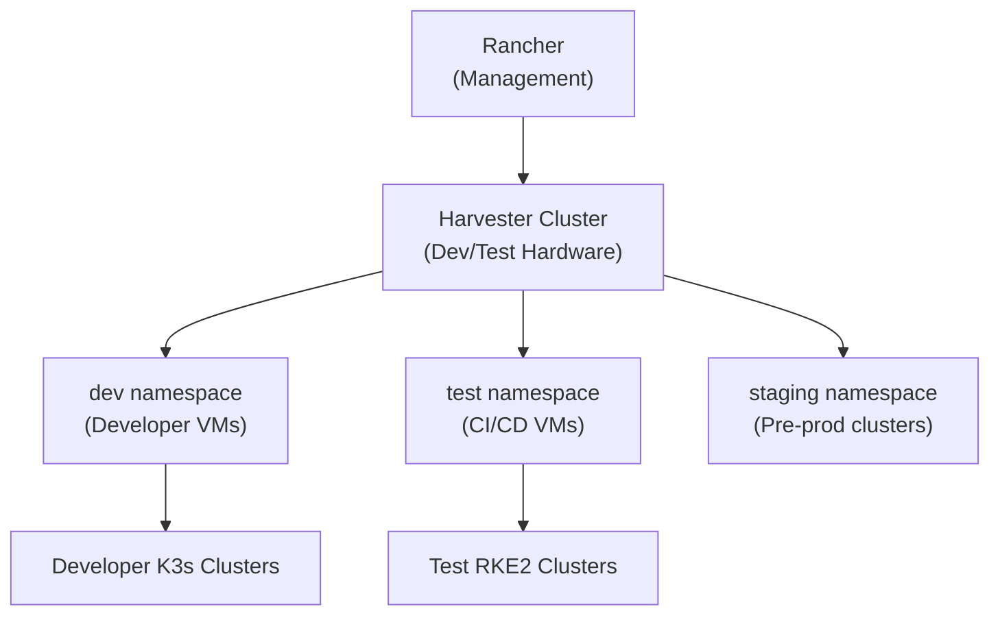

# How to Set Up Harvester for Dev/Test Environments - Environments

Author: [nawazdhandala](https://www.github.com/nawazdhandala)

Tags: Harvester, Kubernetes, Virtualization, HCI, Development, Testing

Description: Learn how to configure Harvester as an efficient development and testing platform, enabling self-service VM and Kubernetes cluster provisioning for engineering teams.

## Introduction

Harvester is an excellent platform for development and testing environments because it enables self-service VM and Kubernetes cluster provisioning, infrastructure-as-code workflows, and on-demand environment creation. Development teams can provision their own isolated environments, test against production-like infrastructure, and tear down resources when done - all without involving operations teams for every request.

## Dev/Test Architecture

A typical Harvester dev/test setup:



## Step 1: Create Isolated Namespaces

Use Kubernetes namespaces to isolate teams and environments:

```bash
# Create namespaces for different teams/environments

kubectl create namespace dev-team-alpha
kubectl create namespace dev-team-beta
kubectl create namespace ci-test
kubectl create namespace staging

# Label namespaces for identification
kubectl label namespace dev-team-alpha team=alpha environment=development
kubectl label namespace dev-team-beta team=beta environment=development
kubectl label namespace ci-test environment=test purpose=ci
kubectl label namespace staging environment=staging
```

## Step 2: Configure Resource Quotas per Team

Prevent any single team from exhausting cluster resources:

```yaml
# dev-team-quota.yaml
# Resource quota for a development team namespace

apiVersion: v1
kind: ResourceQuota
metadata:
  name: dev-team-alpha-quota
  namespace: dev-team-alpha
spec:
  hard:
    # Maximum VMs
    count/virtualmachines.kubevirt.io: "10"
    # Maximum vCPUs across all VMs
    requests.cpu: "32"
    limits.cpu: "32"
    # Maximum memory
    requests.memory: 64Gi
    limits.memory: 64Gi
    # Maximum storage
    persistentvolumeclaims: "20"
    requests.storage: 500Gi
```

```bash
kubectl apply -f dev-team-quota.yaml

# Verify quota is applied
kubectl describe resourcequota dev-team-alpha-quota -n dev-team-alpha
```

## Step 3: Create a Developer VM Template

Standardize the developer VM configuration:

```yaml
# dev-vm-template.yaml
# Standard developer workstation VM template

apiVersion: harvesterhci.io/v1beta1
kind: VirtualMachineTemplate
metadata:
  name: dev-workstation
  namespace: dev-team-alpha
spec:
  description: "Developer workstation - Ubuntu 22.04 with dev tools"
  defaultVersionID: ""
---
apiVersion: harvesterhci.io/v1beta1
kind: VirtualMachineTemplateVersion
metadata:
  name: dev-workstation-v1
  namespace: dev-team-alpha
spec:
  templateID: dev-team-alpha/dev-workstation
  description: "Ubuntu 22.04 + Docker + kubectl + common dev tools"
  vm:
    spec:
      running: false
      template:
        spec:
          domain:
            cpu:
              cores: 4
            resources:
              requests:
                memory: 8Gi
              limits:
                memory: 8Gi
            machine:
              type: q35
            devices:
              disks:
                - name: rootdisk
                  bootOrder: 1
                  disk:
                    bus: virtio
                - name: cloudinit
                  disk:
                    bus: virtio
              interfaces:
                - name: default
                  model: virtio
                  masquerade: {}
          networks:
            - name: default
              pod: {}
          volumes:
            - name: rootdisk
              dataVolume:
                name: ""
            - name: cloudinit
              cloudInitNoCloud:
                userData: |
                  #cloud-config
                  packages:
                    - qemu-guest-agent
                    - git
                    - curl
                    - vim
                    - jq
                    - make
                    - python3
                    - python3-pip
                  runcmd:
                    - systemctl enable --now qemu-guest-agent
                    # Install Docker
                    - curl -fsSL https://get.docker.com | sh
                    - usermod -aG docker ubuntu
                    # Install kubectl
                    - curl -LO "https://dl.k8s.io/release/$(curl -L -s https://dl.k8s.io/release/stable.txt)/bin/linux/amd64/kubectl"
                    - chmod +x kubectl && mv kubectl /usr/local/bin/
                    # Install Helm
                    - curl https://raw.githubusercontent.com/helm/helm/main/scripts/get-helm-3 | bash
                    # Install k9s
                    - curl -sS https://webinstall.dev/k9s | bash
```

## Step 4: Set Up Self-Service VM Provisioning with RBAC

Allow developers to manage VMs in their namespace without cluster-admin access:

```yaml
# dev-vm-rbac.yaml
# RBAC for developers to self-service their VMs

apiVersion: rbac.authorization.k8s.io/v1
kind: Role
metadata:
  name: vm-developer
  namespace: dev-team-alpha
rules:
  # VM management
  - apiGroups: ["kubevirt.io"]
    resources: ["virtualmachines", "virtualmachineinstances"]
    verbs: ["get", "list", "create", "update", "patch", "delete"]
  # VM operations (start, stop, console)
  - apiGroups: ["subresources.kubevirt.io"]
    resources: ["virtualmachines/start", "virtualmachines/stop",
                "virtualmachines/restart", "virtualmachineinstances/console",
                "virtualmachineinstances/vnc"]
    verbs: ["get", "update"]
  # PVC management for VM disks
  - apiGroups: [""]
    resources: ["persistentvolumeclaims"]
    verbs: ["get", "list", "create", "delete"]
  # VM images
  - apiGroups: ["harvesterhci.io"]
    resources: ["virtualmachineimages"]
    verbs: ["get", "list"]
  # Secrets for cloud-init
  - apiGroups: [""]
    resources: ["secrets"]
    verbs: ["get", "list", "create", "update", "delete"]
---
apiVersion: rbac.authorization.k8s.io/v1
kind: RoleBinding
metadata:
  name: dev-team-alpha-vm-access
  namespace: dev-team-alpha
subjects:
  - kind: Group
    name: dev-team-alpha  # Map to your IdP group
    apiGroup: rbac.authorization.k8s.io
roleRef:
  kind: Role
  name: vm-developer
  apiGroup: rbac.authorization.k8s.io
```

```bash
kubectl apply -f dev-vm-rbac.yaml
```

## Step 5: Create a VM Lifecycle Automation Script

Help developers quickly spin up and tear down environments:

```bash
#!/bin/bash
# dev-env-manager.sh - Manage dev environments

NAMESPACE="${NAMESPACE:-dev-team-alpha}"
ACTION="${1:-help}"
ENV_NAME="${2:-}"

# Create a new dev environment (VM)
create_env() {
    local NAME="${1:-dev-$(whoami)-$(date +%m%d)}"
    echo "Creating dev environment: ${NAME}"

    kubectl apply -f - <<EOF
apiVersion: kubevirt.io/v1
kind: VirtualMachine
metadata:
  name: ${NAME}
  namespace: ${NAMESPACE}
  labels:
    creator: $(whoami)
    created-date: $(date +%Y-%m-%d)
    purpose: development
spec:
  running: true
  template:
    spec:
      domain:
        cpu:
          cores: 4
        resources:
          requests:
            memory: 8Gi
        machine:
          type: q35
        devices:
          disks:
            - name: rootdisk
              bootOrder: 1
              disk:
                bus: virtio
            - name: cloudinit
              disk:
                bus: virtio
          interfaces:
            - name: default
              masquerade: {}
      networks:
        - name: default
          pod: {}
      volumes:
        - name: rootdisk
          persistentVolumeClaim:
            claimName: ${NAME}-root
        - name: cloudinit
          cloudInitNoCloud:
            userData: |
              #cloud-config
              users:
                - name: ubuntu
                  sudo: ALL=(ALL) NOPASSWD:ALL
                  ssh_authorized_keys:
                    - $(cat ~/.ssh/id_ed25519.pub 2>/dev/null || echo "# Add your key")
EOF

    echo "Waiting for VM to start..."
    kubectl wait vmi/${NAME} -n ${NAMESPACE} \
        --for=condition=Ready --timeout=300s

    VM_IP=$(kubectl get vmi ${NAME} -n ${NAMESPACE} \
        -o jsonpath='{.status.interfaces[0].ipAddress}')
    echo "VM ${NAME} is ready! IP: ${VM_IP}"
    echo "Connect: ssh ubuntu@${VM_IP}"
}

# List all dev environments for the current user
list_envs() {
    kubectl get vm -n ${NAMESPACE} \
        -l creator=$(whoami) \
        -o custom-columns='NAME:.metadata.name,STATUS:.spec.running,CREATED:.metadata.labels.created-date'
}

# Delete a dev environment
delete_env() {
    local NAME="${1}"
    echo "Deleting dev environment: ${NAME}"
    kubectl delete vm ${NAME} -n ${NAMESPACE}
    kubectl delete pvc ${NAME}-root -n ${NAMESPACE} 2>/dev/null || true
    echo "Deleted ${NAME}"
}

case "${ACTION}" in
    create) create_env "${ENV_NAME}" ;;
    list)   list_envs ;;
    delete) delete_env "${ENV_NAME}" ;;
    *)
        echo "Usage: $0 [create|list|delete] [env-name]"
        ;;
esac
```

## Step 6: Auto-Cleanup of Old Dev VMs

Prevent resource waste by automatically cleaning up old development VMs:

```yaml
# dev-cleanup-cronjob.yaml
# Delete dev VMs older than 7 days

apiVersion: batch/v1
kind: CronJob
metadata:
  name: dev-env-cleanup
  namespace: dev-team-alpha
spec:
  schedule: "0 6 * * *"  # Daily at 6 AM
  jobTemplate:
    spec:
      template:
        spec:
          serviceAccountName: cleanup-sa
          restartPolicy: OnFailure
          containers:
            - name: cleanup
              image: bitnami/kubectl:latest
              command:
                - /bin/sh
                - -c
                - |
                  # Delete VMs with 'purpose: development' label older than 7 days
                  CUTOFF=$(date -d '7 days ago' --iso-8601)
                  kubectl get vm -n dev-team-alpha -l purpose=development \
                      -o json | jq -r \
                      ".items[] | select(.metadata.creationTimestamp < \"${CUTOFF}\") |
                       .metadata.name" | \
                      xargs -I {} kubectl delete vm {} -n dev-team-alpha
```

## Conclusion

Harvester as a dev/test platform transforms the developer experience by enabling self-service, on-demand infrastructure. Developers can provision their own VMs and Kubernetes clusters without waiting for operations team intervention, accelerating development cycles. The combination of resource quotas, RBAC, and automated cleanup keeps costs and resource usage under control. By standardizing VM templates for common use cases (developer workstations, CI runners, test clusters), you ensure consistent, reproducible environments across the entire engineering organization.
