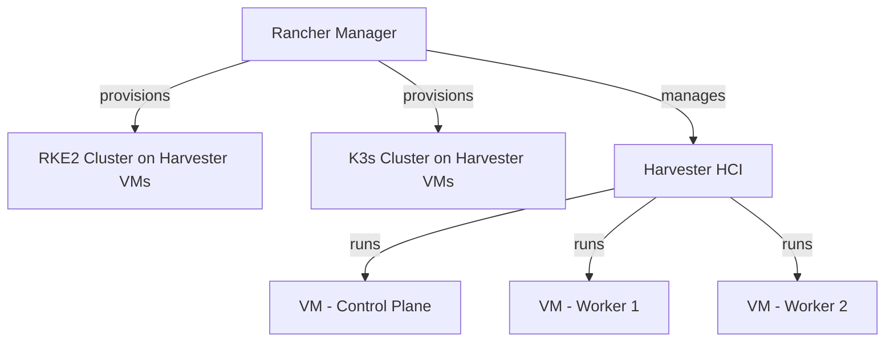

# How to Use Harvester as Infrastructure Provider in Rancher

Author: [nawazdhandala](https://www.github.com/nawazdhandala)

Tags: Harvester, Rancher, Infrastructure Provider, Kubernetes, HCI, VM Provisioning, SUSE

Description: Learn how to configure Harvester as an infrastructure provider in Rancher to provision RKE2 and K3s clusters using Harvester VMs as cloud-like infrastructure.

---

When Harvester is registered with Rancher, it becomes a first-class infrastructure provider. Rancher can then provision Kubernetes clusters directly on Harvester VMs, treating your on-premises HCI stack like a private cloud.

---

## Architecture



---

## Step 1: Import Harvester into Rancher

In the Rancher UI, navigate to **Virtualization Management > Import Existing** and follow the on-screen instructions. This deploys the Harvester cluster agent.

After import, Harvester appears under **Virtualization Management** in Rancher.

---

## Step 2: Create a Harvester Cloud Credential

In Rancher, create a cloud credential that Rancher uses to provision VMs on Harvester:

1. Go to **Cluster Management > Cloud Credentials > Create**
2. Select **Harvester** as the provider
3. Provide the Harvester kubeconfig (download from Harvester UI > Support)
4. Name the credential (e.g., `harvester-prod`)

---

## Step 3: Create an RKE2 Cluster on Harvester

In Rancher UI:

1. **Cluster Management > Create > RKE2/K3s > Harvester**
2. Select the Harvester cloud credential
3. Configure machine pools:

```yaml
# Machine pool configuration (shown in Rancher UI)
controlPlane:
  count: 3
  cpus: 4
  memory: 8192Mi
  diskSize: 50Gi
  image: ubuntu-22-04      # Harvester image name
  network: vlan-100        # Harvester network
  storageClass: longhorn   # Harvester storage class

worker:
  count: 5
  cpus: 8
  memory: 16384Mi
  diskSize: 100Gi
  image: ubuntu-22-04
  network: vlan-100
```

---

## Step 4: Configure Machine Config for Harvester

The machine config controls how VMs are provisioned on Harvester:

```yaml
# Rancher creates HarvesterConfig CRs
apiVersion: rke-machine-config.cattle.io/v1
kind: HarvesterConfig
metadata:
  name: my-rke2-workers
  namespace: fleet-default
spec:
  # Harvester VM settings
  vmNamespace: default
  cpuCount: "8"
  memorySize: "16384"
  diskSize: "102400"
  diskBus: virtio
  imageName: default/ubuntu-22-04
  networkName: default/vlan-100
  networkModel: virtio
  # SSH key for initial VM access
  sshUser: ubuntu
  # Cloud-init user data
  userData: |
    #cloud-config
    package_update: true
    packages:
      - open-iscsi
      - nfs-common
```

---

## Step 5: Verify Cluster Provisioning

```bash
# Check cluster provisioning status in Rancher
rancher cluster ls

# Once active, download the kubeconfig
rancher cluster kubeconfig my-harvester-cluster > ~/.kube/harvester-cluster.yaml

# Verify nodes
KUBECONFIG=~/.kube/harvester-cluster.yaml kubectl get nodes
```

---

## Best Practices

- Use Harvester networks with VLANs to isolate production Kubernetes clusters from development.
- Size VMs based on your workload — control plane nodes need more CPU and memory than their Kubernetes requirements suggest (add 20% for Harvester VM overhead).
- Use Longhorn-backed Harvester storage for cluster disks to leverage Harvester's built-in replication.
- Enable Rancher's cluster autoscaler for worker machine pools to handle variable workloads.
