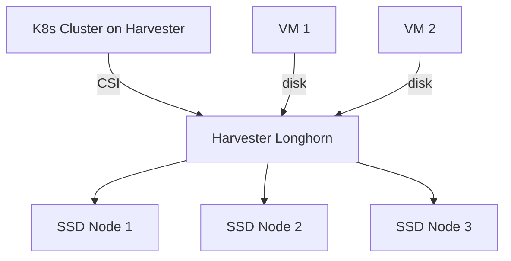

# How to Set Up Harvester Storage for Kubernetes

Author: [nawazdhandala](https://www.github.com/nawazdhandala)

Tags: Harvester, Kubernetes, Storage, Longhorn, CSI, PVC, SUSE Rancher

Description: Learn how to configure Harvester's built-in Longhorn storage for Kubernetes clusters running on Harvester, including StorageClasses, PVC provisioning, and cross-cluster storage access.

---

Harvester uses Longhorn as its built-in storage system. Kubernetes clusters provisioned on Harvester can use Harvester's Longhorn instance directly, giving VMs and containers access to the same distributed storage pool.

---

## Storage Architecture on Harvester



---

## Option 1: Longhorn on the Guest Cluster

For Kubernetes clusters running on Harvester VMs, install Longhorn directly inside the guest cluster. This gives the cluster its own independent Longhorn instance backed by the VM's disks:

```bash
# In the guest K8s cluster
helm repo add longhorn https://charts.longhorn.io
helm repo update
helm install longhorn longhorn/longhorn \
  --namespace longhorn-system \
  --create-namespace \
  --set defaultSettings.defaultDataPath=/var/lib/longhorn
```

This is the standard approach and provides full isolation between clusters.

---

## Option 2: Using Harvester CSI Driver

Harvester provides a CSI driver that allows guest clusters to provision volumes directly from Harvester's storage pool. This is the preferred approach for Kubernetes clusters managed via Rancher on Harvester.

The CSI driver is installed automatically when you provision a cluster via Rancher on Harvester.

```bash
# Verify Harvester CSI driver is installed in the guest cluster
kubectl get pods -n kube-system -l app=harvester-csi-driver

# List available StorageClasses from Harvester
kubectl get storageclasses
```

---

## Step 1: Configure Harvester StorageClass in Guest Cluster

```yaml
# harvester-sc.yaml
apiVersion: storage.k8s.io/v1
kind: StorageClass
metadata:
  name: harvester
  annotations:
    storageclass.kubernetes.io/is-default-class: "true"
provisioner: driver.harvesterhci.io
allowVolumeExpansion: true
reclaimPolicy: Delete
volumeBindingMode: Immediate
parameters:
  migratable: "true"
```

---

## Step 2: Create a PVC Using Harvester Storage

```yaml
# test-pvc.yaml
apiVersion: v1
kind: PersistentVolumeClaim
metadata:
  name: app-data
  namespace: production
spec:
  accessModes:
    - ReadWriteOnce
  storageClassName: harvester
  resources:
    requests:
      storage: 20Gi
```

---

## Step 3: Verify Volume Provisioning

```bash
# Check PVC is bound
kubectl get pvc app-data -n production

# Verify the Harvester volume was created
kubectl get volumes.harvesterhci.io -A

# Check in Harvester UI: Volumes section should show the new volume
```

---

## Step 4: Configure Snapshot Support

```yaml
# harvester-snapshotclass.yaml
apiVersion: snapshot.storage.k8s.io/v1
kind: VolumeSnapshotClass
metadata:
  name: harvester-snapshot
driver: driver.harvesterhci.io
deletionPolicy: Delete
```

---

## Best Practices

- Use Harvester CSI for clusters provisioned by Rancher on Harvester — it integrates volume lifecycle with VM lifecycle.
- For critical production databases, consider running Longhorn inside the guest cluster for additional storage isolation.
- Set `migratable: "true"` in the StorageClass so volumes can follow VM live migrations.
- Back up Harvester storage data separately from your Kubernetes backup strategy.
