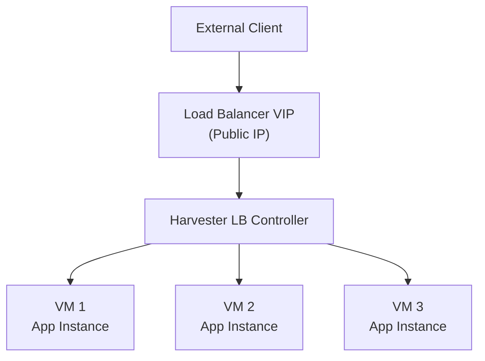

# How to Configure Harvester Load Balancer

Author: [nawazdhandala](https://www.github.com/nawazdhandala)

Tags: Harvester, Kubernetes, Virtualization, HCI, Load Balancer, Networking

Description: Learn how to configure the built-in load balancer in Harvester for distributing traffic to virtual machines and Kubernetes services.

## Introduction

Harvester includes a built-in load balancer controller that provides Layer 4 load balancing for VM workloads and services in guest Kubernetes clusters. The load balancer integrates with Harvester's networking to distribute incoming traffic across multiple VM instances, providing high availability for your applications.

## Harvester Load Balancer Components



The Harvester load balancer works at the IP level, distributing TCP/UDP traffic across backend VM instances.

## Step 1: Install the Harvester Load Balancer

The load balancer is included in Harvester but may need to be explicitly enabled in some versions:

```bash
# Check if the load balancer controller is running

kubectl get pods -n harvester-system | grep lb

# Check the load balancer CRDs
kubectl get crd | grep loadbalancer

# Expected: loadbalancers.loadbalancer.harvesterhci.io
```

## Step 2: Create a Load Balancer

### Via the UI

1. Navigate to **Networks** → **Load Balancers**
2. Click **Create**
3. Configure:

```text
Name:            web-app-lb
Namespace:       default
Description:     Load balancer for web application VMs

```

### Via kubectl

```yaml
# load-balancer.yaml
# Load balancer for web application VMs

apiVersion: loadbalancer.harvesterhci.io/v1beta1
kind: LoadBalancer
metadata:
  name: web-app-lb
  namespace: default
spec:
  # IP address mode: DHCP, Pool, or External
  ipam: Pool
  # Reference to the IP pool (if using Pool mode)
  ipPool: default/lb-ip-pool
  # Health check configuration
  healthCheck:
    # Port to check
    port: 80
    # Interval between health checks (seconds)
    periodSeconds: 10
    # Number of successful checks to mark as healthy
    successThreshold: 1
    # Number of failed checks to mark as unhealthy
    failureThreshold: 3
    # Timeout for each health check
    timeoutSeconds: 5
  # Backend servers (VM IPs + ports)
  backendServers:
    - address: 10.0.100.10
      port: 80
    - address: 10.0.100.11
      port: 80
    - address: 10.0.100.12
      port: 80
  # Load balancer listeners
  listeners:
    - name: http
      port: 80
      protocol: TCP
      backendPort: 80
    - name: https
      port: 443
      protocol: TCP
      backendPort: 443
```

## Step 3: Create an IP Address Pool

For the load balancer to allocate IPs, configure an IP pool:

```yaml
# ip-pool.yaml
# IP address pool for load balancer VIPs

apiVersion: loadbalancer.harvesterhci.io/v1beta1
kind: IPPool
metadata:
  name: lb-ip-pool
  namespace: default
spec:
  # CIDR range for load balancer VIPs
  ranges:
    - subnet: 192.168.1.200/29
      rangeStart: 192.168.1.200
      rangeEnd: 192.168.1.207
      gateway: 192.168.1.1
  # Network selector - this pool is for the management network
  selector:
    network: default/management-network
```

```bash
kubectl apply -f ip-pool.yaml
kubectl apply -f load-balancer.yaml

# Verify the load balancer got an IP
kubectl get loadbalancer web-app-lb -n default \
    -o jsonpath='{.status.address}'
```

## Step 4: Use Load Balancer in Guest Kubernetes Clusters

When Kubernetes clusters run on Harvester (via Rancher), you can use the Harvester cloud provider to create LoadBalancer services:

### Configure the Harvester Cloud Provider in the Guest Cluster

```bash
# The Harvester cloud provider must be installed in the guest cluster
# It's automatically configured when creating clusters via Rancher

# Verify the cloud provider is configured
kubectl get pods -n kube-system | grep cloud-provider
```

### Create a LoadBalancer Service

```yaml
# app-service-lb.yaml
# Kubernetes LoadBalancer service backed by Harvester LB

apiVersion: v1
kind: Service
metadata:
  name: web-app-service
  namespace: production
  annotations:
    # Request a specific IP from the Harvester IP pool
    cloudprovider.harvesterhci.io/ipam: pool
    # Specify the IP pool to use
    cloudprovider.harvesterhci.io/ip-pool-ref: default/lb-ip-pool
spec:
  type: LoadBalancer
  # Load balancer source range restriction
  loadBalancerSourceRanges:
    - 10.0.0.0/8
    - 192.168.0.0/16
  selector:
    app: web-app
  ports:
    - name: http
      port: 80
      targetPort: 8080
    - name: https
      port: 443
      targetPort: 8443
```

```bash
kubectl apply -f app-service-lb.yaml

# Watch for the external IP to be assigned
kubectl get svc web-app-service -n production -w

# Expected output:
# NAME               TYPE           CLUSTER-IP     EXTERNAL-IP      PORT(S)
# web-app-service    LoadBalancer   10.96.50.123   192.168.1.200    80:31234/TCP
```

## Step 5: Configure Health Checks

Health checks ensure the load balancer only routes to healthy backends:

```yaml
# load-balancer-with-health-checks.yaml
apiVersion: loadbalancer.harvesterhci.io/v1beta1
kind: LoadBalancer
metadata:
  name: api-server-lb
  namespace: default
spec:
  ipam: Pool
  ipPool: default/lb-ip-pool
  healthCheck:
    # TCP health check on port 8080
    port: 8080
    periodSeconds: 5
    successThreshold: 2
    failureThreshold: 3
    timeoutSeconds: 3
  backendServers:
    - address: 10.0.100.20
      port: 8080
    - address: 10.0.100.21
      port: 8080
  listeners:
    - name: api
      port: 8080
      protocol: TCP
      backendPort: 8080
```

## Step 6: Monitor Load Balancer Status

```bash
# Check load balancer status
kubectl get loadbalancer -n default

# Get detailed status including backend health
kubectl describe loadbalancer web-app-lb -n default

# Check which backends are healthy
kubectl get loadbalancer web-app-lb -n default \
    -o jsonpath='{.status}' | jq .

# View load balancer events
kubectl get events -n default \
    --field-selector involvedObject.name=web-app-lb
```

## Use Case: Blue-Green Deployments

Load balancers enable blue-green deployments for VMs:

```bash
#!/bin/bash
# blue-green-switch.sh - Switch LB from blue to green VMs

LB_NAME="app-lb"
NAMESPACE="default"
BLUE_BACKENDS='[{"address":"10.0.100.10","port":80},{"address":"10.0.100.11","port":80}]'
GREEN_BACKENDS='[{"address":"10.0.100.20","port":80},{"address":"10.0.100.21","port":80}]'

echo "Switching load balancer to green environment..."

kubectl patch loadbalancer ${LB_NAME} -n ${NAMESPACE} \
    --type merge \
    -p "{\"spec\":{\"backendServers\":${GREEN_BACKENDS}}}"

echo "Traffic now routing to green VMs"
echo "Monitor for 5 minutes before decommissioning blue VMs"
```

## Conclusion

The Harvester load balancer provides essential traffic distribution capabilities for both native VM workloads and guest Kubernetes services. By combining IP pools with health checks and backend VM groups, you can create highly available application architectures on Harvester. The integration with Kubernetes LoadBalancer services in guest clusters makes it seamless for application developers to expose their services through proper load balancers without needing to understand the underlying Harvester infrastructure.
