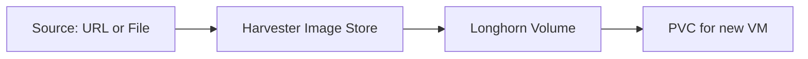

# How to Manage VM Images in Harvester

Author: [nawazdhandala](https://www.github.com/nawazdhandala)

Tags: Harvester, Kubernetes, Virtualization, HCI, VM Image

Description: A guide to managing virtual machine images in Harvester, including importing, organizing, and maintaining images for VM deployments.

## Introduction

VM images in Harvester are the base disks from which virtual machines are created. Harvester stores images as Kubernetes custom resources (`VirtualMachineImage`) backed by Longhorn volumes. Images can be imported from URLs, uploaded from local files, or exported from existing VMs. Proper image management ensures you always have up-to-date, secure base images for your VMs.

## Understanding VM Image Storage

When you import an image into Harvester:



Images are stored as Longhorn volumes and replicated across nodes based on the configured replica count. Each time you create a VM from an image, Harvester clones the image volume, giving the VM its own independent copy.

## Listing and Viewing Images

```bash
# List all VM images via kubectl

kubectl get virtualmachineimages -A

# Get detailed info about a specific image
kubectl describe virtualmachineimage ubuntu-22-04 -n default

# Check image status (should show "Active" when ready)
kubectl get virtualmachineimage ubuntu-22-04 -n default \
    -o jsonpath='{.status.storageClassName}'
```

## Importing Images from a URL

### Via the UI

1. Navigate to **Images** in the Harvester dashboard
2. Click **Create**
3. Provide:
   - **Name**: `ubuntu-22-04-lts`
   - **URL**: The download URL of the image
   - **Namespace**: Select the target namespace

### Via kubectl

```yaml
# ubuntu-image.yaml
# Import Ubuntu 22.04 cloud image into Harvester

apiVersion: harvesterhci.io/v1beta1
kind: VirtualMachineImage
metadata:
  name: ubuntu-22-04-lts
  namespace: default
  annotations:
    # Human-readable display name
    harvesterhci.io/imageDisplayName: "Ubuntu 22.04 LTS"
spec:
  # Source URL for the image
  url: "https://cloud-images.ubuntu.com/jammy/current/jammy-server-cloudimg-amd64.img"
  # qcow2 or raw
  sourceType: download
```

```bash
# Apply the image import
kubectl apply -f ubuntu-image.yaml

# Watch the import progress
kubectl get virtualmachineimage ubuntu-22-04-lts -n default -w

# The image goes through these phases:
# Initializing -> Importing -> Active
```

### Common Cloud Image URLs

```bash
# Ubuntu 22.04 LTS
https://cloud-images.ubuntu.com/jammy/current/jammy-server-cloudimg-amd64.img

# Ubuntu 20.04 LTS
https://cloud-images.ubuntu.com/focal/current/focal-server-cloudimg-amd64.img

# Debian 12 (Bookworm)
https://cloud.debian.org/images/cloud/bookworm/latest/debian-12-genericcloud-amd64.qcow2

# CentOS Stream 9
https://cloud.centos.org/centos/9-stream/x86_64/images/CentOS-Stream-GenericCloud-9-latest.x86_64.qcow2

# Rocky Linux 9
https://download.rockylinux.org/pub/rocky/9/images/x86_64/Rocky-9-GenericCloud.latest.x86_64.qcow2

# Windows Server 2022 (requires manual upload - not publicly downloadable)
# Use the Upload method instead
```

## Uploading Images from Local Files

For images that aren't available via public URL (e.g., Windows, custom builds):

### Via the UI

1. Navigate to **Images** → **Create**
2. Select **Upload** instead of URL
3. Set the **Name** and **Namespace**
4. Click **Choose File** and select the `.qcow2`, `.img`, or `.iso` file
5. Click **Create** - the upload begins immediately

### Via the Harvester API

```bash
# Get the upload URL from the Harvester API
IMAGE_NAME="windows-server-2022"
NAMESPACE="default"

# Create the image resource first
kubectl apply -f - <<EOF
apiVersion: harvesterhci.io/v1beta1
kind: VirtualMachineImage
metadata:
  name: ${IMAGE_NAME}
  namespace: ${NAMESPACE}
spec:
  sourceType: upload
  displayName: "Windows Server 2022"
EOF

# Get the upload endpoint
UPLOAD_URL=$(kubectl get virtualmachineimage ${IMAGE_NAME} -n ${NAMESPACE} \
    -o jsonpath='{.status.uploadURL}')

# Upload the file using curl
curl -X POST "${UPLOAD_URL}" \
    -H "Content-Type: application/octet-stream" \
    --data-binary @windows-server-2022.qcow2
```

## Organizing Images with Labels

Use Kubernetes labels to organize images by OS, version, or environment:

```yaml
# Apply labels to an existing image
kubectl label virtualmachineimage ubuntu-22-04-lts -n default \
    os=ubuntu \
    version=22.04 \
    environment=production \
    team=platform

# List images filtered by label
kubectl get virtualmachineimage -n default -l os=ubuntu

# List all production images across namespaces
kubectl get virtualmachineimage -A -l environment=production
```

## Exporting Images

Export a VM's root disk as a reusable image:

```bash
# First, stop the VM if it's running
kubectl patch vm my-vm --type merge -p '{"spec":{"running":false}}'

# Find the root PVC name
kubectl get pvc -n default | grep my-vm

# Create an image from the PVC
kubectl apply -f - <<EOF
apiVersion: harvesterhci.io/v1beta1
kind: VirtualMachineImage
metadata:
  name: my-custom-image
  namespace: default
spec:
  sourceType: export-from-volume
  pvcName: my-vm-root-disk
  pvcNamespace: default
  displayName: "My Custom Ubuntu Image"
EOF
```

## Deleting Images

```bash
# Delete an image (only if no VMs are using it)
kubectl delete virtualmachineimage ubuntu-20-04-lts -n default

# Check if an image is in use before deleting
kubectl get pvc -A -o json | jq '.items[] |
    select(.spec.dataSource.name == "ubuntu-20-04-lts") |
    .metadata.name'
```

## Image Maintenance Best Practices

**Regular Updates:**
```bash
# Script to check image age and flag old images
kubectl get virtualmachineimage -A -o json | jq '
.items[] | {
    name: .metadata.name,
    namespace: .metadata.namespace,
    created: .metadata.creationTimestamp,
    size: .status.size
}'
```

**Naming Convention:**
```text
{os}-{version}-{variant}-{date}
Examples:
  ubuntu-22-04-server-20240101
  rocky-9-minimal-20240215
  windows-2022-datacenter-20240301
```

## Conclusion

Effective VM image management in Harvester ensures that your virtual machines are always built from known-good, up-to-date base images. By importing images from trusted sources, applying consistent labels, and regularly updating images with security patches, you maintain a healthy image library. The Kubernetes-native approach to image storage means you can automate image lifecycle management using standard Kubernetes tools and GitOps workflows.
