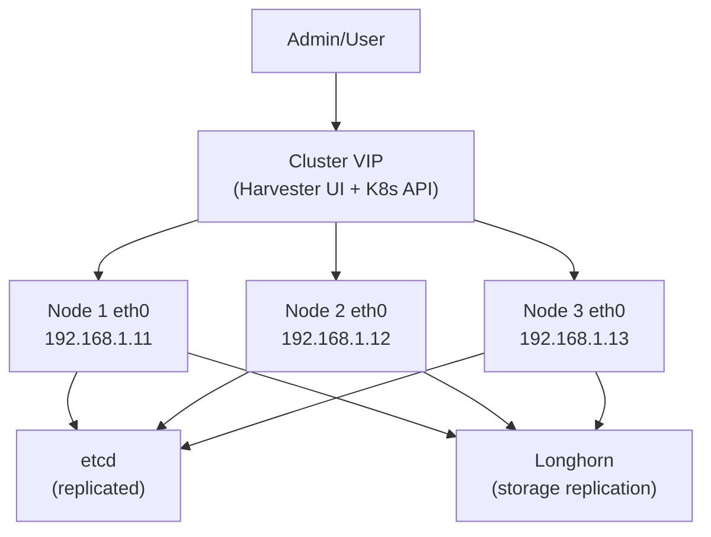

# How to Configure Management Network in Harvester

Author: [nawazdhandala](https://www.github.com/nawazdhandala)

Tags: Harvester, Kubernetes, Virtualization, HCI, Networking, Management Network

Description: Learn how to configure and manage the Harvester management network, including bonding, static IP assignment, and DNS settings for cluster nodes.

## Introduction

The management network in Harvester carries all control plane traffic: Kubernetes API communication, etcd replication, Longhorn storage traffic, and the Harvester UI access. Proper management network configuration is critical for cluster stability and performance. This guide covers configuring the management network during installation and post-installation adjustments.

## Management Network Architecture



## Configuration Options During Installation

During Harvester installation, you configure the management network interactively:

### Static IP Configuration

```
Interface:    eth0
Method:       Static
IP Address:   192.168.1.11/24
Gateway:      192.168.1.1
DNS Servers:  8.8.8.8, 8.8.4.4
NTP Servers:  pool.ntp.org
```

### DHCP Configuration

```
Interface:    eth0
Method:       DHCP
```

**Note:** For production clusters, static IPs or DHCP reservations are strongly recommended to ensure nodes always get the same IP address after reboots.

## Using a Configuration File for Management Network

For automated deployments, define the management network in the Harvester config:

```yaml
# harvester-config.yaml
# Management network configuration section

scheme_version: 1

network:
  # Define the management bond interface
  interfaces:
    - name: harvester-mgmt
      hwAddr: "aa:bb:cc:dd:ee:ff"  # Optional: specify MAC for deterministic NIC selection
  bonds:
    - name: harvester-mgmt
      # Bond mode options: balance-rr, active-backup, balance-xor, broadcast,
      # 802.3ad (LACP), balance-tlb, balance-alb
      mode: active-backup
      slaves:
        - eth0
        - eth1   # Second NIC for failover
      mtu: 1500

# Management IP assignment
install:
  management_interface:
    interfaces:
      - name: harvester-mgmt
    # Method: dhcp or static
    method: static
    ip: 192.168.1.11
    subnetMask: 255.255.255.0
    gateway: 192.168.1.1
    dnsNameservers:
      - 8.8.8.8
      - 8.8.4.4
```

## Configuring NIC Bonding for Redundancy

For high availability, configure NIC bonding on the management network:

### Active-Backup Bonding (Simple Failover)

```bash
# Check current bond configuration on a node
cat /proc/net/bonding/harvester-mgmt

# Expected output shows:
# Bonding Mode: fault-tolerance (active-backup)
# Active Slave: eth0
# Slave Interface: eth0
#   MII Status: up
# Slave Interface: eth1
#   MII Status: up
```

### LACP (802.3ad) Bonding for Higher Throughput

To configure LACP bonding, update the network configuration:

```yaml
# For LACP bonding, the switch must also be configured for LACP
bonds:
  - name: harvester-mgmt
    mode: 802.3ad
    slaves:
      - eth0
      - eth1
    mtu: 1500
    # LACP parameters
    lacpRate: fast
    miimon: 100
```

**Switch configuration for LACP:**
```
! Cisco IOS example
interface Port-channel1
  description Harvester-Node-01-Bond
  switchport mode access
  switchport access vlan 10

interface GigabitEthernet0/1
  description Harvester-Node-01-eth0
  channel-group 1 mode active
  no shutdown

interface GigabitEthernet0/2
  description Harvester-Node-01-eth1
  channel-group 1 mode active
  no shutdown
```

## Changing Management Network IP After Installation

To change a node's management IP after installation:

```bash
# SSH into the node
ssh rancher@192.168.1.11

# Modify the network configuration
sudo vi /etc/sysconfig/network/ifcfg-harvester-mgmt

# Key fields to update:
# IPADDR='192.168.1.21'     # New IP address
# NETMASK='255.255.255.0'
# GATEWAY='192.168.1.1'

# Apply the network change
sudo wicked ifreload harvester-mgmt

# Verify the new IP is active
ip addr show harvester-mgmt
```

**Warning:** Changing the management IP will temporarily disrupt the node's Kubernetes API connectivity. Other cluster nodes may detect the node as NotReady until the IP change propagates.

## Changing DNS Configuration

```bash
# View current DNS configuration
cat /etc/resolv.conf

# Update DNS servers
sudo vi /etc/sysconfig/network/ifcfg-harvester-mgmt
# Update: DNS1='8.8.8.8'
# Update: DNS2='1.1.1.1'

# Or update directly via wicked
sudo wicked ifdown harvester-mgmt
sudo wicked ifup harvester-mgmt

# Verify DNS resolution
nslookup kubernetes.default.svc.cluster.local
```

## Updating NTP Configuration

Accurate time synchronization is critical for etcd and distributed systems:

```bash
# Check current NTP sync status
timedatectl status
chronyc tracking

# Update NTP servers
sudo vi /etc/chrony.conf
# Add or modify server lines:
# server pool.ntp.org iburst
# server 0.pool.ntp.org iburst
# server 1.pool.ntp.org iburst

# Restart chronyd
sudo systemctl restart chronyd

# Verify time sync
chronyc sources -v
```

## Verifying Management Network Health

```bash
# Check all nodes can communicate on the management network
for NODE_IP in 192.168.1.11 192.168.1.12 192.168.1.13; do
    echo -n "Ping ${NODE_IP}: "
    ping -c 1 -W 2 ${NODE_IP} > /dev/null && echo "OK" || echo "FAILED"
done

# Check cluster VIP is reachable
ping -c 3 192.168.1.100

# Verify Kubernetes API is accessible via VIP
curl -k https://192.168.1.100/healthz

# Check etcd cluster health
export KUBECONFIG=/etc/rancher/rke2/rke2.yaml
kubectl get componentstatuses
```

## Monitoring Management Network Performance

```bash
# Check network interface statistics
ip -s link show harvester-mgmt

# Monitor bandwidth usage
# Install iftop or nload if needed
iftop -i harvester-mgmt

# Check for dropped packets or errors
netstat -i | grep harvester-mgmt

# Expected:
# RX-ERR: 0, RX-DRP: 0
# TX-ERR: 0, TX-DRP: 0
```

## Conclusion

The management network is the backbone of your Harvester cluster — all cluster communication flows through it. Configuring it with redundancy (bonding), correct static IPs, proper DNS, and synchronized NTP ensures a stable and reliable cluster. While changes to the management network can be made post-installation, they require careful planning to avoid disrupting cluster operations. For production deployments, invest in proper switch configuration with LACP bonding and dedicated management VLANs to isolate management traffic from VM traffic.
