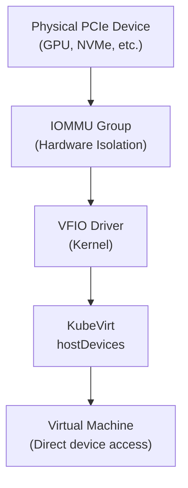

# How to Configure Harvester PCI Passthrough

Author: [nawazdhandala](https://www.github.com/nawazdhandala)

Tags: Harvester, Kubernetes, Virtualization, HCI, PCI Passthrough, GPU, IOMMU

Description: Learn how to configure PCI passthrough in Harvester to give virtual machines direct access to physical PCIe devices like GPUs, NVMe controllers, and network cards.

## Introduction

PCI passthrough allows a virtual machine to directly own and use a physical PCIe device - bypassing the hypervisor and achieving near-native device performance. Common use cases include assigning NVIDIA/AMD GPUs for AI/ML workloads, NVMe storage controllers for ultra-low latency, and specialized networking cards. In Harvester, PCI passthrough is implemented through VFIO (Virtual Function I/O) and KubeVirt's `hostDevices` feature.

## How PCI Passthrough Works



**Important limitations:**
- A VM with PCI passthrough devices CANNOT be live migrated
- The device is exclusively owned by the VM (no sharing)
- The host OS loses access to the passed-through device

## Prerequisites

- Server with PCIe device to pass through
- IOMMU enabled in BIOS/UEFI (Intel VT-d or AMD IOMMU)
- IOMMU groups properly isolated
- Harvester with KubeVirt configured for passthrough

## Step 1: Enable IOMMU on Harvester Nodes

```bash
# SSH into a Harvester node

ssh rancher@192.168.1.11

# Check if IOMMU is already enabled
dmesg | grep -e DMAR -e IOMMU

# Enable IOMMU in kernel parameters
sudo vi /etc/default/grub

# For Intel:
# GRUB_CMDLINE_LINUX_DEFAULT="quiet splash intel_iommu=on iommu=pt"
# For AMD:
# GRUB_CMDLINE_LINUX_DEFAULT="quiet splash amd_iommu=on iommu=pt"

# The 'iommu=pt' (pass-through mode) option improves DMA performance

# Apply the GRUB configuration
sudo grub2-mkconfig -o /boot/grub2/grub.cfg
sudo reboot

# After reboot, verify IOMMU is active
dmesg | grep -e DMAR -e IOMMU | grep -i "enabled"
```

## Step 2: Identify PCI Devices and IOMMU Groups

```bash
# List all PCIe devices with PCI IDs
lspci -nnk

# Example GPU output:
# 01:00.0 VGA compatible controller [0300]: NVIDIA Corporation GA102 [RTX 3090] [10de:2204] (rev a1)
# 01:00.1 Audio device [0403]: NVIDIA Corporation GA102 High Definition Audio [10de:1aef]

# Script to list all IOMMU groups (important for isolating devices)
#!/bin/bash
for d in /sys/kernel/iommu_groups/*/devices/*; do
    n=${d#*/iommu_groups/*}; n=${n%%/*}
    printf 'IOMMU Group %s ' "$n"
    lspci -nns "${d##*/}"
done

# All devices in the same IOMMU group MUST be passed through together
# This is the "IOMMU group" constraint
```

## Step 3: Bind the Device to VFIO

```bash
# Get the PCI ID of the device to pass through
# Example: GPU at 01:00.0 with vendor/device ID 10de:2204
GPU_PCI_ID="01:00.0"
VENDOR_DEVICE="10de 2204"  # Separated by space

# Load VFIO modules
sudo modprobe vfio
sudo modprobe vfio-pci
sudo modprobe vfio_iommu_type1

# Make modules persistent
echo "vfio" >> /etc/modules-load.d/vfio.conf
echo "vfio-pci" >> /etc/modules-load.d/vfio.conf

# Unbind the device from its current driver
DRIVER=$(lspci -k -s ${GPU_PCI_ID} | grep "Kernel driver" | awk '{print $NF}')
echo "Current driver: ${DRIVER}"
echo "${GPU_PCI_ID}" > /sys/bus/pci/drivers/${DRIVER}/unbind

# Bind to VFIO
echo "${VENDOR_DEVICE}" > /sys/bus/pci/drivers/vfio-pci/new_id
echo "${GPU_PCI_ID}" > /sys/bus/pci/drivers/vfio-pci/bind

# Verify the VFIO binding
lspci -k -s ${GPU_PCI_ID} | grep "Kernel driver"
# Expected: Kernel driver in use: vfio-pci

# Make the binding persistent across reboots
cat > /etc/modprobe.d/vfio-pci.conf << EOF
# Bind NVIDIA GPU to VFIO
options vfio-pci ids=${VENDOR_DEVICE/ /,}
EOF
```

## Step 4: Configure KubeVirt for PCI Passthrough

```yaml
# kubevirt-passthrough-config.yaml
# Enable PCI passthrough in KubeVirt

apiVersion: kubevirt.io/v1
kind: KubeVirt
metadata:
  name: kubevirt
  namespace: harvester-system
spec:
  configuration:
    developerConfiguration:
      # Enable use of physical resources
      featureGates:
        - "GPU"
        - "HostDevices"
    # Configure permitted host devices
    permittedHostDevices:
      pciHostDevices:
        # NVIDIA RTX 3090 GPU
        - pciVendorSelector: "10de:2204"
          resourceName: "nvidia.com/GA102"
          externalResourceProvider: false
        # NVIDIA Audio (must include all devices in IOMMU group)
        - pciVendorSelector: "10de:1aef"
          resourceName: "nvidia.com/GA102-audio"
          externalResourceProvider: false
```

```bash
kubectl apply -f kubevirt-passthrough-config.yaml

# Verify the resource is now available on the node
kubectl get node harvester-node-01 \
    -o jsonpath='{.status.allocatable}' | jq 'with_entries(select(.key | contains("nvidia")))'
```

## Step 5: Create a VM with PCI Passthrough

```yaml
# vm-with-gpu.yaml
# VM with NVIDIA GPU passthrough for AI/ML workloads

apiVersion: kubevirt.io/v1
kind: VirtualMachine
metadata:
  name: gpu-vm-01
  namespace: default
  labels:
    workload: ai-ml
spec:
  running: true
  template:
    spec:
      domain:
        cpu:
          cores: 16
          # CPU pinning recommended with GPU passthrough
          dedicatedCpuPlacement: true
        resources:
          requests:
            memory: 64Gi
            cpu: "16"
            # Request the GPU resource
            nvidia.com/GA102: "1"
            nvidia.com/GA102-audio: "1"
          limits:
            memory: 64Gi
            cpu: "16"
            nvidia.com/GA102: "1"
            nvidia.com/GA102-audio: "1"
        machine:
          type: q35
        devices:
          # Host devices (PCI passthrough)
          hostDevices:
            - name: gpu
              deviceName: nvidia.com/GA102
            - name: gpu-audio
              deviceName: nvidia.com/GA102-audio
          disks:
            - name: rootdisk
              bootOrder: 1
              disk:
                bus: virtio
            - name: cloudinit
              disk:
                bus: virtio
          interfaces:
            - name: default
              model: virtio
              masquerade: {}
      networks:
        - name: default
          pod: {}
      volumes:
        - name: rootdisk
          persistentVolumeClaim:
            claimName: gpu-vm-01-root
        - name: cloudinit
          cloudInitNoCloud:
            userData: |
              #cloud-config
              users:
                - name: ubuntu
                  sudo: ALL=(ALL) NOPASSWD:ALL
                  ssh_authorized_keys:
                    - ssh-ed25519 AAAAC3NzaC1... admin@host
              runcmd:
                - systemctl enable --now qemu-guest-agent
```

## Step 6: Install NVIDIA Drivers in the VM

```bash
# SSH into the GPU VM
ssh ubuntu@<vm-ip>

# Install NVIDIA drivers (Ubuntu 22.04)
sudo apt-get update
sudo apt-get install -y ubuntu-drivers-common
sudo ubuntu-drivers autoinstall

# Or install a specific driver version
sudo apt-get install -y nvidia-driver-535

# Reboot
sudo reboot

# After reboot, verify GPU is detected
nvidia-smi

# Expected output shows GPU details, driver version, and CUDA version
# NVIDIA-SMI 535.x.x
# GPU Name: NVIDIA GeForce RTX 3090
# Memory: 24576 MiB
```

## Step 7: Verify PCI Passthrough

```bash
# Inside the VM, verify the GPU is visible
lspci | grep -i nvidia

# Check GPU details with nvidia-smi
nvidia-smi

# Run a quick CUDA test
# Install nvidia-cuda-toolkit if needed
sudo apt-get install -y nvidia-cuda-toolkit
nvcc --version

# Test CUDA with a simple program
cat > test_cuda.cu << 'EOF'
#include <stdio.h>
int main() {
    int count;
    cudaGetDeviceCount(&count);
    printf("CUDA devices: %d\n", count);
    return 0;
}
EOF
nvcc test_cuda.cu -o test_cuda && ./test_cuda
```

## Conclusion

PCI passthrough in Harvester unlocks the full performance of physical PCIe devices for virtual machines. For AI/ML workloads requiring GPU acceleration, high-frequency trading requiring ultra-low latency NICs, or database workloads requiring NVMe performance, passthrough is the solution. The key requirements are IOMMU support in both the CPU/chipset and BIOS, proper VFIO binding, and KubeVirt configuration. While passthrough prevents live migration, the performance benefits often far outweigh this limitation for specialized workloads.
