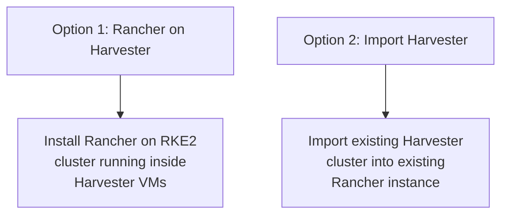

# How to Integrate Harvester with Rancher

Author: [nawazdhandala](https://www.github.com/nawazdhandala)

Tags: Harvester, Kubernetes, Rancher, Virtualization, HCI, Integration

Description: A complete guide to integrating Harvester HCI with Rancher for unified management of virtual machines and Kubernetes clusters.

## Introduction

Integrating Harvester with Rancher unlocks a unified management experience where you can manage both virtual machines (through Harvester) and Kubernetes clusters (through Rancher) from a single control plane. Rancher can be installed directly on Harvester VMs, or an existing Rancher instance can import Harvester as a managed cluster. This guide covers both approaches.

## Integration Approaches



Both approaches end with the same result: Rancher managing Harvester, and the ability to provision Kubernetes clusters on Harvester infrastructure.

## Option 1: Install Rancher on Harvester

This is the recommended approach for new deployments.

### Step 1: Create a Dedicated RKE2 Cluster for Rancher

First, create a 3-node RKE2 cluster inside Harvester:

```bash
# Create 3 VMs for Rancher

for i in 1 2 3; do
kubectl apply -f - <<EOF
apiVersion: kubevirt.io/v1
kind: VirtualMachine
metadata:
  name: rancher-node-0${i}
  namespace: default
spec:
  running: true
  template:
    spec:
      domain:
        cpu:
          cores: 4
        resources:
          requests:
            memory: 8Gi
        machine:
          type: q35
        devices:
          disks:
            - name: rootdisk
              bootOrder: 1
              disk:
                bus: virtio
            - name: cloudinit
              disk:
                bus: virtio
          interfaces:
            - name: default
              masquerade: {}
      networks:
        - name: default
          pod: {}
      volumes:
        - name: rootdisk
          persistentVolumeClaim:
            claimName: rancher-node-0${i}-root
        - name: cloudinit
          cloudInitNoCloud:
            userData: |
              #cloud-config
              hostname: rancher-node-0${i}
              users:
                - name: ubuntu
                  sudo: ALL=(ALL) NOPASSWD:ALL
                  ssh_authorized_keys:
                    - ssh-ed25519 AAAAC3... admin@host
              packages:
                - qemu-guest-agent
              runcmd:
                - systemctl enable --now qemu-guest-agent
EOF
done
```

### Step 2: Bootstrap RKE2 on the VMs

```bash
# On rancher-node-01 (first node)
curl -sfL https://get.rke2.io | INSTALL_RKE2_VERSION=v1.27.9+rke2r1 sh -

# Configure RKE2 server
mkdir -p /etc/rancher/rke2
cat > /etc/rancher/rke2/config.yaml <<EOF
token: my-rancher-cluster-token
tls-san:
  - 192.168.1.200  # VIP for Rancher cluster
  - rancher.company.com
EOF

systemctl enable --now rke2-server

# On rancher-node-02 and rancher-node-03 (join nodes)
cat > /etc/rancher/rke2/config.yaml <<EOF
server: https://192.168.1.101:9345
token: my-rancher-cluster-token
EOF

systemctl enable --now rke2-server
```

### Step 3: Install cert-manager and Rancher

```bash
# Set kubeconfig for the Rancher cluster
export KUBECONFIG=/etc/rancher/rke2/rke2.yaml

# Install cert-manager
kubectl apply -f https://github.com/cert-manager/cert-manager/releases/download/v1.13.2/cert-manager.crds.yaml

helm repo add jetstack https://charts.jetstack.io
helm repo update

helm install cert-manager jetstack/cert-manager \
    --namespace cert-manager \
    --create-namespace \
    --version v1.13.2

# Wait for cert-manager to be ready
kubectl wait deployment cert-manager -n cert-manager \
    --for=condition=available --timeout=300s

# Add the Rancher Helm repository
helm repo add rancher-stable https://releases.rancher.com/server-charts/stable
helm repo update

# Install Rancher
helm install rancher rancher-stable/rancher \
    --namespace cattle-system \
    --create-namespace \
    --set hostname=rancher.company.com \
    --set replicas=3 \
    --set bootstrapPassword=InitialPassword123!

# Wait for Rancher to be fully deployed
kubectl wait deployment rancher -n cattle-system \
    --for=condition=available --timeout=600s
```

### Step 4: Configure Rancher to Manage Harvester

Once Rancher is running, import the Harvester cluster:

```bash
# In the Rancher UI:
# 1. Navigate to Cluster Management
# 2. Click Import Existing
# 3. Select Harvester
# 4. Give it a name (e.g., "local-harvester")
# 5. Copy the import command shown by Rancher

# The import command looks like:
kubectl apply -f https://rancher.company.com/v3/import/XXXXX.yaml
```

## Option 2: Import Existing Harvester into Existing Rancher

If you already have both Rancher and Harvester running:

### Step 1: Generate Import Manifest in Rancher

1. In Rancher, navigate to **Cluster Management**
2. Click **Import Existing**
3. Select **Harvester**
4. Enter a cluster name
5. Copy the generated kubectl command

### Step 2: Apply the Import Manifest on Harvester

```bash
# SSH into a Harvester node
ssh rancher@192.168.1.11

# Set kubeconfig
export KUBECONFIG=/etc/rancher/rke2/rke2.yaml

# Apply the Rancher import manifest
# (Replace with the actual URL from step 1)
kubectl apply -f https://rancher.company.com/v3/import/XXXXX.yaml

# Wait for the cattle-cluster-agent to connect to Rancher
kubectl get pods -n cattle-system -w
```

### Step 3: Verify the Integration

After the import:

```bash
# In Rancher, the Harvester cluster should appear in Cluster Management
# Status should show "Active"

# Verify from the Harvester side
kubectl get pods -n cattle-system
# All pods should be Running

# Check the Rancher cluster agent is connected
kubectl get deployment cattle-cluster-agent -n cattle-system
```

## Post-Integration Configuration

### Configure the Harvester Cloud Provider

Enable the Harvester cloud provider for RKE2/K3s clusters:

```yaml
# In Rancher cluster provisioning, add to the cluster config:
spec:
  rkeConfig:
    chartValues:
      harvester-cloud-provider:
        cloudConfigPath: /etc/kubernetes/cloud-config
        clusterName: harvester-infra
```

### Set Up VM Images in Rancher

After integration, VM images in Harvester are accessible from Rancher's cluster provisioning:

1. Navigate to the Harvester cluster in Rancher
2. Go to **Virtualization Management** → **Images**
3. Images are synchronized from Harvester automatically

## Troubleshooting Integration Issues

```bash
# Rancher agent can't connect to Rancher:
# Check network connectivity from Harvester node to Rancher
curl -k https://rancher.company.com/ping

# Check cluster agent logs
kubectl logs -n cattle-system \
    $(kubectl get pods -n cattle-system -l app=cattle-cluster-agent -o name)

# Certificate issues:
# If using self-signed certs, add the CA to Harvester nodes
# Or use Rancher's built-in CA and configure trust on Harvester
```

## Conclusion

Integrating Harvester with Rancher creates a powerful unified management platform for your entire infrastructure. From a single Rancher interface, you can manage VMs through Harvester, provision Kubernetes clusters on VM infrastructure, apply policies across all clusters, and gain unified monitoring and alerting. This integration is particularly valuable for organizations running both legacy VM workloads and modern containerized applications - it enables a gradual migration path while maintaining operational visibility across both paradigms.
