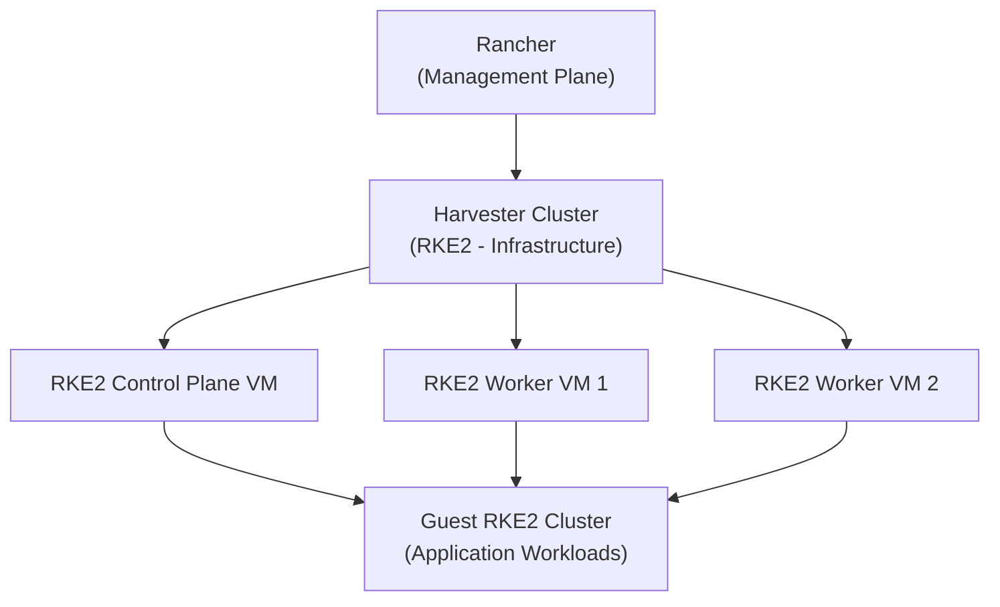

# How to Create RKE2 Clusters on Harvester

Author: [nawazdhandala](https://www.github.com/nawazdhandala)

Tags: Harvester, Kubernetes, RKE2, Rancher, Virtualization, HCI

Description: A guide to provisioning RKE2 Kubernetes clusters on Harvester virtual machines using Rancher's cluster provisioning capabilities.

## Introduction

Harvester can serve as the infrastructure provider for Kubernetes clusters, allowing you to provision RKE2 clusters that run as VMs on your HCI platform. This creates a "nested Kubernetes" architecture where Harvester (running RKE2 internally) hosts guest RKE2 clusters for application workloads. Rancher provides the management plane for this configuration through its Harvester node driver.

## Architecture Overview



## Prerequisites

- A running Harvester cluster integrated with Rancher
- Rancher 2.7+ with the Harvester node driver enabled
- VM images uploaded to Harvester (Ubuntu 22.04 or Rocky Linux 9 recommended)
- Sufficient Harvester cluster resources for the guest VMs
- A VM network configured in Harvester for the guest cluster

## Step 1: Configure Rancher Integration

First, ensure Harvester is imported into Rancher:

1. In Rancher, navigate to **Cluster Management**
2. Find your Harvester cluster listed as an imported cluster
3. If not imported, see the Rancher-Harvester integration guide

## Step 2: Create a Cloud Credential for Harvester

In Rancher:

1. Go to **Cluster Management** → **Cloud Credentials**
2. Click **Create**
3. Select **Harvester**
4. Fill in:

```
Name:               harvester-infra-creds
Harvester Cluster:  [Select your Harvester cluster]
```

5. Click **Create**

## Step 3: Create an RKE2 Cluster via Rancher UI

1. Navigate to **Cluster Management** → **Clusters**
2. Click **Create**
3. Select **RKE2/K3s**
4. Select **Harvester** as the infrastructure provider

### Configure the Cluster

```
Cluster Name:       production-rke2
Kubernetes Version: v1.27.x (latest stable)
CNI:                Canal
```

### Configure Node Pools

**Control Plane Pool:**
```
Machine Count:      3 (for HA)
Node Roles:         etcd, Control Plane
VM CPU:             4 cores
VM Memory:          8 GB
VM Image:           ubuntu-22-04-lts
VM Network:         default/vlan-100
VM Disk Size:       50 GB
```

**Worker Pool:**
```
Machine Count:      3
Node Roles:         Worker
VM CPU:             8 cores
VM Memory:          16 GB
VM Image:           ubuntu-22-04-lts
VM Network:         default/vlan-100
VM Disk Size:       100 GB
```

4. Click **Create** — Rancher will provision the VMs in Harvester and bootstrap RKE2

## Step 4: Create an RKE2 Cluster via Rancher API

For GitOps-friendly cluster creation, use the Rancher API:

```yaml
# rke2-harvester-cluster.yaml
# Provision an RKE2 cluster on Harvester via Rancher API

apiVersion: provisioning.cattle.io/v1
kind: Cluster
metadata:
  name: production-rke2
  namespace: fleet-default
  annotations:
    field.cattle.io/description: "Production RKE2 cluster on Harvester"
spec:
  rkeConfig:
    # Machine pools definition
    machinePools:
      # Control plane pool
      - name: control-plane
        quantity: 3
        etcdRole: true
        controlPlaneRole: true
        workerRole: false
        machineConfigRef:
          kind: HarvesterConfig
          name: cp-harvester-config
      # Worker pool
      - name: workers
        quantity: 3
        etcdRole: false
        controlPlaneRole: false
        workerRole: true
        machineConfigRef:
          kind: HarvesterConfig
          name: worker-harvester-config
    # RKE2 upgrade strategy
    upgradeStrategy:
      controlPlaneDrainOptions:
        enabled: true
        deleteEmptyDirData: true
        ignoreDaemonSets: true
      workerDrainOptions:
        enabled: true
        deleteEmptyDirData: true
        ignoreDaemonSets: true
  # Kubernetes version
  kubernetesVersion: "v1.27.9+rke2r1"
  # Enable network policy
  networkConfig:
    plugin: canal
```

```yaml
# cp-harvester-config.yaml
# Harvester VM configuration for control plane nodes

apiVersion: rke-machine-config.cattle.io/v1
kind: HarvesterConfig
metadata:
  name: cp-harvester-config
  namespace: fleet-default
spec:
  # Harvester cluster name
  clusterName: local
  # Harvester namespace
  namespace: default
  # VM image
  imageName: default/ubuntu-22-04-lts
  # VM network
  networkName: default/vlan-100
  # VM resources
  cpuCount: "4"
  memorySize: "8"  # GB
  # VM disk
  diskSize: "50"  # GB
  diskStorageClassName: longhorn
  # SSH credentials
  sshUser: ubuntu
  vmAffinity: ""
  # Cloud-init user data
  userData: |
    #cloud-config
    package_update: true
    packages:
      - qemu-guest-agent
    runcmd:
      - systemctl enable --now qemu-guest-agent
```

```yaml
# worker-harvester-config.yaml
apiVersion: rke-machine-config.cattle.io/v1
kind: HarvesterConfig
metadata:
  name: worker-harvester-config
  namespace: fleet-default
spec:
  clusterName: local
  namespace: default
  imageName: default/ubuntu-22-04-lts
  networkName: default/vlan-100
  cpuCount: "8"
  memorySize: "16"
  diskSize: "100"
  diskStorageClassName: longhorn
  sshUser: ubuntu
  userData: |
    #cloud-config
    package_update: true
    packages:
      - qemu-guest-agent
    runcmd:
      - systemctl enable --now qemu-guest-agent
```

```bash
kubectl apply -f cp-harvester-config.yaml
kubectl apply -f worker-harvester-config.yaml
kubectl apply -f rke2-harvester-cluster.yaml

# Watch cluster provisioning
kubectl get cluster production-rke2 -n fleet-default -w
```

## Step 5: Monitor Cluster Provisioning

```bash
# In Rancher, watch the cluster come up
kubectl get machines -n fleet-default

# Check individual machine status
kubectl describe machine -n fleet-default | grep -E "Name:|State:|Provisioned:"

# Once provisioned, verify the guest cluster
# Get the kubeconfig for the new cluster from Rancher
kubectl get secret production-rke2-kubeconfig -n fleet-default \
    -o jsonpath='{.data.value}' | base64 -d > production-rke2.kubeconfig

# Connect to the guest cluster
export KUBECONFIG=production-rke2.kubeconfig
kubectl get nodes
```

## Step 6: Configure Storage for the Guest Cluster

The guest RKE2 cluster needs a storage class. Since it's running on Harvester, use the Harvester CSI driver:

```bash
# In the guest cluster, verify Harvester CSI is installed
kubectl get storageclass

# The harvester storage class should be present
# Create a test PVC to verify
kubectl apply -f - <<EOF
apiVersion: v1
kind: PersistentVolumeClaim
metadata:
  name: test-pvc
spec:
  accessModes:
    - ReadWriteOnce
  storageClassName: harvester
  resources:
    requests:
      storage: 10Gi
EOF

kubectl get pvc test-pvc
```

## Conclusion

Running RKE2 clusters on Harvester creates a powerful, flexible infrastructure where VM-based Kubernetes clusters can be provisioned and managed programmatically through Rancher. This architecture is ideal for environments that need to support multiple isolated Kubernetes clusters while maintaining central visibility and management through Rancher. The VM-based approach provides strong workload isolation, independent upgrade paths, and the ability to right-size each cluster for its specific workload requirements.
