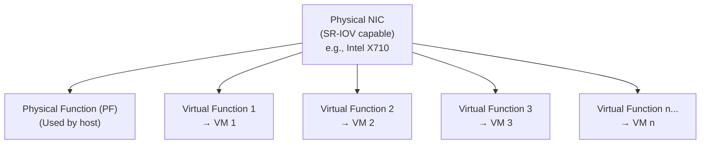

# How to Configure Harvester SR-IOV for Network Performance

Author: [nawazdhandala](https://www.github.com/nawazdhandala)

Tags: Harvester, Kubernetes, Virtualization, HCI, SR-IOV, Networking, Performance

Description: Learn how to configure SR-IOV (Single Root I/O Virtualization) in Harvester for high-performance, low-latency VM networking.

## Introduction

SR-IOV (Single Root I/O Virtualization) allows a single physical NIC to be partitioned into multiple virtual functions (VFs), each of which can be assigned directly to a VM. This bypasses the software networking stack, providing near-bare-metal network performance with very low latency and CPU overhead. SR-IOV is ideal for VMs running network-intensive workloads like NFV (Network Functions Virtualization), high-performance databases, or trading systems.

## SR-IOV Architecture



**Benefits:**
- Near-wire-speed performance (10/25/40/100 Gbps)
- Sub-microsecond latency
- Minimal CPU overhead (DMA bypasses hypervisor)
- Hardware-based VLAN and QoS

**Limitations:**
- VMs with SR-IOV devices CANNOT be live migrated
- Requires SR-IOV capable hardware
- Requires IOMMU enabled in BIOS/UEFI

## Prerequisites

- SR-IOV capable NIC (Intel X710, Mellanox ConnectX-4/5/6, etc.)
- IOMMU enabled in BIOS/UEFI (VT-d for Intel, AMD-Vi for AMD)
- SR-IOV feature enabled on the NIC
- Harvester nodes with the SR-IOV CNI plugin

## Step 1: Enable IOMMU in BIOS/UEFI

In the server BIOS/UEFI:
- Intel: Enable **VT-d** (Intel Virtualization Technology for Directed I/O)
- AMD: Enable **AMD-Vi** or **IOMMU**

## Step 2: Enable IOMMU in the Kernel

```bash
# SSH into a Harvester node
ssh rancher@192.168.1.11

# Check if IOMMU is enabled
dmesg | grep -i iommu

# If not enabled, add to kernel parameters
sudo vi /etc/default/grub

# For Intel CPUs:
# GRUB_CMDLINE_LINUX="intel_iommu=on iommu=pt"
# For AMD CPUs:
# GRUB_CMDLINE_LINUX="amd_iommu=on iommu=pt"

# Regenerate GRUB config
sudo grub2-mkconfig -o /boot/grub2/grub.cfg

# Reboot the node
sudo reboot
```

## Step 3: Enable SR-IOV on the Physical NIC

```bash
# Find the SR-IOV capable NIC
lspci | grep -i ethernet

# Check if the NIC supports SR-IOV
lspci -v | grep "SR-IOV"

# Enable virtual functions (VFs) on the NIC
# Replace ethX with your NIC name
# Enable 16 VFs
echo 16 > /sys/class/net/eth1/device/sriov_numvfs

# Verify VFs were created
lspci | grep "Virtual Function"
ip link show eth1

# Make the VF count persistent across reboots
# Create a udev rule or systemd service:
cat > /etc/systemd/system/sriov-vfs.service << 'EOF'
[Unit]
Description=Enable SR-IOV Virtual Functions
After=network.target

[Service]
Type=oneshot
ExecStart=/bin/bash -c 'echo 16 > /sys/class/net/eth1/device/sriov_numvfs'
RemainAfterExit=yes

[Install]
WantedBy=multi-user.target
EOF

systemctl enable sriov-vfs.service
```

## Step 4: Install the SR-IOV CNI Plugin

Harvester needs the SR-IOV CNI plugin to manage VF allocation:

```bash
# Check if SR-IOV CNI is already installed
kubectl get pods -n harvester-system | grep sriov

# If not installed, apply the SR-IOV CNI
kubectl apply -f https://raw.githubusercontent.com/k8snetworkplumbingwg/sriov-cni/master/images/k8s-v1.16/sriov-cni-daemonset.yaml

# Install the SR-IOV Network Device Plugin
kubectl apply -f https://raw.githubusercontent.com/k8snetworkplumbingwg/sriov-network-device-plugin/master/deployments/sriovdp-daemonset.yaml
```

## Step 5: Create a SR-IOV ConfigMap

Configure the device plugin to manage the SR-IOV VFs:

```yaml
# sriov-dp-config.yaml
# SR-IOV device plugin configuration

apiVersion: v1
kind: ConfigMap
metadata:
  name: sriovdp-config
  namespace: kube-system
data:
  config.json: |
    {
      "resourceList": [
        {
          "resourceName": "intel_sriov_netdevice",
          "resourcePrefix": "intel.com",
          "selectors": {
            "vendors": ["8086"],
            "devices": ["158b"],
            "drivers": ["i40evf"],
            "pfNames": ["eth1"]
          }
        }
      ]
    }
```

```bash
kubectl apply -f sriov-dp-config.yaml

# Restart the device plugin to pick up new config
kubectl rollout restart daemonset sriov-device-plugin -n kube-system

# Verify VFs are advertised as node resources
kubectl get node harvester-node-01 \
    -o jsonpath='{.status.allocatable}' | jq 'with_entries(select(.key | contains("intel")))'
```

## Step 6: Create a SR-IOV NetworkAttachmentDefinition

```yaml
# sriov-net.yaml
# Network attachment definition for SR-IOV VFs

apiVersion: k8s.cni.cncf.io/v1
kind: NetworkAttachmentDefinition
metadata:
  name: sriov-net-100
  namespace: default
  annotations:
    k8s.v1.cni.cncf.io/resourceName: intel.com/intel_sriov_netdevice
spec:
  config: |
    {
      "type": "sriov",
      "cniVersion": "0.3.1",
      "name": "sriov-net-100",
      "vlan": 100,
      "ipam": {
        "type": "whereabouts",
        "range": "10.100.0.0/24",
        "exclude": ["10.100.0.1/32"]
      }
    }
```

```bash
kubectl apply -f sriov-net.yaml
```

## Step 7: Create a VM with SR-IOV Interface

```yaml
# vm-with-sriov.yaml
# VM using SR-IOV for high-performance networking

apiVersion: kubevirt.io/v1
kind: VirtualMachine
metadata:
  name: hpc-vm-01
  namespace: default
spec:
  running: true
  template:
    spec:
      domain:
        cpu:
          cores: 8
          # CPU pinning for consistent performance alongside SR-IOV
          dedicatedCpuPlacement: true
        resources:
          requests:
            memory: 16Gi
            cpu: "8"
            # Request an SR-IOV VF
            intel.com/intel_sriov_netdevice: "1"
          limits:
            memory: 16Gi
            cpu: "8"
            intel.com/intel_sriov_netdevice: "1"
        machine:
          type: q35
        devices:
          # Standard management interface
          interfaces:
            - name: default
              model: virtio
              masquerade: {}
            # SR-IOV interface - passes VF directly to VM
            - name: sriov-net
              model: virtio
              sriov: {}
          disks:
            - name: rootdisk
              bootOrder: 1
              disk:
                bus: virtio
      networks:
        - name: default
          pod: {}
        - name: sriov-net
          multus:
            networkName: default/sriov-net-100
      volumes:
        - name: rootdisk
          persistentVolumeClaim:
            claimName: hpc-vm-01-root
```

**Important Note:** VMs with SR-IOV devices cannot be live migrated. The VM must be stopped and restarted (cold migration) to move it between nodes.

## Step 8: Verify SR-IOV Performance

```bash
# SSH into the VM and check the SR-IOV interface
ip addr show
ethtool enp2s0  # Should show the VF interface

# Run a network performance test
# Install iperf3 on both the VM and a test machine
iperf3 -s  # On the server side
iperf3 -c <server-ip> -P 4 -t 60  # On the client side

# Expected results with SR-IOV vs virtio:
# virtio:   ~8-12 Gbps on 10 GbE
# SR-IOV:   ~9.8-10 Gbps on 10 GbE (near wire speed)
# Latency:  virtio ~100-300μs vs SR-IOV ~5-20μs
```

## Conclusion

SR-IOV configuration in Harvester provides a path to near-bare-metal network performance for VMs that need it. The trade-off is the loss of live migration capability, which means SR-IOV is best reserved for workloads where raw network performance is more critical than operational flexibility. For most general-purpose workloads, virtio networking provides excellent performance without the complexity and migration limitations of SR-IOV. Consider SR-IOV for NFV workloads, high-performance databases, real-time applications, and HPC clusters where every microsecond of latency matters.
