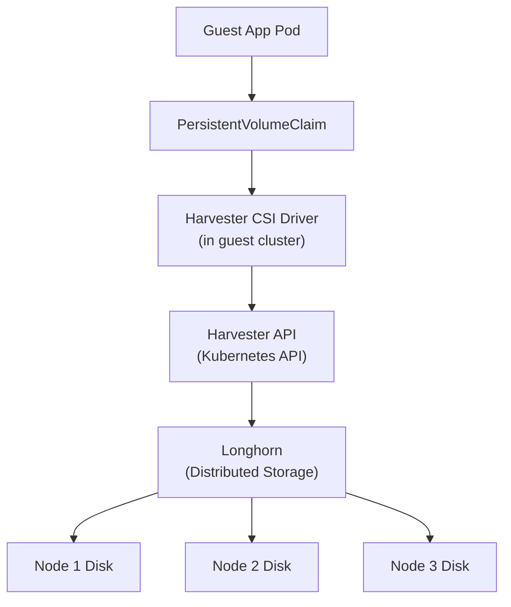

# How to Set Up Harvester Storage for Kubernetes

Author: [nawazdhandala](https://www.github.com/nawazdhandala)

Tags: Harvester, Kubernetes, Virtualization, HCI, Storage, Longhorn, CSI

Description: Learn how to configure Harvester's built-in Longhorn storage for use by guest Kubernetes clusters through the Harvester CSI driver.

## Introduction

Guest Kubernetes clusters running on Harvester VMs can leverage Harvester's built-in Longhorn storage for persistent volumes through the Harvester CSI (Container Storage Interface) driver. This integration means applications in guest clusters can dynamically provision persistent volumes that are backed by Longhorn's distributed, replicated storage — without needing to deploy a separate storage solution.

## Architecture



When a PVC is created in the guest cluster, the CSI driver calls the Harvester API to create a Longhorn volume and attach it to the appropriate VM.

## Prerequisites

- Harvester cluster running with Longhorn storage
- A guest Kubernetes cluster (RKE2 or K3s) running on Harvester VMs
- The guest cluster's VMs must have the `open-iscsi` package installed (required for Longhorn iSCSI)
- Harvester cluster API access from the guest cluster (network connectivity)

## Step 1: Prepare Guest VM Nodes

Guest cluster nodes need iSCSI support for Longhorn volume attachment:

```bash
# Add to cloud-init for guest cluster nodes
# This ensures iSCSI is available when nodes boot

#cloud-config
packages:
  - open-iscsi
  - nfs-common  # For NFS volumes if needed

runcmd:
  # Enable and start the iSCSI initiator
  - systemctl enable --now iscsid
  # Load the iSCSI TCP kernel module
  - modprobe iscsi_tcp
  # Persist the module load
  - echo 'iscsi_tcp' >> /etc/modules-load.d/iscsi.conf
```

## Step 2: Create the Harvester CSI Secret in the Guest Cluster

The CSI driver needs credentials to communicate with the Harvester API:

```bash
# On the Harvester cluster (not the guest cluster)
# Get the Harvester kubeconfig
export KUBECONFIG=/etc/rancher/rke2/rke2.yaml
cat /etc/rancher/rke2/rke2.yaml > /tmp/harvester.kubeconfig

# Modify the server URL in the kubeconfig to use the cluster VIP
# (must be reachable from inside the guest VMs)
sed -i 's|server: https://127.0.0.1:6443|server: https://192.168.1.100:6443|' \
    /tmp/harvester.kubeconfig

# Now switch to the guest cluster
export KUBECONFIG=/path/to/guest-cluster.kubeconfig

# Create the namespace and secret for the CSI driver
kubectl create namespace harvester-system

kubectl create secret generic harvester-csi-controller-sa \
    --from-file=kubeconfig=/tmp/harvester.kubeconfig \
    -n harvester-system

# Verify the secret
kubectl get secret harvester-csi-controller-sa -n harvester-system
```

## Step 3: Install the Harvester CSI Driver

```bash
# In the guest cluster:
export KUBECONFIG=/path/to/guest-cluster.kubeconfig

# Add the Harvester Helm repository
helm repo add harvester https://charts.harvesterhci.io/
helm repo update

# Install the CSI driver
helm install harvester-csi-driver harvester/harvester-csi-driver \
    --namespace harvester-system \
    --set cloudConfigPath=/etc/kubernetes/cloud-config

# Verify the CSI driver pods are running
kubectl get pods -n harvester-system

# Expected pods:
# harvester-csi-controller-xxxxx   Running
# harvester-csi-node-xxxxx (on each worker node)  Running
```

## Step 4: Verify the StorageClass

After installing the CSI driver, a `harvester` StorageClass is created:

```bash
# Check available storage classes
kubectl get storageclass

# Expected output:
# NAME         PROVISIONER                       RECLAIMPOLICY  VOLUMEBINDINGMODE
# harvester    driver.harvesterhci.io            Delete         Immediate
# (default)    rancher.io/local-path             Delete         WaitForFirstConsumer

# Make harvester the default storage class if desired
kubectl patch storageclass harvester \
    -p '{"metadata": {"annotations": {"storageclass.kubernetes.io/is-default-class": "true"}}}'

# Verify the change
kubectl get storageclass
```

## Step 5: Test Persistent Volume Provisioning

```yaml
# test-pvc.yaml
# Test PVC using the Harvester storage class

apiVersion: v1
kind: PersistentVolumeClaim
metadata:
  name: test-harvester-pvc
  namespace: default
spec:
  accessModes:
    - ReadWriteOnce
  storageClassName: harvester
  resources:
    requests:
      storage: 10Gi
```

```bash
kubectl apply -f test-pvc.yaml

# Watch the PVC get bound
kubectl get pvc test-harvester-pvc -w

# It should quickly move to Bound state:
# NAME                  STATUS   VOLUME   CAPACITY   ACCESS MODES   STORAGECLASS
# test-harvester-pvc    Bound    pvc-xxx  10Gi       RWO            harvester

# Verify the volume was created in Harvester
# (on the Harvester cluster)
kubectl get pvc -n default | grep guest-cluster
```

## Step 6: Deploy a Stateful Application

Test with a real stateful workload:

```yaml
# postgres-with-harvester-storage.yaml
# PostgreSQL with Harvester-backed storage

apiVersion: apps/v1
kind: StatefulSet
metadata:
  name: postgres
  namespace: production
spec:
  serviceName: postgres
  replicas: 1
  selector:
    matchLabels:
      app: postgres
  template:
    metadata:
      labels:
        app: postgres
    spec:
      containers:
        - name: postgres
          image: postgres:15
          env:
            - name: POSTGRES_PASSWORD
              valueFrom:
                secretKeyRef:
                  name: postgres-secret
                  key: password
            - name: PGDATA
              value: /var/lib/postgresql/data/pgdata
          ports:
            - containerPort: 5432
          volumeMounts:
            - name: postgres-data
              mountPath: /var/lib/postgresql/data
  volumeClaimTemplates:
    - metadata:
        name: postgres-data
      spec:
        accessModes:
          - ReadWriteOnce
        # Use Harvester storage class
        storageClassName: harvester
        resources:
          requests:
            storage: 50Gi
```

```bash
kubectl apply -f postgres-with-harvester-storage.yaml

# Watch the pod start
kubectl get pod -n production -l app=postgres -w

# Verify the PVC was created and bound
kubectl get pvc -n production

# Check that the volume exists in Harvester
# (on the Harvester cluster)
kubectl get volumes.longhorn.io -n longhorn-system | grep postgres
```

## Step 7: Configure Volume Snapshots

Enable Kubernetes volume snapshots backed by Longhorn:

```bash
# Install the snapshot CRDs and controller
kubectl apply -f https://raw.githubusercontent.com/kubernetes-csi/external-snapshotter/main/client/config/crd/snapshot.storage.k8s.io_volumesnapshotclasses.yaml
kubectl apply -f https://raw.githubusercontent.com/kubernetes-csi/external-snapshotter/main/client/config/crd/snapshot.storage.k8s.io_volumesnapshotcontents.yaml
kubectl apply -f https://raw.githubusercontent.com/kubernetes-csi/external-snapshotter/main/client/config/crd/snapshot.storage.k8s.io_volumesnapshots.yaml
```

```yaml
# snapshot-class.yaml
apiVersion: snapshot.storage.k8s.io/v1
kind: VolumeSnapshotClass
metadata:
  name: harvester-snapshot-class
driver: driver.harvesterhci.io
deletionPolicy: Delete
```

```yaml
# Take a snapshot
apiVersion: snapshot.storage.k8s.io/v1
kind: VolumeSnapshot
metadata:
  name: postgres-snapshot-20240315
  namespace: production
spec:
  volumeSnapshotClassName: harvester-snapshot-class
  source:
    persistentVolumeClaimName: postgres-data-postgres-0
```

## Conclusion

The Harvester CSI driver bridges Harvester's powerful Longhorn storage with guest Kubernetes clusters, providing enterprise-grade distributed storage for containerized applications without additional complexity. Applications get the full benefits of Longhorn — data replication, snapshots, and volume expansion — while maintaining standard Kubernetes PVC semantics. This integration is one of the key reasons Harvester is a compelling HCI platform: it provides consistent, high-quality storage for both VMs and containers through a unified management interface.
