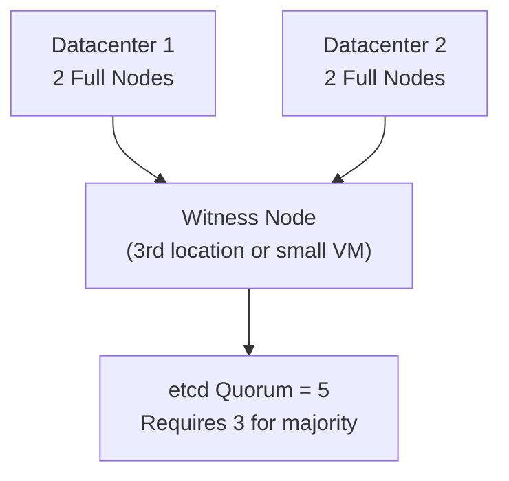

# How to Set Up Harvester Witness Node

Author: [nawazdhandala](https://www.github.com/nawazdhandala)

Tags: Harvester, Kubernetes, Virtualization, HCI, Witness Node, High Availability

Description: Learn how to configure a Harvester witness node to maintain etcd quorum in multi-datacenter deployments without adding full compute nodes.

## Introduction

A witness node in Harvester is a lightweight cluster member that participates in etcd quorum voting without running VM workloads. Witness nodes are valuable for two-datacenter disaster recovery configurations where you need a third node to break ties in quorum voting, but don't want to deploy a full Harvester node in a third location. The witness node runs etcd and the Kubernetes control plane but not the heavy KubeVirt and Longhorn storage components.

## When to Use a Witness Node



**Use witness nodes when:**
- You have exactly 2 datacenters with 2+ nodes each
- You need a tie-breaker for etcd quorum
- The third location cannot host a full HCI node
- Cost of a full node in a third location is prohibitive

## Witness Node Architecture

A Harvester witness node:
- Runs etcd (participates in consensus voting)
- Runs the Kubernetes API server
- Does NOT run KubeVirt (no VMs)
- Does NOT run Longhorn (no storage)
- Requires minimal hardware (~4 vCPUs, 8 GB RAM, 100 GB disk)

## Prerequisites

- An existing Harvester cluster (2-node minimum)
- A third server or VM for the witness
- Network connectivity between all nodes
- The cluster join token

## Step 1: Prepare the Witness Node Hardware

Witness nodes have minimal hardware requirements:

```text
Minimum Witness Node Specs:
- CPU:     4 cores (no virtualization extensions needed)
- RAM:     8 GB
- Disk:    100 GB SSD (for OS and etcd data only)
- Network: 1 NIC with management network connectivity
```

## Step 2: Install Harvester on the Witness Node

Boot the server with the Harvester ISO and select **Join an existing Harvester cluster**:

```yaml
# witness-node-config.yaml

# Configuration for installing the witness node

scheme_version: 1

install:
  device: /dev/sda
  automatic: true

os:
  hostname: harvester-witness-01
  ssh_authorized_keys:
    - ssh-ed25519 AAAAC3NzaC1... admin@host
  ntp_servers:
    - pool.ntp.org
  dns_nameservers:
    - 8.8.8.8

network:
  interfaces:
    - name: eth0

harvester:
  mode: join
  # URL of the existing cluster
  server_url: https://192.168.1.100
  # Cluster join token
  token: "your-cluster-token"
  management_interface:
    interfaces:
      - name: eth0
    method: static
    ip: 192.168.1.15
    subnetMask: 255.255.255.0
    gateway: 192.168.1.1
    dnsNameservers:
      - 8.8.8.8
  # CRITICAL: Mark this node as a witness node
  role: "witness"
```

## Step 3: Configure the Node Role After Joining

After the node joins the cluster, configure it as a witness:

```bash
# SSH into the witness node
ssh rancher@192.168.1.15

# Verify the node joined
sudo kubectl --kubeconfig /etc/rancher/rke2/rke2.yaml get nodes

# Label the node as a witness to prevent VM and storage scheduling
sudo kubectl --kubeconfig /etc/rancher/rke2/rke2.yaml \
    label node harvester-witness-01 \
    harvesterhci.io/role=witness

# Add taints to prevent workload scheduling
sudo kubectl --kubeconfig /etc/rancher/rke2/rke2.yaml \
    taint node harvester-witness-01 \
    harvesterhci.io/witness=true:NoSchedule

# Verify the node is labeled correctly
sudo kubectl --kubeconfig /etc/rancher/rke2/rke2.yaml \
    get node harvester-witness-01 -o yaml | grep -A 10 "labels:"
```

## Step 4: Verify Witness Node in the Cluster

```bash
export KUBECONFIG=/etc/rancher/rke2/rke2.yaml

# Check all nodes
kubectl get nodes -o wide

# Expected:
# NAME                    STATUS   ROLES
# harvester-node-01       Ready    control-plane,etcd,master   (Full node)
# harvester-node-02       Ready    control-plane,etcd,master   (Full node)
# harvester-witness-01    Ready    control-plane,etcd,master   (Witness node)

# Verify etcd has 3 members
kubectl exec -n kube-system \
    $(kubectl get pods -n kube-system -l component=etcd -o name | head -1) -- \
    etcdctl --endpoints=https://127.0.0.1:2379 \
            --cacert /var/lib/rancher/rke2/server/tls/etcd/server-ca.crt \
            --cert /var/lib/rancher/rke2/server/tls/etcd/server-client.crt \
            --key /var/lib/rancher/rke2/server/tls/etcd/server-client.key \
            member list

# Verify no VMs can be scheduled on the witness
kubectl describe node harvester-witness-01 | grep -A 5 "Taints:"
```

## Step 5: Verify Workload Isolation

Confirm that VMs and Longhorn replicas don't schedule on the witness:

```bash
# Check that no VMs are scheduled on the witness
kubectl get vmi -A \
    --field-selector spec.nodeName=harvester-witness-01

# Check that no Longhorn replicas are on the witness
kubectl get replicas.longhorn.io -n longhorn-system \
    -o json | jq --arg node "harvester-witness-01" \
    '[.items[] | select(.spec.nodeID == $node)] | length'

# Both should return 0
```

## Step 6: Test Quorum with Witness Node

Simulate a node failure to verify the witness maintains quorum:

```bash
# Shutdown one full node (NOT the witness)
# On harvester-node-01:
sudo shutdown -h now

# From a remaining node or external workstation
# Verify the cluster is still operational
kubectl get nodes
# harvester-node-01 should show NotReady
# But the cluster should still function with nodes 02 + witness

# Test that VMs continue running
kubectl get vmi -A

# Test that the Harvester API is still accessible
curl -k https://192.168.1.100/healthz

# Verify etcd still has quorum
kubectl get componentstatuses
```

## Step 7: Witness Node Monitoring

The witness node should be monitored specifically for etcd health:

```bash
# Check etcd on the witness node
ssh rancher@192.168.1.15

sudo kubectl --kubeconfig /etc/rancher/rke2/rke2.yaml \
    exec -n kube-system \
    $(kubectl --kubeconfig /etc/rancher/rke2/rke2.yaml \
        get pods -n kube-system -l component=etcd \
        --field-selector spec.nodeName=harvester-witness-01 \
        -o name) -- \
    etcdctl endpoint health \
    --cacert /var/lib/rancher/rke2/server/tls/etcd/server-ca.crt \
    --cert /var/lib/rancher/rke2/server/tls/etcd/server-client.crt \
    --key /var/lib/rancher/rke2/server/tls/etcd/server-client.key

# Monitor etcd disk latency (critical for etcd performance)
sudo kubectl --kubeconfig /etc/rancher/rke2/rke2.yaml \
    exec -n kube-system \
    $(kubectl --kubeconfig /etc/rancher/rke2/rke2.yaml \
        get pods -n kube-system -l component=etcd \
        --field-selector spec.nodeName=harvester-witness-01 \
        -o name) -- \
    etcdctl check perf \
    --cacert /var/lib/rancher/rke2/server/tls/etcd/server-ca.crt \
    --cert /var/lib/rancher/rke2/server/tls/etcd/server-client.crt \
    --key /var/lib/rancher/rke2/server/tls/etcd/server-client.key
```

## Conclusion

The witness node is an elegant solution to the etcd quorum problem in two-datacenter deployments. By contributing only to voting without running expensive hypervisor workloads, the witness enables a geographically distributed cluster to survive a complete datacenter failure without needing three full-featured HCI nodes. The minimal hardware requirements mean the witness can even run as a VM on an existing server in a third location, colocation facility, or cloud instance - providing high availability at a fraction of the cost of a full third HCI node.
