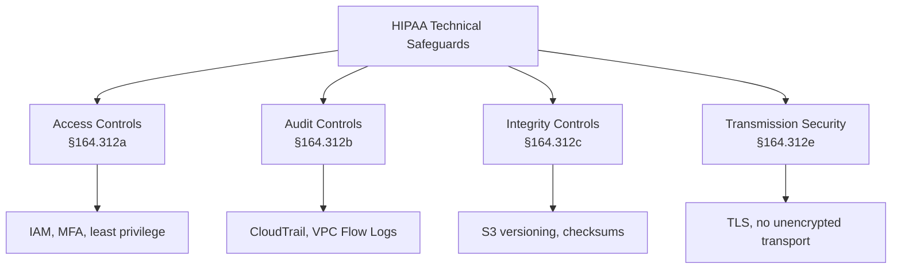

# How to Implement HIPAA-Compliant Infrastructure with OpenTofu

Author: [nawazdhandala](https://www.github.com/nawazdhandala)

Tags: OpenTofu, HIPAA, Compliance, PHI, Healthcare, Encryption, Audit Logging, Infrastructure as Code

Description: Learn how to provision HIPAA-compliant AWS infrastructure using OpenTofu, covering encryption at rest and in transit, audit logging, access controls, and backup requirements for protected health information.

---

HIPAA requires technical safeguards for protected health information (PHI): encryption, audit controls, access controls, and data integrity mechanisms. OpenTofu codifies these requirements so every PHI environment is provisioned identically and compliantly.

## HIPAA Technical Safeguard Requirements



## Encryption at Rest

```hcl
# kms.tf
resource "aws_kms_key" "phi" {
  description             = "KMS key for PHI encryption — HIPAA compliant"
  deletion_window_in_days = 30
  enable_key_rotation     = true  # Required for HIPAA

  policy = jsonencode({
    Version = "2012-10-17"
    Statement = [
      {
        Sid    = "AllowHIPAAAdmin"
        Effect = "Allow"
        Principal = { AWS = var.hipaa_admin_role_arn }
        Action   = "kms:*"
        Resource = "*"
      },
      {
        Sid    = "AllowServiceEncryption"
        Effect = "Allow"
        Principal = {
          Service = ["rds.amazonaws.com", "s3.amazonaws.com"]
        }
        Action   = ["kms:GenerateDataKey*", "kms:Decrypt"]
        Resource = "*"
      }
    ]
  })

  tags = {
    PHI        = "true"
    Compliance = "HIPAA"
  }
}

# RDS with encryption
resource "aws_db_instance" "phi" {
  identifier              = "${var.environment}-phi-database"
  engine                  = "postgres"
  storage_encrypted       = true
  kms_key_id              = aws_kms_key.phi.arn
  backup_retention_period = 35  # HIPAA requires 6-year retention capability
  deletion_protection     = true
  multi_az                = true  # Availability requirement
  publicly_accessible     = false

  lifecycle {
    prevent_destroy = true
  }
}
```

## Audit Logging

```hcl
# cloudtrail.tf — HIPAA requires audit activity logs
resource "aws_cloudtrail" "phi_audit" {
  name                          = "phi-audit-trail"
  s3_bucket_name                = aws_s3_bucket.audit_logs.id
  include_global_service_events = true
  is_multi_region_trail         = true
  enable_log_file_validation    = true  # Detect tampering

  event_selector {
    read_write_type           = "All"
    include_management_events = true

    data_resource {
      type   = "AWS::S3::Object"
      values = ["${aws_s3_bucket.phi_data.arn}/"]
    }
  }

  cloud_watch_logs_group_arn = "${aws_cloudwatch_log_group.audit.arn}:*"
  cloud_watch_logs_role_arn  = aws_iam_role.cloudtrail.arn
}

# Audit log retention — HIPAA requires 6 years
resource "aws_s3_bucket_lifecycle_configuration" "audit_logs" {
  bucket = aws_s3_bucket.audit_logs.id

  rule {
    id     = "retain-6-years"
    status = "Enabled"

    transition {
      days          = 90
      storage_class = "GLACIER"
    }

    expiration {
      days = 2190  # 6 years
    }
  }
}
```

## PHI Data Bucket

```hcl
# phi_storage.tf
resource "aws_s3_bucket" "phi_data" {
  bucket = "${var.environment}-phi-data"

  lifecycle {
    prevent_destroy = true
  }
}

resource "aws_s3_bucket_versioning" "phi" {
  bucket = aws_s3_bucket.phi_data.id
  versioning_configuration { status = "Enabled" }
}

resource "aws_s3_bucket_object_lock_configuration" "phi" {
  bucket = aws_s3_bucket.phi_data.id

  rule {
    default_retention {
      mode = "COMPLIANCE"
      days = 2190  # 6-year retention
    }
  }
}

resource "aws_s3_bucket_server_side_encryption_configuration" "phi" {
  bucket = aws_s3_bucket.phi_data.id
  rule {
    apply_server_side_encryption_by_default {
      sse_algorithm     = "aws:kms"
      kms_master_key_id = aws_kms_key.phi.arn
    }
  }
}
```

## Access Controls

```hcl
# iam_phi.tf
# Only specific roles can access PHI
resource "aws_iam_policy" "phi_access" {
  name = "phi-data-access"

  policy = jsonencode({
    Version = "2012-10-17"
    Statement = [
      {
        Effect   = "Allow"
        Action   = ["s3:GetObject", "s3:PutObject"]
        Resource = "${aws_s3_bucket.phi_data.arn}/*"
        Condition = {
          Bool = { "aws:MultiFactorAuthPresent" = "true" }
        }
      }
    ]
  })
}
```

## Best Practices

- Sign a Business Associate Agreement (BAA) with AWS before storing PHI — this is a legal requirement.
- Enable KMS key rotation — HIPAA doesn't prescribe rotation frequency but CMS requires at least annual rotation.
- Use S3 Object Lock in COMPLIANCE mode for audit logs — compliance mode prevents anyone, including AWS, from deleting records.
- Enable CloudTrail log file validation to detect tampering and use it as evidence in audits.
- Test backup restoration quarterly — HIPAA requires not just backing up but verifying you can restore.
