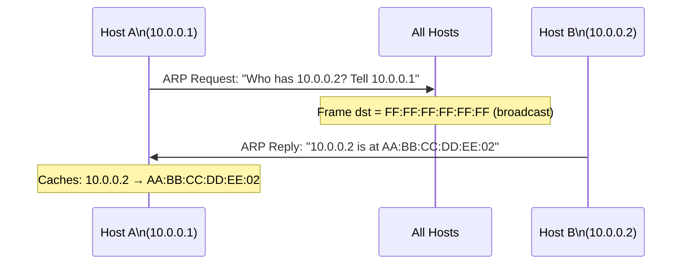

# How to Understand How ARP Maps IP Addresses to MAC Addresses

Author: [nawazdhandala](https://www.github.com/nawazdhandala)

Tags: ARP, Networking, MAC Address, IPv4, Layer 2

Description: ARP (Address Resolution Protocol) resolves IPv4 addresses to MAC addresses by broadcasting a 'who has this IP?' query on the local network, enabling layer-2 frame delivery on Ethernet networks.

## Why ARP Is Necessary

IP addresses are logical (layer 3) identifiers. Ethernet frames use MAC addresses (layer 2) for delivery. When a host wants to send an IP packet to another host on the same subnet, it needs the destination's MAC address. ARP provides this mapping.

## ARP Request and Reply



## ARP Packet Structure

```text
Hardware Type:    1 (Ethernet)
Protocol Type:    0x0800 (IPv4)
HW Address Len:   6 (MAC = 6 bytes)
Proto Address Len: 4 (IPv4 = 4 bytes)
Operation:        1 = Request, 2 = Reply
Sender MAC:       Source MAC
Sender IP:        Source IP
Target MAC:       00:00:00:00:00:00 (request) / dest MAC (reply)
Target IP:        IP being queried
```

## Python: Sending an ARP Request with Scapy

```python
from scapy.all import ARP, Ether, srp

def arp_lookup(target_ip: str, interface: str = "eth0") -> str:
    """
    Send an ARP request and return the MAC address for the target IP.
    Returns None if no response.
    """
    pkt = Ether(dst="ff:ff:ff:ff:ff:ff") / ARP(pdst=target_ip)
    result, _ = srp(pkt, iface=interface, timeout=2, verbose=False)

    for _, rcvd in result:
        return rcvd[ARP].hwsrc   # Sender MAC in the reply
    return None

mac = arp_lookup("192.168.1.1")
print(f"192.168.1.1 is at {mac}")
```

## The ARP Cache

Hosts cache ARP replies to avoid broadcasting for every packet. The cache has a timeout (typically 5–20 minutes on Linux/macOS):

```bash
# View the ARP cache on Linux

ip neigh show

# Or with arp command
arp -n

# Show ARP cache on macOS
arp -a

# Windows
arp -a
```

## ARP and Default Gateway

When sending traffic off-subnet, the host sends packets to the default gateway's MAC address. The gateway's IP is resolved via ARP:

```text
Destination: 8.8.8.8 (off-subnet)
→ Host ARPs for 192.168.1.1 (default gateway)
→ Gets gateway's MAC
→ Sends frame with dst=gateway MAC, but IP dst=8.8.8.8
```

## Key Takeaways

- ARP maps layer-3 IPv4 addresses to layer-2 MAC addresses on the local segment.
- ARP requests are broadcast (FF:FF:FF:FF:FF:FF); replies are unicast.
- Hosts cache ARP replies to reduce broadcast traffic.
- For off-subnet destinations, the host ARPs for the default gateway's MAC, not the destination.
