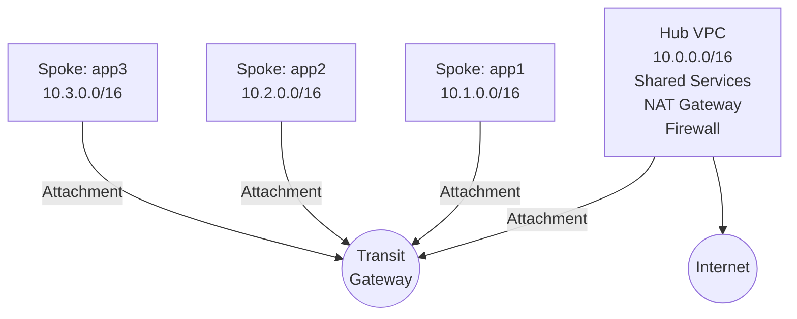

# How to Build Hub-and-Spoke Networking with OpenTofu

Author: [nawazdhandala](https://www.github.com/nawazdhandala)

Tags: OpenTofu, Hub-Spoke, VPC Peering, Transit Gateway, Networking, AWS, Infrastructure as Code

Description: Learn how to implement hub-and-spoke network topology using OpenTofu - connecting multiple spoke VPCs through a central hub for shared services and centralized egress.

## Introduction

Hub-and-spoke topology has a central hub VPC (shared services, security tools, centralized egress) connected to multiple spoke VPCs (individual workloads). Spokes communicate with the hub but not directly with each other. On AWS, use Transit Gateway for this pattern; on GCP, use Shared VPC.

## AWS: Hub-Spoke with Transit Gateway

```hcl
# Hub VPC

resource "aws_vpc" "hub" {
  cidr_block           = "10.0.0.0/16"
  enable_dns_hostnames = true

  tags = { Name = "hub-vpc", Type = "hub" }
}

# Spoke VPCs
resource "aws_vpc" "spoke" {
  for_each = {
    app1 = "10.1.0.0/16"
    app2 = "10.2.0.0/16"
    app3 = "10.3.0.0/16"
  }

  cidr_block           = each.value
  enable_dns_hostnames = true

  tags = { Name = "${each.key}-vpc", Type = "spoke" }
}

# Transit Gateway
resource "aws_ec2_transit_gateway" "main" {
  description                     = "Hub-Spoke Transit Gateway"
  amazon_side_asn                 = 64512
  auto_accept_shared_attachments  = "enable"
  default_route_table_association = "enable"
  default_route_table_propagation = "enable"
  dns_support                     = "enable"

  tags = { Name = "hub-spoke-tgw" }
}

# Attach Hub VPC
resource "aws_ec2_transit_gateway_vpc_attachment" "hub" {
  transit_gateway_id = aws_ec2_transit_gateway.main.id
  vpc_id             = aws_vpc.hub.id
  subnet_ids         = aws_subnet.hub_transit[*].id

  dns_support = "enable"

  tags = { Name = "hub-attachment", Type = "hub" }
}

# Attach Spoke VPCs
resource "aws_ec2_transit_gateway_vpc_attachment" "spoke" {
  for_each = aws_vpc.spoke

  transit_gateway_id = aws_ec2_transit_gateway.main.id
  vpc_id             = each.value.id
  subnet_ids         = [aws_subnet.spoke_transit[each.key].id]

  dns_support = "enable"

  tags = { Name = "${each.key}-attachment", Type = "spoke" }
}
```

## Transit Gateway Route Tables

```hcl
# Hub route table - can see all spokes
resource "aws_ec2_transit_gateway_route_table" "hub" {
  transit_gateway_id = aws_ec2_transit_gateway.main.id
  tags               = { Name = "hub-route-table" }
}

# Spoke route table - can only see hub
resource "aws_ec2_transit_gateway_route_table" "spoke" {
  transit_gateway_id = aws_ec2_transit_gateway.main.id
  tags               = { Name = "spoke-route-table" }
}

# Associate spoke attachments with spoke route table
resource "aws_ec2_transit_gateway_route_table_association" "spoke" {
  for_each = aws_ec2_transit_gateway_vpc_attachment.spoke

  transit_gateway_attachment_id  = each.value.id
  transit_gateway_route_table_id = aws_ec2_transit_gateway_route_table.spoke.id
}

# Propagate hub routes to spoke route table (spokes know hub CIDR)
resource "aws_ec2_transit_gateway_route_table_propagation" "hub_to_spoke_rt" {
  transit_gateway_attachment_id  = aws_ec2_transit_gateway_vpc_attachment.hub.id
  transit_gateway_route_table_id = aws_ec2_transit_gateway_route_table.spoke.id
}

# Propagate spoke routes to hub route table (hub knows all spoke CIDRs)
resource "aws_ec2_transit_gateway_route_table_propagation" "spoke_to_hub_rt" {
  for_each = aws_ec2_transit_gateway_vpc_attachment.spoke

  transit_gateway_attachment_id  = each.value.id
  transit_gateway_route_table_id = aws_ec2_transit_gateway_route_table.hub.id
}
```

## VPC Route Tables

```hcl
# Spoke VPC route tables - route to hub via TGW
resource "aws_route" "spoke_to_hub" {
  for_each = aws_vpc.spoke

  route_table_id         = aws_route_table.spoke_private[each.key].id
  destination_cidr_block = aws_vpc.hub.cidr_block
  transit_gateway_id     = aws_ec2_transit_gateway.main.id
}

# Spoke default route to hub for internet egress
resource "aws_route" "spoke_default" {
  for_each = aws_vpc.spoke

  route_table_id         = aws_route_table.spoke_private[each.key].id
  destination_cidr_block = "0.0.0.0/0"
  transit_gateway_id     = aws_ec2_transit_gateway.main.id
  # Hub VPC has NAT gateways for centralized internet egress
}
```

## GCP: Hub-Spoke with Shared VPC

```hcl
# Hub project as Shared VPC host
resource "google_compute_shared_vpc_host_project" "hub" {
  project = var.hub_project_id
}

# Attach spoke projects
resource "google_compute_shared_vpc_service_project" "spoke" {
  for_each = toset(var.spoke_project_ids)

  host_project    = var.hub_project_id
  service_project = each.value

  depends_on = [google_compute_shared_vpc_host_project.hub]
}
```

## Architecture Diagram



## Conclusion

Hub-and-spoke with AWS Transit Gateway separates shared services (in the hub) from workloads (in spokes) while maintaining network isolation between spokes. Use separate TGW route tables for hub and spoke to control which routes each can see. Route spoke traffic to the hub for centralized NAT, firewall inspection, or shared services. For GCP, Shared VPC achieves the same pattern natively with host and service project relationships.
