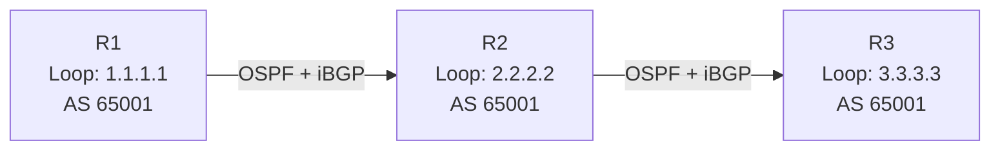

# How to Configure iBGP Peering with Loopback Addresses

Author: [nawazdhandala](https://www.github.com/nawazdhandala)

Tags: BGP, IBGP, Cisco IOS, Routing, Loopback, OSPF

Description: Learn how to configure iBGP sessions using loopback addresses for stability, including updating the source interface and enabling OSPF reachability.

## Why Use Loopback Addresses for iBGP?

When iBGP peers use physical interface addresses, the BGP session drops whenever that specific interface goes down-even if the routers are still reachable via another path. By sourcing iBGP sessions from loopback interfaces, the session survives as long as any path between the routers exists. Loopbacks are always up unless the router itself is down.

## Topology



All three routers are in AS 65001. OSPF provides reachability between loopbacks.

## Step 1: Configure Loopback Interfaces

On each router, create a loopback interface with a unique /32 address:

```text
! On R1
R1(config)# interface Loopback0
R1(config-if)# ip address 1.1.1.1 255.255.255.255
R1(config-if)# no shutdown

! On R2
R2(config)# interface Loopback0
R2(config-if)# ip address 2.2.2.2 255.255.255.255

! On R3
R3(config)# interface Loopback0
R3(config-if)# ip address 3.3.3.3 255.255.255.255
```

## Step 2: Advertise Loopbacks into OSPF

The loopback addresses must be reachable via OSPF (or another IGP) before iBGP sessions can form:

```text
! On R1 - advertise loopback and connected interfaces
R1(config)# router ospf 1
R1(config-router)# network 1.1.1.1 0.0.0.0 area 0
R1(config-router)# network 10.0.12.0 0.0.0.3 area 0

! Repeat on R2 and R3 for their respective loopbacks and links
```

Verify OSPF reachability before proceeding:

```text
R1# ping 2.2.2.2 source 1.1.1.1
```

## Step 3: Configure iBGP with update-source Loopback0

The critical addition for loopback-based peering is the `update-source` command, which tells BGP to source the TCP session from the loopback:

```text
! On R1 - peer with R2 and R3
R1(config)# router bgp 65001
R1(config-router)# bgp router-id 1.1.1.1
R1(config-router)# neighbor 2.2.2.2 remote-as 65001
R1(config-router)# neighbor 2.2.2.2 update-source Loopback0
R1(config-router)# neighbor 3.3.3.3 remote-as 65001
R1(config-router)# neighbor 3.3.3.3 update-source Loopback0
```

```text
! On R2 - peer with R1 and R3
R2(config)# router bgp 65001
R2(config-router)# bgp router-id 2.2.2.2
R2(config-router)# neighbor 1.1.1.1 remote-as 65001
R2(config-router)# neighbor 1.1.1.1 update-source Loopback0
R2(config-router)# neighbor 3.3.3.3 remote-as 65001
R2(config-router)# neighbor 3.3.3.3 update-source Loopback0
```

## Step 4: Verify Sessions Are Established

```text
R1# show ip bgp summary

Neighbor        V     AS   MsgRcvd MsgSent   TblVer  InQ OutQ Up/Down  State/PfxRcd
2.2.2.2         4  65001        23      23        4    0    0 00:10:15        0
3.3.3.3         4  65001        18      18        4    0    0 00:08:44        0
```

## Step 5: Note the iBGP Next-Hop Behavior

iBGP does not change the next-hop attribute when forwarding routes between iBGP peers. If R1 learns a prefix from an eBGP peer with next-hop `203.0.113.1`, R2 will also see `203.0.113.1` as the next-hop-which may not be reachable from R2 unless you advertise it. Use `next-hop-self` to fix this:

```text
! R1 sets itself as next-hop for all iBGP peers
R1(config-router)# neighbor 2.2.2.2 next-hop-self
R1(config-router)# neighbor 3.3.3.3 next-hop-self
```

## Conclusion

Using loopback addresses for iBGP sessions provides resilience against physical link failures. The key requirements are: loopbacks reachable via an IGP, the `update-source Loopback0` directive on each neighbor statement, and `next-hop-self` when the iBGP peers cannot reach eBGP next-hops directly.
