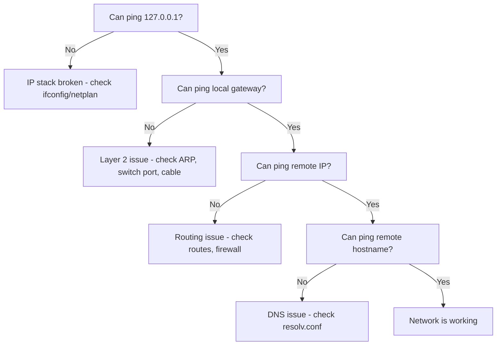

# How to Use ICMP for Network Troubleshooting

Author: [nawazdhandala](https://www.github.com/nawazdhandala)

Tags: ICMP, Networking, Troubleshooting, IPv4, Linux, Ping

Description: Use ICMP-based tools and techniques systematically to diagnose network problems from the local interface through to the remote destination.

## Introduction

ICMP is the network layer's built-in diagnostic language. When something goes wrong, routers and hosts use ICMP to communicate the problem back to the sender. By actively generating ICMP traffic and watching for ICMP error responses, you can pinpoint failures at each layer of the network stack.

## Systematic ICMP Troubleshooting Methodology



## Step 1: Test Local Stack

```bash
# Test loopback — confirms IP stack is functional
ping -c 1 127.0.0.1

# Test own IP address
ip addr show eth0 | grep inet
ping -c 1 <your-own-ip>
```

## Step 2: Test Local Gateway

```bash
# Find default gateway
ip route show default
# default via 192.168.1.1 dev eth0

# Ping the gateway
ping -c 4 192.168.1.1

# If this fails: ARP problem, check:
arp -n 192.168.1.1
# If incomplete/missing, the gateway is unreachable at Layer 2
```

## Step 3: Test Remote Routing

```bash
# Ping a known external IP (Google DNS)
ping -c 4 8.8.8.8

# If this fails but gateway works:
# Check for outbound firewall rules
iptables -L FORWARD -n
iptables -L OUTPUT -n

# Check routing table for default route
ip route show | grep default
```

## Step 4: Use ICMP to Detect Specific Problems

```bash
# Detect MTU issues: large ping with DF bit
# If 1472-byte payload fails but 1000 succeeds, MTU problem exists
ping -s 1472 -M do -c 3 8.8.8.8   # -M do = set Don't Fragment
ping -s 1000 -M do -c 3 8.8.8.8

# Detect routing loops: traceroute showing repeated hops
traceroute -n 10.20.0.5 | awk '{print $2}' | sort | uniq -d

# Detect packet loss: extended ping
ping -c 1000 -i 0.2 10.20.0.5 | tail -3
```

## Step 5: Capture ICMP Errors

```bash
# Watch for ICMP error messages being returned to you
tcpdump -i eth0 -n 'icmp and icmp[0] != 0 and icmp[0] != 8'

# This filters out echo requests (8) and replies (0)
# Leaving only error messages: unreachable, redirect, time-exceeded, etc.
```

## ICMP-Based Connectivity Script

```bash
#!/bin/bash
# Quick network health check using ICMP

check_host() {
    local host="$1"
    local desc="$2"
    if ping -c 2 -W 2 "$host" &>/dev/null; then
        echo "OK: $desc ($host)"
    else
        echo "FAIL: $desc ($host) — unreachable"
    fi
}

check_host 127.0.0.1    "Loopback"
check_host 192.168.1.1  "Default gateway"
check_host 8.8.8.8      "Internet (Google DNS)"
check_host 1.1.1.1      "Internet (Cloudflare DNS)"
```

## Conclusion

ICMP is the fastest path to network diagnosis. A systematic approach — loopback, gateway, remote IP, DNS — isolates problems quickly to the correct layer. ICMP error messages tell you exactly what the network thinks is wrong. Capture these messages with tcpdump to get the full picture, especially for intermittent issues that don't reproduce when you're actively looking.
