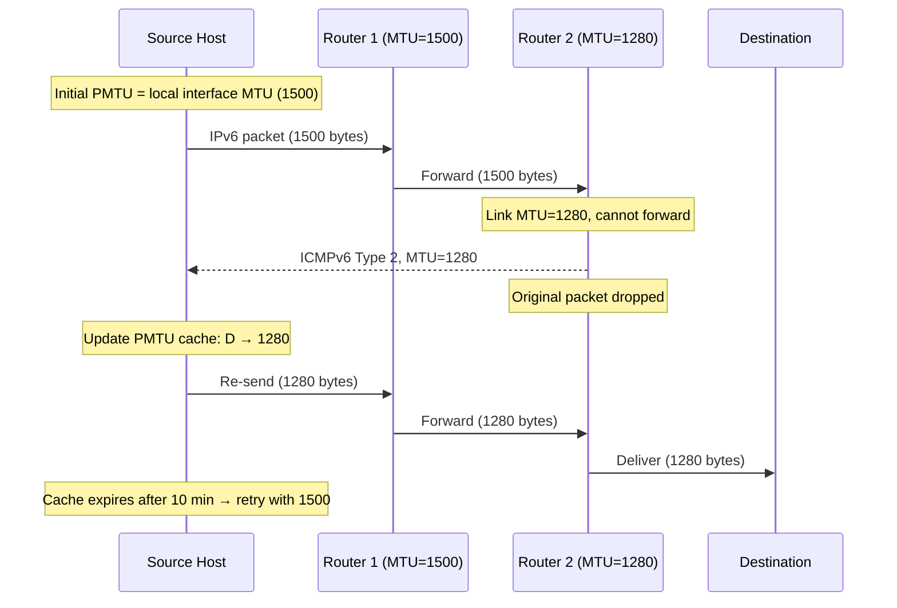

# How ICMPv6 Enables Path MTU Discovery

Author: [nawazdhandala](https://www.github.com/nawazdhandala)

Tags: ICMPv6, Path MTU Discovery, PMTUD, IPv6, RFC 8201

Description: Understand how ICMPv6 Packet Too Big messages drive IPv6 Path MTU Discovery, the complete PMTUD feedback loop, and how to monitor and debug PMTUD using ICMPv6.

## Introduction

IPv6 Path MTU Discovery (RFC 8201) relies entirely on ICMPv6 Packet Too Big messages. When a router cannot forward a packet because it exceeds the next-link MTU, it discards the packet and sends a Packet Too Big message to the source. The source uses this to update its PMTU cache and resend at the correct size. Without ICMPv6 Packet Too Big, all IPv6 paths would have PMTU black holes for any connection crossing a reduced-MTU link.

## PMTUD Using ICMPv6: The Complete Flow



## PMTU Cache Mechanics

```bash
# View the PMTU cache (kernel maintains per-destination MTU values)

ip -6 route show cache

# Example output:
# 2001:db8::1 from :: via fe80::1 dev eth0 src 2001:db8::100
#    cache  expires 590sec mtu 1280

# The cache has a 10-minute expiry:
cat /proc/sys/net/ipv6/route/mtu_expires
# Default: 600 (seconds)

# After expiry, source tries full MTU again to detect path changes
# If path MTU increased: success, new cache entry at larger size
# If path MTU same: receives another PTB, cache updated

# Force PMTU rediscovery for all destinations
sudo ip -6 route flush cache

# Check if PMTUD is enabled for an interface
cat /proc/sys/net/ipv6/conf/eth0/path_mtu_discovery
# 1 = enabled (should always be 1)
```

## Monitoring PMTUD with tcpdump

```bash
# Watch for Packet Too Big messages arriving at this host
# These indicate PMTUD is active and reducing MTU
sudo tcpdump -i eth0 -v "icmp6 and ip6[40] == 2"

# Watch for all PMTUD-related traffic simultaneously
sudo tcpdump -i eth0 -v \
    "(icmp6 and ip6[40] == 2) or (ip6[6] == 44)"
# Type 2 = PTB messages, ip6[6]==44 = Fragment Header (post-PTB fragmentation)

# Trace PMTUD for a specific destination
sudo tcpdump -i eth0 -v \
    "(host 2001:db8::1 and icmp6 and ip6[40] == 2) or \
     (src host 2001:db8::1 and icmp6 and ip6[40] == 2)"

# Check PMTU statistics from kernel
cat /proc/net/snmp6 | grep -E "Pmtu|TooBig|Reasm"
# Ip6InTooBigErrors: Number of PTB messages received
```

## Simulating PMTUD

```python
import subprocess
import re

def simulate_pmtud(destination: str, start_mtu: int = 1500,
                   min_mtu: int = 1280) -> list:
    """
    Simulate PMTUD by probing with decreasing packet sizes.
    Uses ping6 -M do to prevent fragmentation.
    Returns list of MTU probes and results.
    """
    results = []
    probe_mtu = start_mtu

    while probe_mtu >= min_mtu:
        # Data size = probe_mtu - 40 (IPv6) - 8 (ICMPv6)
        data_size = probe_mtu - 48

        proc = subprocess.run(
            ["ping6", "-c", "1", "-M", "do", "-s", str(data_size),
             "-W", "2", destination],
            capture_output=True, text=True
        )

        success = proc.returncode == 0
        results.append({
            "probe_mtu": probe_mtu,
            "data_size": data_size,
            "success": success,
        })

        if success:
            print(f"✓ MTU {probe_mtu} bytes: WORKS (path MTU ≥ {probe_mtu})")
            break
        else:
            # Check if it's a PTB error vs timeout
            if "Message too long" in proc.stderr or "mtu=" in proc.stderr:
                print(f"✗ MTU {probe_mtu} bytes: TOO LARGE (PTB received)")
                # Reduce by 8 bytes (common MTU reduction step)
                probe_mtu -= 8
            else:
                print(f"? MTU {probe_mtu} bytes: timeout (firewall blocking PTB?)")
                break

    return results

# Example PMTUD simulation
# results = simulate_pmtud("2001:db8::1")
```

## Common PMTUD Failure Patterns

```text
Pattern 1: PTB is blocked by firewall
  Symptom: Large packets fail, small succeed, no PTB in tcpdump
  Fix:     Allow ICMPv6 Type 2 at the blocking firewall

Pattern 2: PTB is rate-limited
  Symptom: Occasional large-packet failures that self-recover
  Fix:     Ensure PTB is not in the rate-limited message types

Pattern 3: PTB is delivered but cache expires too fast
  Symptom: Periodic large-packet failures every N minutes
  Fix:     Increase mtu_expires sysctl; check if path MTU is stable

Pattern 4: PTB contains wrong MTU value
  Symptom: Source reduces to wrong size, still fails
  Fix:     Debug the intermediate router's MTU reporting
```

## Conclusion

ICMPv6 Packet Too Big is the single mechanism that makes IPv6 PMTUD work. Without it, every connection crossing a reduced-MTU link would fail silently for large data transfers. The kernel's PMTU cache (visible via `ip -6 route show cache`) stores per-destination learned MTU values with a 10-minute expiry. Monitoring for ICMPv6 Type 2 messages with tcpdump is the first diagnostic step when large-data connectivity issues arise. The kernel's `Ip6InTooBigErrors` counter provides aggregate statistics on PMTUD activity.
