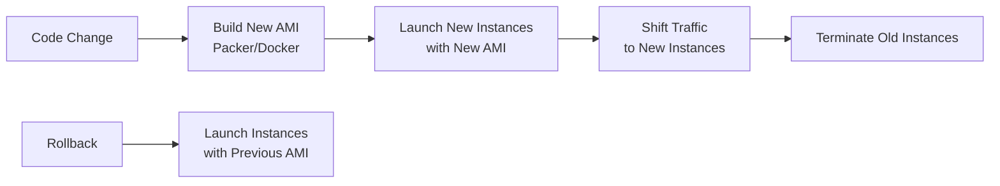

# How to Use Immutable Infrastructure Patterns with OpenTofu

Author: [nawazdhandala](https://www.github.com/nawazdhandala)

Tags: OpenTofu, Immutable Infrastructure, AWS, AMI, Infrastructure as Code, Reliability, DevOps

Description: Learn how to implement immutable infrastructure patterns using OpenTofu where servers are replaced rather than modified, eliminating configuration drift and simplifying rollbacks.

---

Immutable infrastructure means servers are never modified after deployment. Instead of updating packages or configuration on running instances, you build a new image, deploy it to new instances, and terminate the old ones. This eliminates configuration drift, makes deployments reproducible, and turns rollback into launching the previous image.

## Core Principle



## Using `create_before_destroy` for Instance Replacement

OpenTofu's `create_before_destroy` lifecycle rule implements immutable replacement.

```hcl
# main.tf
terraform {
  required_providers {
    aws = {
      source  = "hashicorp/aws"
      version = "~> 5.30"
    }
  }
}

provider "aws" {
  region = var.aws_region
}

# Launch template — new AMI ID triggers new instances
resource "aws_launch_template" "app" {
  name_prefix   = "app-"
  image_id      = var.ami_id  # Change this to trigger replacement
  instance_type = var.instance_type

  lifecycle {
    # Create new launch template before destroying the old one
    create_before_destroy = true
  }

  user_data = base64encode(<<-EOF
    #!/bin/bash
    # Minimal bootstrap — app config baked into the AMI
    systemctl start app
  EOF
  )

  tag_specifications {
    resource_type = "instance"
    tags = {
      Name     = "app-${var.environment}"
      Version  = var.app_version
      ImageId  = var.ami_id
    }
  }
}

# Auto Scaling Group using the launch template
resource "aws_autoscaling_group" "app" {
  name                = "app-${var.environment}-${var.ami_id}"  # Name includes AMI ID
  min_size            = var.min_size
  max_size            = var.max_size
  desired_capacity    = var.desired_count
  vpc_zone_identifier = var.private_subnet_ids

  launch_template {
    id      = aws_launch_template.app.id
    version = "$Latest"
  }

  # Instance refresh replaces instances with new launch template
  instance_refresh {
    strategy = "Rolling"
    preferences {
      min_healthy_percentage = 90  # Keep 90% healthy during refresh
      instance_warmup        = 300  # Wait 5 min for new instances to warm up
    }
  }

  lifecycle {
    create_before_destroy = true
  }

  target_group_arns = [aws_lb_target_group.app.arn]

  tag {
    key                 = "Name"
    value               = "app-${var.environment}"
    propagate_at_launch = true
  }
}
```

## AMI Selection Strategy

```hcl
# ami.tf
# Always use the latest app AMI for a given version
data "aws_ami" "app" {
  most_recent = true
  owners      = [data.aws_caller_identity.current.account_id]

  filter {
    name   = "name"
    values = ["app-${var.app_version}-*"]
  }

  filter {
    name   = "state"
    values = ["available"]
  }
}

# Or pin to a specific AMI ID for production stability
variable "ami_id" {
  description = "AMI ID to deploy — change this to trigger instance replacement"
  type        = string
  # Set explicitly in production: ami_id = "ami-0abc123def456"
}
```

## Preventing In-Place Modifications

```hcl
# no_drift.tf
# Prevent SSH access — all changes must go through a new AMI
resource "aws_security_group" "app_no_ssh" {
  name        = "app-no-ssh"
  description = "Security group with no SSH access — immutable instances"
  vpc_id      = var.vpc_id

  # No port 22 ingress — enforces immutability
  egress {
    from_port   = 0
    to_port     = 0
    protocol    = "-1"
    cidr_blocks = ["0.0.0.0/0"]
  }
}
```

## Best Practices

- Build AMIs with Packer, baking in all application code and configuration — instances should start fully configured.
- Include the AMI ID or app version in the Auto Scaling Group name to force resource replacement on every deployment.
- Disable SSH access to production instances — if you need to debug, use AWS Systems Manager Session Manager.
- Use `instance_refresh` on Auto Scaling Groups to perform rolling replacements without manual intervention.
- Store AMI IDs with their build metadata in a registry so rollback means deploying a known-good AMI ID.
