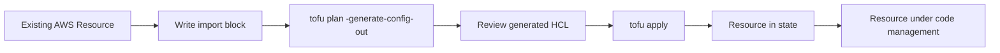

# How to Generate OpenTofu Configuration from Existing AWS Resources

Author: [nawazdhandala](https://www.github.com/nawazdhandala)

Tags: OpenTofu, AWS, Import, State, Migration, Infrastructure as Code

Description: Learn how to import existing AWS resources into OpenTofu state using import blocks and the tofu import command, enabling you to bring manually-created infrastructure under code management.

---

Importing existing infrastructure into OpenTofu brings manually-created resources under code management without recreating them. The modern `import` block approach generates configuration automatically, while `tofu import` adds resources to state for hand-written configurations.

## Import Workflow



## Import Block (Modern Approach)

```hcl
# import.tf - generates configuration automatically

import {
  id = "i-1234567890abcdef0"
  to = aws_instance.web
}

import {
  id = "sg-12345678"
  to = aws_security_group.app
}

import {
  id = "mycompany-production-bucket"
  to = aws_s3_bucket.production
}
```

```bash
# Generate HCL configuration for imported resources
tofu plan -generate-config-out=generated.tf

# Review the generated configuration
cat generated.tf

# Apply to add resources to state
tofu apply
```

## Classic Import Command

```bash
# tofu import <resource_address> <resource_id>

# EC2 instance
tofu import aws_instance.web i-1234567890abcdef0

# S3 bucket
tofu import aws_s3_bucket.production mycompany-production-bucket

# RDS instance
tofu import aws_db_instance.main mydb-production

# Security group
tofu import aws_security_group.app sg-12345678

# IAM role
tofu import aws_iam_role.app my-application-role

# Route53 hosted zone
tofu import aws_route53_zone.primary Z1D633PJN98FT9

# ALB
tofu import aws_lb.main arn:aws:elasticloadbalancing:us-east-1:123456789012:loadbalancer/app/my-alb/50dc6c495c0c9188

# EKS cluster
tofu import aws_eks_cluster.main my-cluster
```

## Bulk Import Script

```bash
#!/bin/bash
# import_script.sh - discover and import resources

# Discover all EC2 instances in a region
INSTANCES=$(aws ec2 describe-instances \
  --filters "Name=tag:Environment,Values=production" \
  --query "Reservations[*].Instances[*].InstanceId" \
  --output text)

for INSTANCE_ID in $INSTANCES; do
  NAME=$(aws ec2 describe-instances \
    --instance-ids "$INSTANCE_ID" \
    --query "Reservations[0].Instances[0].Tags[?Key=='Name'].Value" \
    --output text | tr '[:upper:]' '[:lower:]' | tr ' -' '_')

  echo "Importing $INSTANCE_ID as aws_instance.${NAME}"

  # Add import block to imports.tf
  cat >> imports.tf << EOF
import {
  id = "$INSTANCE_ID"
  to = aws_instance.${NAME}
}
EOF
done

tofu plan -generate-config-out=generated_instances.tf
```

## Handling Import Drift

```bash
# After importing, run plan to check for drift
tofu plan

# Common issues after import:
# 1. Tags that OpenTofu would add - add to your config
# 2. Settings that differ - decide if your config or reality is correct
# 3. Lifecycle rules - add ignore_changes for attributes you don't want to manage

# Example: ignore tags managed externally
resource "aws_instance" "web" {
  # ... imported config ...

  lifecycle {
    ignore_changes = [
      tags["LastManaged"],  # Tag managed by external tooling
      user_data,            # User data set during launch, not managed here
    ]
  }
}
```

## Best Practices

- Use import blocks with `-generate-config-out` for new imports - the auto-generated configuration is a better starting point than writing from scratch.
- Review generated configuration carefully before committing - it often includes computed attributes that should be removed.
- Import resources in logical groups (all networking together, then compute, etc.) rather than all at once.
- Run `tofu plan` after each import to confirm no unintended changes will be applied on the next apply.
- Use `ignore_changes` for attributes managed outside OpenTofu (like tags from AWS Config or auto-scaling) to prevent constant drift.
