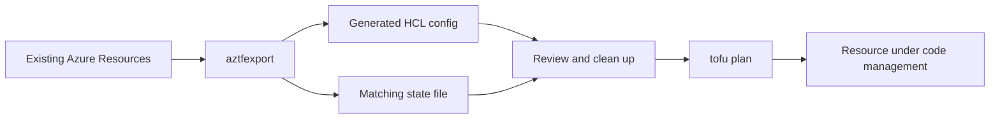

# How to Generate OpenTofu Configuration from Existing Azure Resources with aztfexport

Author: [nawazdhandala](https://www.github.com/nawazdhandala)

Tags: OpenTofu, Azure, aztfexport, Import, Migration, Infrastructure as Code

Description: Learn how to use aztfexport to generate OpenTofu/Terraform configuration from existing Azure resources, enabling you to bring manually-created Azure infrastructure under code management.

---

aztfexport (Azure Terraform Export) is Microsoft's official tool for generating Terraform/OpenTofu configuration from existing Azure resources. It queries Azure Resource Manager and produces ready-to-use HCL configuration with matching state.

## aztfexport Workflow



## Installing aztfexport

```bash
# macOS
brew install aztfexport

# Linux
curl -sSL https://aka.ms/aztfexport/install.sh | bash

# Verify installation
aztfexport --version
```

## Export by Resource Group

```bash
# Export all resources in a resource group
aztfexport resource-group MyResourceGroup \
  --output-dir ./imported-azure \
  --non-interactive

# This creates:
# imported-azure/
# ├── main.tf           — all resource definitions
# ├── provider.tf       — azurerm provider config
# └── terraform.tfstate — matching state file
```

## Export Specific Resource Types

```bash
# Export only specific resource types
aztfexport resource \
  --output-dir ./imported-azure \
  --non-interactive \
  "/subscriptions/00000000-0000-0000-0000-000000000000/resourceGroups/my-rg/providers/Microsoft.Compute/virtualMachines/my-vm"

# Export by query (using Azure Resource Graph)
aztfexport query \
  --output-dir ./imported-azure \
  --non-interactive \
  "resourceGroup == 'my-production-rg' and type == 'microsoft.network/virtualnetworks'"
```

## Review and Clean Generated Configuration

```bash
# After export, review and clean up
cd imported-azure

# 1. Remove resource-specific IDs that should be variables
# 2. Extract common variables (location, resource_group_name)
# 3. Add descriptions to variables
# 4. Remove computed attributes that would cause drift

# Run plan to check for differences
tofu init
tofu plan
```

## Typical Generated Configuration

```hcl
# Generated by aztfexport — review before using
resource "azurerm_virtual_network" "res-0" {
  address_space       = ["10.0.0.0/16"]
  location            = "eastus"
  name                = "my-vnet"
  resource_group_name = "my-production-rg"

  tags = {
    Environment = "production"
    ManagedBy   = "terraform"
  }
}

resource "azurerm_subnet" "res-1" {
  address_prefixes     = ["10.0.1.0/24"]
  name                 = "app-subnet"
  resource_group_name  = "my-production-rg"
  virtual_network_name = azurerm_virtual_network.res-0.name
}
```

## Post-Export Cleanup

```bash
# Rename auto-generated resource names (res-0, res-1) to meaningful names
# Use a sed script or IDE rename
sed -i 's/azurerm_virtual_network.res-0/azurerm_virtual_network.main/g' main.tf

# Extract common values to variables
cat > variables.tf << 'EOF'
variable "location" {
  default = "eastus"
}

variable "resource_group_name" {
  default = "my-production-rg"
}
EOF

# Replace hardcoded values
sed -i 's/location            = "eastus"/location            = var.location/g' main.tf

# Run plan to verify no unintended changes
tofu plan
```

## Move State to Remote Backend

```bash
# After cleanup, migrate state to S3 or Azure Blob
# Add backend config
cat > backend.tf << 'EOF'
terraform {
  backend "azurerm" {
    resource_group_name  = "tfstate"
    storage_account_name = "mytfstate"
    container_name       = "tfstate"
    key                  = "production.tfstate"
  }
}
EOF

tofu init -migrate-state
```

## Best Practices

- Use `--non-interactive` mode for aztfexport in CI/CD or scripted migrations — it skips prompts.
- Review all generated resources for auto-generated names like `res-0` and rename them to meaningful identifiers before committing.
- Run `tofu plan` immediately after export — any non-empty plan indicates drift between the generated config and actual state.
- Export in phases: networking first, then compute, then PaaS services — this helps manage the complexity.
- Keep the original aztfexport output in a separate git commit for reference before making cleanup changes.
