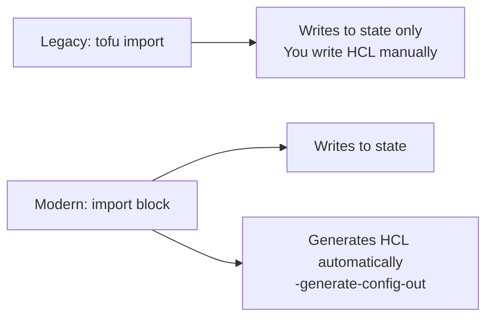

# How to Use Import Blocks to Generate HCL from Existing Infrastructure

Author: [nawazdhandala](https://www.github.com/nawazdhandala)

Tags: OpenTofu, Import Blocks, HCL, Migration, Infrastructure as Code

Description: Learn how to use OpenTofu import blocks with -generate-config-out to automatically generate HCL configuration from existing infrastructure, streamlining the process of bringing resources under...

---

Import blocks are the modern way to bring existing infrastructure into OpenTofu management. Combined with `-generate-config-out`, they automatically generate HCL configuration matching the real resource state, eliminating the need to write configuration from scratch for existing resources.

## Import Block vs Legacy tofu import



## Basic Import Block

```hcl
# imports.tf

import {
  id = "i-1234567890abcdef0"  # The resource ID in the provider
  to = aws_instance.web       # The target resource address
}
```

```bash
# Generate HCL configuration for all import blocks
tofu plan -generate-config-out=generated.tf

# This creates generated.tf with the resource configuration
# Review the generated file, then apply

tofu apply
# Resources are added to state - no infrastructure changes made
```

## Generating Configuration for Multiple Resources

```hcl
# imports.tf - multiple resources at once
import {
  id = "vpc-12345678"
  to = aws_vpc.main
}

import {
  id = "subnet-11111111"
  to = aws_subnet.public_1
}

import {
  id = "subnet-22222222"
  to = aws_subnet.public_2
}

import {
  id = "subnet-33333333"
  to = aws_subnet.private_1
}

import {
  id = "sg-12345678"
  to = aws_security_group.app
}
```

```bash
# Generate all configurations
tofu plan -generate-config-out=networking.tf

# Review, clean up, and commit
cat networking.tf
tofu apply
```

## Example Generated Configuration

```hcl
# generated.tf - auto-generated by tofu plan -generate-config-out
# DO NOT EDIT: Regenerate with `tofu plan -generate-config-out`

resource "aws_vpc" "main" {
  assign_generated_ipv6_cidr_block     = false
  cidr_block                           = "10.0.0.0/16"
  enable_dns_hostnames                 = true
  enable_dns_support                   = true
  enable_network_address_usage_metrics = false
  instance_tenancy                     = "default"

  tags = {
    Environment = "production"
    ManagedBy   = "manual"
    Name        = "production-vpc"
  }

  tags_all = {
    Environment = "production"
    ManagedBy   = "manual"
    Name        = "production-vpc"
  }
}
```

## Cleaning Up Generated Configuration

```hcl
# After generation, clean up:
# 1. Remove redundant tags_all (managed by provider default_tags)
# 2. Replace hardcoded IDs with references
# 3. Remove computed-only attributes
# 4. Add variable references

# Before cleanup (generated):
resource "aws_subnet" "app" {
  availability_zone                              = "us-east-1a"
  cidr_block                                     = "10.0.1.0/24"
  vpc_id                                         = "vpc-12345678"  # hardcoded
  map_public_ip_on_launch                        = false
  enable_resource_name_dns_a_record_on_launch    = false
  enable_resource_name_dns_aaaa_record_on_launch = false
  ipv6_native                                    = false
  private_dns_hostname_type_on_launch            = "ip-name"
}

# After cleanup:
resource "aws_subnet" "app" {
  availability_zone = "us-east-1a"
  cidr_block        = "10.0.1.0/24"
  vpc_id            = aws_vpc.main.id  # Use reference instead of hardcoded ID

  tags = {
    Name = "app-subnet"
  }
}
```

## Dynamic Import for Multiple Similar Resources

```hcl
# Import multiple subnets using for_each
locals {
  subnet_imports = {
    "public-1"  = "subnet-11111111"
    "public-2"  = "subnet-22222222"
    "private-1" = "subnet-33333333"
  }
}

import {
  for_each = local.subnet_imports
  id = each.value
  to = aws_subnet.main[each.key]
}

# Corresponding resource (written after inspecting generated output)
resource "aws_subnet" "main" {
  for_each = local.subnet_imports
  # ... attributes from generated config
}
```

## Best Practices

- Keep import blocks in a separate `imports.tf` file - remove or archive them after the resources are successfully imported.
- Always run `tofu plan` after `tofu apply` on imports to confirm no unintended changes remain.
- Use `-generate-config-out` to a new file rather than appending to existing files - it's easier to review changes separately.
- Remove `tags_all` and other computed-only attributes from generated config - they cause unnecessary complexity without adding value.
- Import blocks support `for_each` for importing multiple similar resources with a single block.
