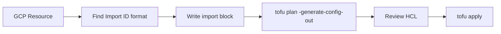

# How to Generate OpenTofu Configuration from Existing GCP Resources

Author: [nawazdhandala](https://www.github.com/nawazdhandala)

Tags: OpenTofu, GCP, Import, Migration, Google Cloud, Infrastructure as Code

Description: Learn how to import existing GCP resources into OpenTofu using import blocks and the tofu import command, enabling you to bring manually-created Google Cloud infrastructure under code management.

---

Importing GCP resources into OpenTofu allows you to manage existing Google Cloud infrastructure as code without recreating resources. The modern import block approach with `-generate-config-out` is the recommended path, supplemented by specific GCP resource ID patterns.

## GCP Import ID Patterns



## Common GCP Resource Import IDs

```bash
# GCE Instance: projects/{project}/zones/{zone}/instances/{name}
tofu import google_compute_instance.web \
  "projects/my-project/zones/us-central1-a/instances/web-server-1"

# GCS Bucket: {bucket_name}
tofu import google_storage_bucket.data "my-data-bucket"

# Cloud SQL: projects/{project}/instances/{name}
tofu import google_sql_database_instance.main \
  "projects/my-project/instances/my-sql-instance"

# GKE Cluster: projects/{project}/locations/{location}/clusters/{name}
tofu import google_container_cluster.main \
  "projects/my-project/locations/us-central1/clusters/my-cluster"

# Service Account: projects/{project}/serviceAccounts/{email}
tofu import google_service_account.app \
  "projects/my-project/serviceAccounts/app@my-project.iam.gserviceaccount.com"

# VPC Network: projects/{project}/global/networks/{name}
tofu import google_compute_network.main \
  "projects/my-project/global/networks/my-vpc"

# Subnet: projects/{project}/regions/{region}/subnetworks/{name}
tofu import google_compute_subnetwork.private \
  "projects/my-project/regions/us-central1/subnetworks/private-subnet"

# Cloud Run Service: locations/{location}/namespaces/{project}/services/{name}
tofu import google_cloud_run_service.api \
  "locations/us-central1/namespaces/my-project/services/my-api"
```

## Import Blocks for Multiple Resources

```hcl
# imports.tf
import {
  id = "projects/my-project/global/networks/production-vpc"
  to = google_compute_network.production
}

import {
  id = "projects/my-project/regions/us-central1/subnetworks/app-subnet"
  to = google_compute_subnetwork.app
}

import {
  id = "projects/my-project/zones/us-central1-a/instances/web-1"
  to = google_compute_instance.web["web-1"]
}
```

```bash
# Generate configuration
tofu plan -generate-config-out=generated_gcp.tf

# Review and apply
tofu apply
```

## Importing IAM Bindings

```bash
# IAM member: project/{project} roles/{role} {member}
tofu import google_project_iam_member.app_storage \
  "my-project roles/storage.objectViewer serviceAccount:app@my-project.iam.gserviceaccount.com"

# IAM binding: project/{project} roles/{role}
tofu import google_project_iam_binding.editors \
  "my-project roles/editor"
```

## Discovering Resources with gcloud

```bash
# List all GCE instances to find import IDs
gcloud compute instances list \
  --format="table(name,zone,selfLink)" \
  --project my-project

# List Cloud SQL instances
gcloud sql instances list --project my-project

# List GKE clusters
gcloud container clusters list --project my-project

# List Cloud Run services
gcloud run services list --project my-project
```

## Bulk Import Generator Script

```bash
#!/bin/bash
# generate_gcp_imports.sh

PROJECT="my-project"

# Generate import blocks for all GCE instances
gcloud compute instances list --project "$PROJECT" \
  --format="value(name,zone)" | \
while read -r NAME ZONE; do
  SAFE_NAME=$(echo "$NAME" | tr '-' '_')
  cat >> imports.tf << EOF
import {
  id = "projects/${PROJECT}/zones/${ZONE}/instances/${NAME}"
  to = google_compute_instance.${SAFE_NAME}
}
EOF
done

tofu plan -generate-config-out=generated_instances.tf
```

## Best Practices

- Use `gcloud` commands to discover resource IDs before writing import blocks — GCP resource IDs follow patterns that are easy to look up.
- Import networking resources first (VPCs, subnets, firewall rules), then compute resources that depend on them.
- After import, run `tofu plan` and review carefully — GCP resources often have many computed fields in the generated config that will cause drift.
- Use `ignore_changes` for fields managed outside OpenTofu (like `metadata.annotations` in Kubernetes resources managed by GKE).
- Activate Google Cloud APIs before importing resources that depend on them — `google_project_service` resources are often needed.
