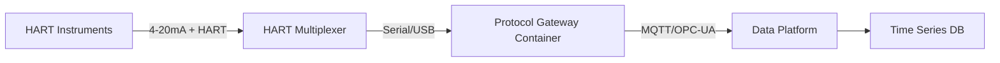

# How to Manage Industrial HART Device Data with Portainer

Author: [nawazdhandala](https://www.github.com/nawazdhandala)

Tags: HART, Industrial IoT, Portainer, OPC-UA, Docker, Manufacturing, Edge Computing

Description: Deploy containerized HART protocol gateways and data collection agents using Portainer to bridge industrial field instruments to modern data platforms.

---

HART (Highway Addressable Remote Transducer) is the dominant protocol for industrial field instruments - pressure transmitters, flow meters, level sensors, and more. Connecting HART devices to modern data infrastructure requires protocol gateways. Portainer makes it easy to deploy and manage these gateways as containers on edge hardware.

## HART Protocol Architecture



## Step 1: Deploy a HART-to-MQTT Gateway

The following stack deploys a HART gateway container that reads instrument data and publishes it to MQTT:

```yaml
# hart-gateway-stack.yml

version: "3.8"

services:
  hart-gateway:
    image: industrial/hart-gateway:2.1.0
    # Privileged mode needed for serial port access
    privileged: true
    devices:
      # Map the HART multiplexer's serial port
      - /dev/ttyUSB0:/dev/ttyUSB0
      - /dev/ttyUSB1:/dev/ttyUSB1
    environment:
      - MQTT_BROKER=mosquitto
      - MQTT_PORT=1883
      - MQTT_TOPIC_PREFIX=plant/field-instruments
      - POLL_INTERVAL_MS=1000
      - LOG_LEVEL=INFO
    volumes:
      - /opt/hart-gateway/devices.json:/config/devices.json:ro
    depends_on:
      - mosquitto
    restart: unless-stopped
    networks:
      - industrial-net

  mosquitto:
    image: eclipse-mosquitto:2.0
    volumes:
      - mosquitto-data:/mosquitto/data
    ports:
      - "1883:1883"
    restart: unless-stopped
    networks:
      - industrial-net

  telegraf:
    image: telegraf:1.29
    volumes:
      - /opt/telegraf/telegraf.conf:/etc/telegraf/telegraf.conf:ro
    depends_on:
      - mosquitto
    restart: unless-stopped
    networks:
      - industrial-net

volumes:
  mosquitto-data:

networks:
  industrial-net:
    driver: bridge
```

## Step 2: Configure Device Mapping

Define which HART instruments are connected and their tag assignments:

```json
// /opt/hart-gateway/devices.json
{
  "multiplexers": [
    {
      "id": "mux-1",
      "serial_port": "/dev/ttyUSB0",
      "baud_rate": 1200,
      "instruments": [
        {
          "address": 1,
          "tag": "PT-101",
          "description": "Reactor Inlet Pressure",
          "unit": "PSI",
          "scale_min": 0,
          "scale_max": 500
        },
        {
          "address": 2,
          "tag": "FT-201",
          "description": "Feed Flow Transmitter",
          "unit": "GPM",
          "scale_min": 0,
          "scale_max": 100
        }
      ]
    }
  ]
}
```

## Step 3: Configure Telegraf to Forward Data

```toml
# /opt/telegraf/telegraf.conf
# Read HART data from MQTT and forward to InfluxDB

[[inputs.mqtt_consumer]]
  servers = ["tcp://mosquitto:1883"]
  topics = ["plant/field-instruments/#"]
  data_format = "json"
  # Map MQTT topic segments to tags
  [[inputs.mqtt_consumer.topic_parsing]]
    topic = "plant/field-instruments/+/+"
    tags = "_/_/_/tag"
    fields = "_/_/_/measurement"

[[outputs.influxdb_v2]]
  urls = ["http://influxdb:8086"]
  token = "your-token"
  organization = "plant-ops"
  bucket = "hart-data"
```

## Step 4: Monitor Instrument Health

HART devices report diagnostic information including:

- Loop current (4–20mA)
- Device status flags (sensor failure, configuration changed)
- Primary variable and engineering units

Use the Portainer log viewer to monitor the gateway container for instrument communication errors.

## Handling Network Interruptions

Edge sites often have intermittent connectivity. Configure Telegraf's buffer for resilience:

```toml
[agent]
  # Buffer up to 100,000 metrics before dropping (handles 1.5 hours of data at 1s intervals)
  metric_buffer_limit = 100000
  flush_interval = "10s"
  flush_jitter = "2s"
```

## Summary

Portainer makes it easy to deploy and manage industrial HART gateway containers on edge hardware. The container-based approach gives you the flexibility to update gateway software without disrupting the underlying OS, and Portainer's remote management lets you push updates to remote plant sites without traveling on-site.
