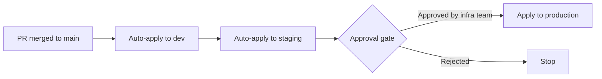

# How to Implement Infrastructure Change Approval Gates with OpenTofu

Author: [nawazdhandala](https://www.github.com/nawazdhandala)

Tags: OpenTofu, Approval Gates, GitHub Environments, Change Management, Security, Infrastructure as Code

Description: Learn how to implement infrastructure change approval gates with OpenTofu using GitHub Environments, required reviewers, and policy checks to prevent unauthorized changes from reaching production.

---

Approval gates ensure that infrastructure changes to production are reviewed and authorized before being applied. GitHub Environments provide a native approval mechanism that pauses CI/CD pipelines until designated reviewers approve.

## Approval Gate Workflow



## GitHub Environments via OpenTofu

```hcl
# github_environments.tf
resource "github_repository_environment" "dev" {
  repository  = var.infra_repo
  environment = "dev"

  # No protection rules for dev — auto-deploy
  deployment_branch_policy {
    protected_branches     = false
    custom_branch_policies = true
  }
}

resource "github_repository_environment" "staging" {
  repository  = var.infra_repo
  environment = "staging"

  reviewers {
    teams = [data.github_team.infrastructure.id]
  }

  wait_timer = 5  # minutes

  deployment_branch_policy {
    protected_branches     = true
    custom_branch_policies = false
  }
}

resource "github_repository_environment" "production" {
  repository  = var.infra_repo
  environment = "production"

  reviewers {
    teams = [
      data.github_team.infrastructure.id,
      data.github_team.security.id,
    ]
    users = [data.github_user.infra_lead.id]
  }

  # Prevent auto-dismissal of approvals
  # wait_timer = 0 means no wait — approval is required immediately

  deployment_branch_policy {
    protected_branches     = true
    custom_branch_policies = false
  }
}
```

## CI/CD with Environment Gates

```yaml
# .github/workflows/deploy.yml
name: Deploy Infrastructure
on:
  push:
    branches: [main]

jobs:
  deploy-dev:
    environment: dev
    runs-on: ubuntu-latest
    steps:
      - uses: actions/checkout@v4
      - uses: opentofu/setup-opentofu@v1
      - run: tofu init && tofu apply -auto-approve
        working-directory: environments/dev

  deploy-staging:
    needs: deploy-dev
    environment: staging   # No approval required for staging
    runs-on: ubuntu-latest
    steps:
      - uses: actions/checkout@v4
      - uses: opentofu/setup-opentofu@v1
      - run: tofu init && tofu apply -auto-approve
        working-directory: environments/staging

  deploy-production:
    needs: deploy-staging
    environment: production   # Requires reviewer approval
    runs-on: ubuntu-latest
    steps:
      - uses: actions/checkout@v4
      - uses: opentofu/setup-opentofu@v1
      - run: tofu init && tofu apply -auto-approve
        working-directory: environments/production
```

## Change Freeze Windows

```hcl
# freeze_check.tf — custom approval policy based on calendar
resource "null_resource" "change_freeze_check" {
  count = var.environment == "production" ? 1 : 0

  triggers = { always_run = timestamp() }

  provisioner "local-exec" {
    command = <<-EOT
      #!/bin/bash
      DOW=$(date +%u)  # 1=Mon, 7=Sun
      HOUR=$(date +%H)

      # Block deploys on weekends and outside business hours
      if [ "$DOW" -ge 6 ] || [ "$HOUR" -lt 9 ] || [ "$HOUR" -ge 18 ]; then
        echo "ERROR: Production deploys blocked outside business hours (Mon-Fri 9-18 UTC)"
        exit 1
      fi

      echo "Change window check passed"
    EOT
  }
}
```

## Slack Notification for Pending Approvals

```yaml
- name: Notify pending approval
  if: github.ref == 'refs/heads/main'
  uses: slackapi/slack-github-action@v1
  with:
    payload: |
      {
        "text": "🚨 Production deployment waiting for approval",
        "blocks": [
          {
            "type": "section",
            "text": {
              "type": "mrkdwn",
              "text": "*Production deployment pending approval*\nApprove at: ${{ github.server_url }}/${{ github.repository }}/actions/runs/${{ github.run_id }}"
            }
          }
        ]
      }
  env:
    SLACK_WEBHOOK_URL: ${{ secrets.SLACK_WEBHOOK }}
```

## Best Practices

- Require at least 2 approvers for production — a single approver can be pressured or unavailable.
- Restrict production deployments to protected branches only — `protected_branches = true` in GitHub Environment.
- Send Slack notifications when approvals are pending — reviewers shouldn't have to check GitHub manually.
- Implement change freeze windows (weekends, holidays) by adding a pre-apply check that validates business hours.
- Log all approvals with GitHub's built-in deployment history — this creates an audit trail for change management processes.
