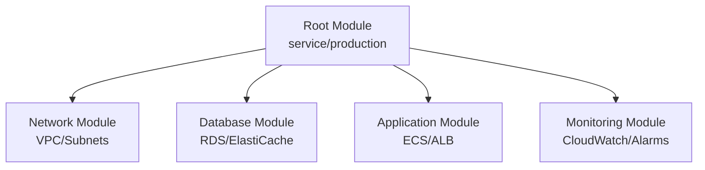

# How to Implement Infrastructure Composition Patterns in OpenTofu

Author: [nawazdhandala](https://www.github.com/nawazdhandala)

Tags: OpenTofu, Modules, Composition, Infrastructure as Code, Reusability, Architecture, Best Practices

Description: Learn how to compose complex infrastructure from reusable OpenTofu modules using composition patterns that promote DRY principles and team-scale infrastructure management.

---

Infrastructure composition is the practice of building complex deployments from smaller, reusable modules. Rather than writing monolithic configurations, you compose vetted building blocks — a VPC module, an ECS module, a database module — into a complete service. This promotes reuse, simplifies testing, and enables team-scale infrastructure management.

## The Composition Pattern



## Creating Composable Modules

```hcl
# modules/network/main.tf
# A reusable VPC module with well-defined inputs and outputs
variable "cidr_block" {
  type        = string
  description = "CIDR block for the VPC"
}

variable "environment" {
  type        = string
  description = "Environment name (e.g., production, staging)"
}

variable "availability_zones" {
  type        = list(string)
  description = "List of AZs to create subnets in"
}

resource "aws_vpc" "main" {
  cidr_block           = var.cidr_block
  enable_dns_hostnames = true
  enable_dns_support   = true

  tags = {
    Name        = "${var.environment}-vpc"
    Environment = var.environment
  }
}

# Output everything downstream modules need
output "vpc_id" {
  value = aws_vpc.main.id
}

output "private_subnet_ids" {
  value = aws_subnet.private[*].id
}

output "public_subnet_ids" {
  value = aws_subnet.public[*].id
}
```

## Composing Modules in a Root Configuration

```hcl
# environments/production/main.tf
terraform {
  required_providers {
    aws = {
      source  = "hashicorp/aws"
      version = "~> 5.30"
    }
  }

  backend "s3" {
    bucket = "my-tofu-state"
    key    = "production/terraform.tfstate"
    region = "us-east-1"
  }
}

# Compose the network layer
module "network" {
  source = "../../modules/network"

  environment        = "production"
  cidr_block         = "10.0.0.0/16"
  availability_zones = ["us-east-1a", "us-east-1b", "us-east-1c"]
}

# Compose the database layer — receives outputs from network module
module "database" {
  source = "../../modules/database"

  environment        = "production"
  vpc_id             = module.network.vpc_id
  private_subnet_ids = module.network.private_subnet_ids
  instance_class     = "db.r5.large"
  multi_az           = true
}

# Compose the application layer
module "application" {
  source = "../../modules/ecs-service"

  environment        = "production"
  vpc_id             = module.network.vpc_id
  private_subnet_ids = module.network.private_subnet_ids
  public_subnet_ids  = module.network.public_subnet_ids
  db_endpoint        = module.database.endpoint
  db_password_secret = module.database.password_secret_arn
  app_image          = var.app_image
  desired_count      = 3
}

# Compose the monitoring layer
module "monitoring" {
  source = "../../modules/monitoring"

  environment     = "production"
  service_name    = module.application.service_name
  alb_arn_suffix  = module.application.alb_arn_suffix
  db_identifier   = module.database.identifier
  alert_email     = var.ops_email
}
```

## Module Version Pinning

```hcl
# Using versioned modules from a registry or Git
module "s3_bucket" {
  # Pin to a specific version for stability
  source  = "terraform-aws-modules/s3-bucket/aws"
  version = "4.1.0"

  bucket = "my-application-data"
  acl    = "private"
}

module "vpc" {
  source  = "terraform-aws-modules/vpc/aws"
  version = "5.5.1"

  name = "production-vpc"
  cidr = "10.0.0.0/16"
}

# From a private Git repository with a pinned tag
module "internal_service" {
  source = "git::https://github.com/myorg/tf-modules.git//modules/ecs-service?ref=v2.3.0"

  environment = "production"
  # ... other variables
}
```

## Dependency Management Between Modules

```hcl
# explicit_dependencies.tf
# Modules that depend on outputs from other modules
module "app" {
  source = "../../modules/app"

  # Pass outputs from the network module as inputs to app module
  vpc_id     = module.network.vpc_id
  subnet_ids = module.network.private_subnet_ids

  # This implicitly creates a dependency: OpenTofu will create
  # the network module first, then the app module
}

module "dns" {
  source = "../../modules/dns"

  # Pass the ALB DNS name from app module to DNS module
  alb_dns_name = module.app.alb_dns_name

  # Explicit depends_on for non-output dependencies
  depends_on = [module.app]
}
```

## Best Practices

- Modules should have a single responsibility — a VPC module creates only network resources, not application resources.
- Use semantic versioning for internal modules and pin versions in root configurations.
- Make modules self-contained — they should work without knowledge of the calling module.
- Document every input and output with `description` fields — modules are APIs for infrastructure.
- Test modules in isolation with Terratest or OpenTofu's built-in test framework before using them in production root configs.
