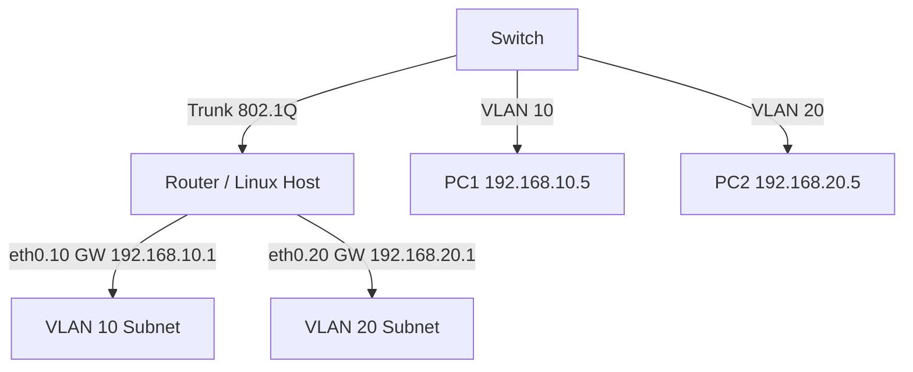

# How to Understand Routing Between VLANs (Inter-VLAN Routing)

Author: [nawazdhandala](https://www.github.com/nawazdhandala)

Tags: Networking, VLANs, Routing, Linux, 802.1Q, Layer3

Description: Understand how inter-VLAN routing works and configure it on Linux using 802.1Q VLAN subinterfaces to route traffic between isolated Layer 2 segments.

## Introduction

VLANs segment a network at Layer 2, meaning hosts on different VLANs cannot communicate directly — even if they're on the same physical switch. To route between VLANs, you need a Layer 3 device: either a router with a trunk link (router-on-a-stick), a Layer 3 switch with SVIs, or a Linux host with VLAN subinterfaces.

## How Router-on-a-Stick Works



A single trunk interface carries tagged frames for multiple VLANs. The router creates subinterfaces, one per VLAN, and routes between them.

## Configuring Inter-VLAN Routing on Linux

### Step 1: Load the 802.1Q Module

```bash
# Ensure the 802.1Q VLAN kernel module is loaded
modprobe 8021q
echo "8021q" >> /etc/modules
```

### Step 2: Create VLAN Subinterfaces

```bash
# Bring up the physical trunk interface (no IP needed on parent)
ip link set eth0 up

# Create subinterface for VLAN 10
ip link add link eth0 name eth0.10 type vlan id 10
ip addr add 192.168.10.1/24 dev eth0.10
ip link set eth0.10 up

# Create subinterface for VLAN 20
ip link add link eth0 name eth0.20 type vlan id 20
ip addr add 192.168.20.1/24 dev eth0.20
ip link set eth0.20 up
```

### Step 3: Enable IP Forwarding

```bash
sysctl -w net.ipv4.ip_forward=1
echo "net.ipv4.ip_forward=1" >> /etc/sysctl.conf
```

### Step 4: Verify Routing Between VLANs

```bash
# Check that subinterfaces are up and have correct addresses
ip addr show eth0.10
ip addr show eth0.20

# Verify the routing table has connected routes for both VLANs
ip route show
# 192.168.10.0/24 dev eth0.10 proto kernel scope link src 192.168.10.1
# 192.168.20.0/24 dev eth0.20 proto kernel scope link src 192.168.20.1

# From a host on VLAN 10, ping a host on VLAN 20
ping -c 4 192.168.20.5
```

## Making VLAN Interfaces Persistent (Netplan)

```yaml
# /etc/netplan/00-vlans.yaml
network:
  version: 2
  ethernets:
    eth0:
      dhcp4: no
  vlans:
    eth0.10:
      id: 10
      link: eth0
      addresses: [192.168.10.1/24]
    eth0.20:
      id: 20
      link: eth0
      addresses: [192.168.20.1/24]
```

```bash
netplan apply
```

## Firewall Control Between VLANs

Use iptables to control which VLANs can communicate:

```bash
# Allow VLAN 10 to reach VLAN 20
iptables -A FORWARD -i eth0.10 -o eth0.20 -j ACCEPT
iptables -A FORWARD -i eth0.20 -o eth0.10 -m state --state RELATED,ESTABLISHED -j ACCEPT

# Drop all other inter-VLAN traffic
iptables -A FORWARD -j DROP
```

## Conclusion

Inter-VLAN routing on Linux is straightforward once you understand 802.1Q tagging. VLAN subinterfaces act as separate Layer 3 interfaces, and the kernel's IP forwarding handles routing between them. This approach works well for small deployments; for high-throughput environments, consider a Layer 3 switch with hardware-accelerated SVIs.
