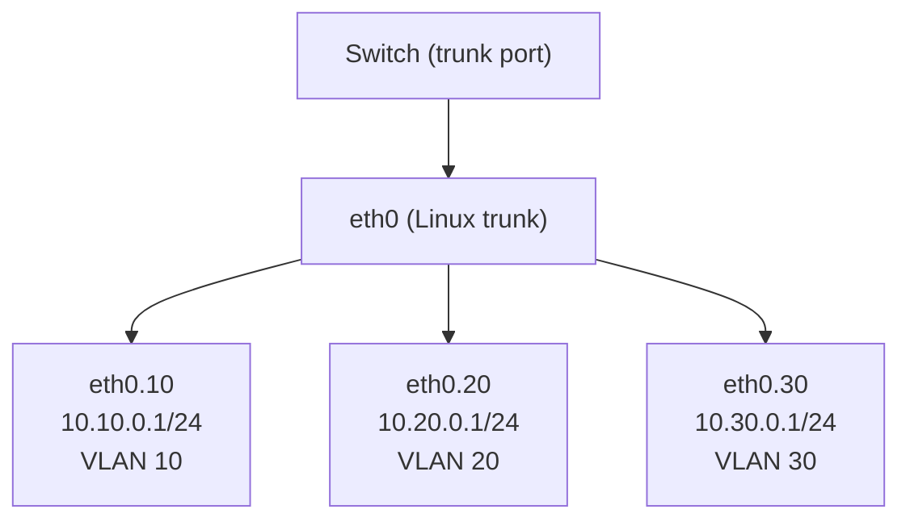

# How to Set Up Inter-VLAN Routing on Linux

Author: [nawazdhandala](https://www.github.com/nawazdhandala)

Tags: Linux, VLAN, Inter-VLAN Routing, IP Forwarding, 802.1Q, Networking, Firewall

Description: Configure a Linux server as a router-on-a-stick for inter-VLAN routing, enabling communication between hosts on different VLANs through a single physical interface.

## Introduction

Inter-VLAN routing allows hosts on different VLANs to communicate through a router. On Linux, you can implement "router-on-a-stick" by connecting a single physical interface to a switch trunk port, creating VLAN subinterfaces, and enabling IP forwarding. Linux then routes packets between VLAN subnets natively.

## Prerequisites

- Physical interface connected to a switch trunk port
- Multiple VLANs configured as subinterfaces
- Root access

## Step 1: Create VLAN Interfaces

```bash
modprobe 8021q
ip link set eth0 up

# VLAN 10: Management (10.10.0.0/24)

ip link add link eth0 name eth0.10 type vlan id 10
ip addr add 10.10.0.1/24 dev eth0.10
ip link set eth0.10 up

# VLAN 20: Servers (10.20.0.0/24)
ip link add link eth0 name eth0.20 type vlan id 20
ip addr add 10.20.0.1/24 dev eth0.20
ip link set eth0.20 up

# VLAN 30: IoT (10.30.0.0/24)
ip link add link eth0 name eth0.30 type vlan id 30
ip addr add 10.30.0.1/24 dev eth0.30
ip link set eth0.30 up
```

## Step 2: Enable IP Forwarding

IP forwarding is the key that enables routing between the VLAN interfaces:

```bash
# Enable immediately
sysctl -w net.ipv4.ip_forward=1

# Make it persistent
echo "net.ipv4.ip_forward = 1" >> /etc/sysctl.d/99-inter-vlan.conf
```

## Step 3: Verify Routing Table

Linux automatically adds directly-connected routes for each VLAN:

```bash
ip route show
# 10.10.0.0/24 dev eth0.10 proto kernel scope link src 10.10.0.1
# 10.20.0.0/24 dev eth0.20 proto kernel scope link src 10.20.0.1
# 10.30.0.0/24 dev eth0.30 proto kernel scope link src 10.30.0.1
```

## Step 4: Configure Hosts on Each VLAN

Each VLAN host must use the Linux router as its default gateway:

```text
# Host on VLAN 10 (10.10.0.10)
# Default gateway: 10.10.0.1 (eth0.10 IP)

# Host on VLAN 20 (10.20.0.20)
# Default gateway: 10.20.0.1 (eth0.20 IP)
```

## Step 5: Control Inter-VLAN Access with iptables

Allow some inter-VLAN traffic and block others:

```bash
# Allow VLAN 10 (management) to access all VLANs
iptables -A FORWARD -i eth0.10 -j ACCEPT
iptables -A FORWARD -o eth0.10 -m state --state ESTABLISHED,RELATED -j ACCEPT

# Allow VLAN 20 to access VLAN 30
iptables -A FORWARD -i eth0.20 -o eth0.30 -j ACCEPT
iptables -A FORWARD -i eth0.30 -o eth0.20 -m state --state ESTABLISHED,RELATED -j ACCEPT

# Block IoT (VLAN 30) from accessing servers (VLAN 20) unless established
iptables -A FORWARD -i eth0.30 -o eth0.20 -j DROP
```

## Test Inter-VLAN Connectivity

```bash
# From a host on VLAN 10, ping a host on VLAN 20
ping 10.20.0.20

# Trace the route (should go through the Linux router)
traceroute 10.20.0.20
# 1  10.10.0.1  (Linux router eth0.10)
# 2  10.20.0.20 (destination host)
```

## Architecture Diagram



## Conclusion

Inter-VLAN routing on Linux is achieved by creating VLAN subinterfaces and enabling `net.ipv4.ip_forward=1`. Linux automatically routes between directly-connected VLAN subnets. Use iptables FORWARD chain rules to control which VLANs can communicate, implementing security segmentation alongside routing.
