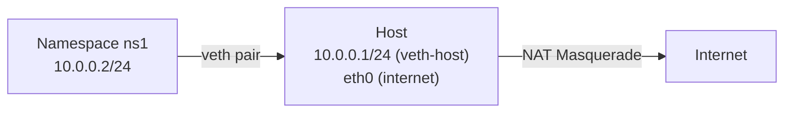

# How to Provide Internet Access to a Network Namespace Using NAT

Author: [nawazdhandala](https://www.github.com/nawazdhandala)

Tags: Linux, Network Namespaces, NAT, iptables, nftables, Internet Access, Networking

Description: Give a Linux network namespace internet access by enabling IP forwarding on the host and configuring NAT masquerade rules to forward and translate namespace traffic.

## Introduction

By default, a network namespace has no internet access. To give it internet connectivity, you need to connect it to the host network via a veth pair, enable IP forwarding on the host, and add a NAT masquerade rule so the namespace's private IP is translated to the host's public IP when sending traffic out.

## Architecture



## Step 1: Create and Connect the Namespace

```bash
# Create the namespace
ip netns add ns1

# Create a veth pair
ip link add veth-host type veth peer name veth-ns

# Move the namespace side into ns1
ip link set veth-ns netns ns1

# Configure the host side
ip addr add 10.0.0.1/24 dev veth-host
ip link set veth-host up

# Configure the namespace side
ip netns exec ns1 ip link set lo up
ip netns exec ns1 ip addr add 10.0.0.2/24 dev veth-ns
ip netns exec ns1 ip link set veth-ns up
```

## Step 2: Add a Default Route in the Namespace

```bash
# The namespace routes all traffic to the host as its gateway
ip netns exec ns1 ip route add default via 10.0.0.1
```

## Step 3: Enable IP Forwarding on the Host

```bash
# Enable IP forwarding on the host
sysctl -w net.ipv4.ip_forward=1

# Make it persistent
echo "net.ipv4.ip_forward = 1" >> /etc/sysctl.d/99-forwarding.conf
```

## Step 4: Add NAT Masquerade Rule

Using **iptables**:

```bash
# Replace eth0 with your actual internet-facing interface
iptables -t nat -A POSTROUTING -s 10.0.0.0/24 -o eth0 -j MASQUERADE
```

Using **nftables**:

```bash
nft add table ip nat
nft add chain ip nat postrouting { type nat hook postrouting priority 100 \; }
nft add rule ip nat postrouting ip saddr 10.0.0.0/24 oif "eth0" masquerade
```

## Step 5: Configure DNS Inside the Namespace

```bash
# Create a resolv.conf for the namespace
mkdir -p /etc/netns/ns1
echo "nameserver 8.8.8.8" > /etc/netns/ns1/resolv.conf
echo "nameserver 8.8.4.4" >> /etc/netns/ns1/resolv.conf
```

## Step 6: Test Internet Access

```bash
# Ping an external IP from inside the namespace
ip netns exec ns1 ping -c 3 8.8.8.8

# Test DNS resolution
ip netns exec ns1 ping -c 3 google.com

# Test HTTP access
ip netns exec ns1 curl -s https://icanhazip.com
```

## Full Setup Script

```bash
#!/bin/bash
# ns-internet.sh: Give namespace internet access via NAT

NS=ns1
HOST_VETH=veth-host
NS_VETH=veth-ns
HOST_IP=10.0.0.1/24
NS_IP=10.0.0.2/24
INTERNET_IFACE=eth0

ip netns add $NS
ip link add $HOST_VETH type veth peer name $NS_VETH
ip link set $NS_VETH netns $NS

ip addr add $HOST_IP dev $HOST_VETH && ip link set $HOST_VETH up
ip netns exec $NS ip link set lo up
ip netns exec $NS ip addr add $NS_IP dev $NS_VETH
ip netns exec $NS ip link set $NS_VETH up
ip netns exec $NS ip route add default via 10.0.0.1

sysctl -w net.ipv4.ip_forward=1
iptables -t nat -A POSTROUTING -s 10.0.0.0/24 -o $INTERNET_IFACE -j MASQUERADE

mkdir -p /etc/netns/$NS
echo "nameserver 8.8.8.8" > /etc/netns/$NS/resolv.conf

echo "Testing connectivity..."
ip netns exec $NS ping -c 3 8.8.8.8 && echo "Internet access working!"
```

## Conclusion

Providing internet access to a network namespace requires four components: a veth pair connecting the namespace to the host, IP forwarding enabled on the host, a NAT masquerade rule for the namespace subnet, and DNS configuration. This is exactly the setup Docker uses for containers in the default bridge network mode.
