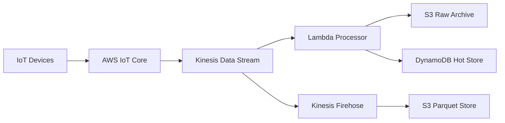

# How to Set Up IoT Data Pipelines with OpenTofu

Author: [nawazdhandala](https://www.github.com/nawazdhandala)

Tags: OpenTofu, AWS, IoT, Kinesis, Data Pipeline, Infrastructure as Code

Description: Learn how to build end-to-end IoT data pipelines from device ingestion through Kinesis, Lambda, and S3 using OpenTofu.

## Introduction

IoT devices generate high-volume, continuous streams of telemetry data. A well-designed pipeline ingests this data through IoT Core, buffers it in Kinesis, processes it with Lambda, and stores it in S3 for analytics. OpenTofu manages the entire pipeline as code.

## Architecture



## Kinesis Data Stream

```hcl
resource "aws_kinesis_stream" "telemetry" {
  name             = "${var.app_name}-telemetry"
  shard_count      = 4  # each shard handles 1 MB/s ingestion
  retention_period = 24 # hours

  shard_level_metrics = [
    "IncomingBytes",
    "OutgoingBytes",
    "IncomingRecords",
    "IteratorAgeMilliseconds"
  ]

  tags = {
    Environment = var.environment
    ManagedBy   = "opentofu"
  }
}
```

## IoT Core Rule to Kinesis

```hcl
resource "aws_iot_topic_rule" "to_kinesis" {
  name        = "${replace(var.app_name, "-", "_")}_to_kinesis"
  enabled     = true
  sql         = "SELECT * FROM 'sensors/+/telemetry'"
  sql_version = "2016-03-23"

  kinesis {
    role_arn       = aws_iam_role.iot_kinesis.arn
    stream_name    = aws_kinesis_stream.telemetry.name
    partition_key  = "$${clientId()}"  # partition by device
  }
}
```

## Lambda Stream Processor

```hcl
resource "aws_lambda_function" "stream_processor" {
  function_name = "${var.app_name}-stream-processor"
  runtime       = "python3.12"
  handler       = "processor.handler"
  role          = aws_iam_role.lambda_stream.arn
  filename      = "processor.zip"
  timeout       = 300
  memory_size   = 512

  environment {
    variables = {
      DDB_TABLE  = aws_dynamodb_table.hot_store.name
      S3_BUCKET  = aws_s3_bucket.raw_archive.bucket
    }
  }
}

resource "aws_lambda_event_source_mapping" "kinesis" {
  event_source_arn              = aws_kinesis_stream.telemetry.arn
  function_name                 = aws_lambda_function.stream_processor.arn
  starting_position             = "LATEST"
  batch_size                    = 100
  parallelization_factor        = 2  # 2 concurrent Lambda invocations per shard
  bisect_batch_on_function_error = true
}
```

## Kinesis Firehose for Parquet Storage

```hcl
resource "aws_kinesis_firehose_delivery_stream" "parquet" {
  name        = "${var.app_name}-parquet-delivery"
  destination = "extended_s3"

  kinesis_source_configuration {
    kinesis_stream_arn = aws_kinesis_stream.telemetry.arn
    role_arn           = aws_iam_role.firehose.arn
  }

  extended_s3_configuration {
    role_arn           = aws_iam_role.firehose.arn
    bucket_arn         = aws_s3_bucket.parquet_store.arn
    prefix             = "year=!{timestamp:yyyy}/month=!{timestamp:MM}/day=!{timestamp:dd}/"
    error_output_prefix = "errors/!{firehose:error-output-type}/"
    buffering_size      = 128  # MB
    buffering_interval  = 300  # seconds

    data_format_conversion_configuration {
      enabled = true

      output_format_configuration {
        serializer {
          parquet_ser_de {}  # convert to Parquet format
        }
      }

      input_format_configuration {
        deserializer {
          open_x_json_ser_de {}
        }
      }

      schema_configuration {
        role_arn      = aws_iam_role.firehose.arn
        database_name = aws_glue_catalog_database.telemetry.name
        table_name    = aws_glue_catalog_table.telemetry.name
      }
    }
  }
}
```

## Deploying

```bash
tofu init
tofu plan -out=tfplan
tofu apply tfplan
```

## Summary

IoT data pipelines require careful design for high throughput and cost efficiency. OpenTofu manages the complete pipeline - IoT Core rules, Kinesis streams, Lambda processors, Firehose delivery to Parquet, and DynamoDB hot storage - as reproducible, version-controlled infrastructure code.
