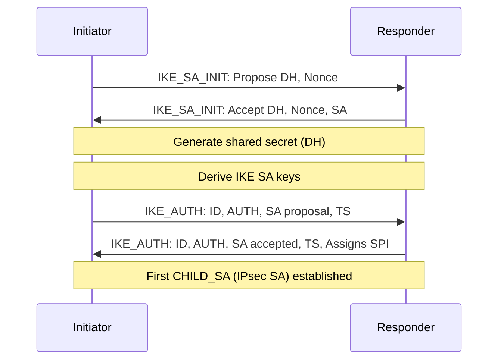

# How to Understand IPsec Security Associations for IPv6

Author: [nawazdhandala](https://www.github.com/nawazdhandala)

Tags: IPv6, IPsec, Security Associations, SPI, SAD

Description: Learn how IPsec Security Associations work in IPv6 networks, including the SAD/SPD databases, SPI identifiers, SA negotiation with IKEv2, and lifetime management.

## Overview

A Security Association (SA) is a one-way logical connection between two IPv6 hosts that defines the cryptographic parameters (algorithm, key, SPI) for IPsec processing. Every IPsec tunnel requires two SAs - one in each direction. Understanding SAs is fundamental to troubleshooting IPsec issues.

## SA Components

A Security Association is uniquely identified by three values:

| Component | Description |
|-----------|-------------|
| SPI (Security Parameters Index) | 32-bit value chosen by the receiver |
| Destination IP | IPv6 address of the SA's destination |
| Protocol | AH (51) or ESP (50) |

Together these form the SA selector: `(SPI, dst, protocol)`

## Security Association Database (SAD)

The SAD contains all active SAs. Each entry includes:

```text
SA Parameters:
  SPI:           0xABC123
  Protocol:      ESP
  Src:           2001:db8:gw1::1
  Dst:           2001:db8:gw2::1
  Mode:          Tunnel
  Cipher:        AES-256-GCM
  Key:           [256-bit key]
  Auth:          Built-in (GCM)
  Seq Counter:   5 (anti-replay)
  Bitmap:        0xFFFFFFFF (anti-replay window)
  Lifetime:      3600s / 4294967295 bytes
  Elapsed:       45s / 892644 bytes
```

```bash
# View SAD on Linux

ip xfrm state list

# Detailed view
ip -s xfrm state list

# Sample output:
# src 2001:db8:gw1::1 dst 2001:db8:gw2::1
#   proto esp spi 0x00abc123 reqid 1 mode tunnel
#   replay-window 64 flag af-unspec
#   aead rfc4106(gcm(aes)) 0x...key...  128
#   anti-replay context: seq 0x5, oseq 0x5, bitmap 0xffffffff
#   lifetime config:
#     limit: soft 0(bytes), hard 0(bytes)
#     limit: soft 3510(use), hard 3600(use)
#   current:
#     892644(bytes), 721(packets), used 42(sec)
```

## Security Policy Database (SPD)

The SPD determines which traffic is subject to IPsec processing:

```bash
# View SPD on Linux
ip xfrm policy list

# Sample output:
# src 2001:db8:site1::/48 dst 2001:db8:site2::/48
#   dir out priority 0
#   tmpl src 2001:db8:gw1::1 dst 2001:db8:gw2::1
#     proto esp spi 0x00000000(0) reqid 1 mode tunnel
```

SPD actions:
- **PROTECT**: Apply IPsec (ENCRYPT/AUTHENTICATE)
- **BYPASS**: Send without IPsec
- **DISCARD**: Drop the packet

## SA Negotiation with IKEv2



## SA Lifetimes

SAs have both time and byte-based lifetimes:

```bash
# strongSwan: Configure SA lifetimes in swanctl.conf
children {
    my-tunnel {
        rekey_time = 3600s      ! Initiate rekey at 3600s
        life_time  = 7200s      ! Hard lifetime (force new SA at 7200s)
        rekey_bytes = 1000000000  ! Rekey after 1GB
        life_bytes  = 2000000000  ! Hard byte limit
    }
}
```

### SA Rekey vs SA Renewal

- **Rekey**: New keys are negotiated while old SA is still valid (smooth transition)
- **Renewal**: Old SA expires, new negotiation starts (brief interruption possible)

```bash
# Monitor SA rekey events
journalctl -u strongswan | grep -E 'rekeying|CHILD_SA'
```

## Anti-Replay Protection

ESP includes a sequence number for anti-replay protection:

```bash
# The anti-replay window (default 64 packets)
# If a packet arrives with a sequence number outside the window → dropped
# This prevents replay attacks where attacker resends captured ESP packets

# View current sequence numbers
ip xfrm state list | grep 'anti-replay context'
# seq = expected next inbound sequence
# oseq = current outbound sequence

# Extend anti-replay window (for high-bandwidth links with reordering)
ip xfrm state add ... replay-window 512
```

## SA Monitoring

```bash
# Count SA bytes processed
ip -s xfrm state list | grep -A 1 'current:'
# Shows: bytes/packets since SA was created

# Watch SA expiry
watch -n 5 "ip xfrm state list | grep 'lifetime\|current'"

# strongSwan: Show SA details
swanctl --list-sas --raw | grep -E 'spi|bytes|rekey'
```

## Summary

IPsec SAs are identified by (SPI, Destination IP, Protocol). The SAD stores active SAs with their keys, algorithms, and counters. The SPD determines which traffic gets IPsec treatment. IKEv2 negotiates SAs in two phases: IKE_SA_INIT (DH exchange) and IKE_AUTH (authentication + first CHILD_SA). SAs have time and byte-based lifetimes with automatic rekeying (strongSwan: `rekey_time`). Monitor SAs with `ip xfrm state list` on Linux or `swanctl --list-sas`. Anti-replay protection uses a sequence number window to prevent replay attacks.
