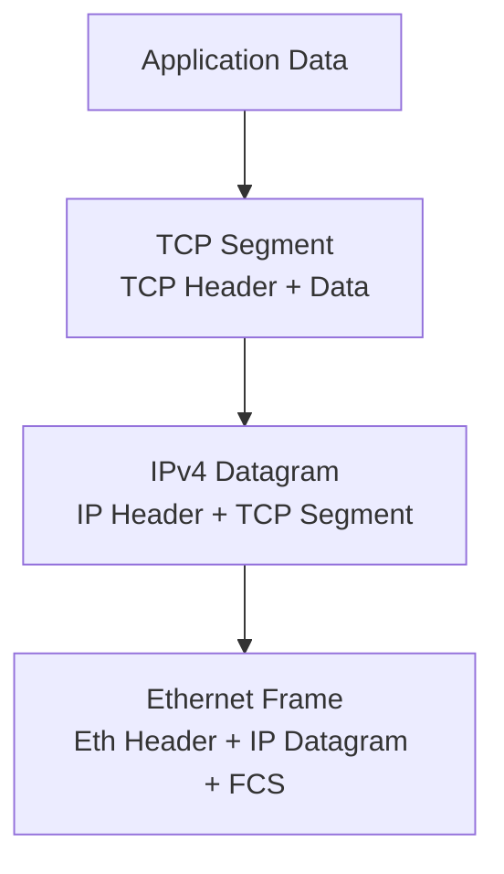

# How to Understand IPv4 Encapsulation and Decapsulation

Author: [nawazdhandala](https://www.github.com/nawazdhandala)

Tags: IPv4, Networking, Encapsulation, OSI Model, TCP/IP, Network Architecture

Description: IPv4 encapsulation wraps upper-layer protocol data inside an IP datagram by prepending an IP header, while decapsulation at the destination strips that header to deliver the payload to the correct protocol handler.

## What Is Encapsulation?

Encapsulation is the process of adding protocol-specific headers (and sometimes trailers) as data moves down the network stack. Each layer wraps the data from the layer above with its own control information.



## Step-by-Step Encapsulation

1. **Application layer**: Produces data (e.g., HTTP request body).
2. **Transport layer (TCP)**: Adds TCP header (source/dest port, sequence, flags).
3. **Network layer (IPv4)**: Adds IP header (src/dst IP, TTL, protocol=6).
4. **Data link layer (Ethernet)**: Adds MAC header and FCS trailer.
5. **Physical layer**: Converts frame to bits for transmission.

## Decapsulation (Receiving Side)

Each layer strips its own header and passes the payload up:

```python
import struct, socket

def decapsulate_ethernet_ipv4(frame: bytes):
    """
    Minimal decapsulation: strip Ethernet and IPv4 headers.
    Returns (src_ip, dst_ip, protocol, payload).
    """
    # Ethernet header: 6 (dst MAC) + 6 (src MAC) + 2 (EtherType) = 14 bytes
    eth_payload = frame[14:]

    # IPv4 header: minimum 20 bytes
    version_ihl = eth_payload[0]
    ihl = (version_ihl & 0x0F) * 4   # Header length in bytes
    protocol = eth_payload[9]
    src_ip = socket.inet_ntoa(eth_payload[12:16])
    dst_ip = socket.inet_ntoa(eth_payload[16:20])
    ip_payload = eth_payload[ihl:]    # Strip IP header

    return src_ip, dst_ip, protocol, ip_payload

# Example: minimal synthetic frame (Ethernet + IP + 4 bytes payload)
# Ethernet dst + src (12 bytes) + EtherType 0x0800 (2 bytes)
eth_hdr = bytes(12) + b'\x08\x00'
ip_hdr = struct.pack("!BBHHHBBH4s4s",
    0x45, 0, 24, 1, 0, 64, 17, 0,
    socket.inet_aton("10.0.0.1"),
    socket.inet_aton("10.0.0.2"),
)
frame = eth_hdr + ip_hdr + b'\xDE\xAD\xBE\xEF'

src, dst, proto, payload = decapsulate_ethernet_ipv4(frame)
print(f"Src={src} Dst={dst} Proto={proto} Payload={payload.hex()}")
```

## IP-in-IP and GRE Tunneling

IPv4 datagrams can themselves be encapsulated inside another IP datagram (IP-in-IP, protocol 4) or inside GRE (protocol 47), creating tunnel overlays.

```bash
# Create a GRE tunnel on Linux
ip tunnel add gre0 mode gre remote 203.0.113.1 local 198.51.100.1
ip addr add 10.10.10.1/30 dev gre0
ip link set gre0 up
```

## Key Takeaways

- Encapsulation adds headers layer-by-layer going down the stack; decapsulation strips them going up.
- The IPv4 Protocol field tells the receiver which upper-layer handler should process the payload.
- Tunneling is just another layer of encapsulation, wrapping IP datagrams inside other IP datagrams.
- Each layer's header is independent; changing one layer does not require modifying others.
