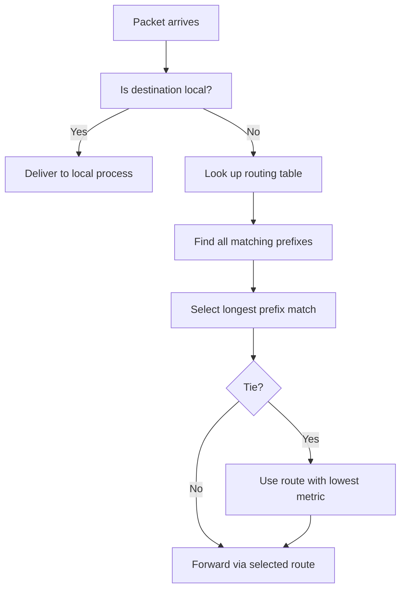

# How to Understand How IPv4 Routing Decisions Are Made

Author: [nawazdhandala](https://www.github.com/nawazdhandala)

Tags: Networking, Routing, IPv4, Linux

Description: Learn the step-by-step process Linux and other routers use to make IPv4 forwarding decisions, including longest prefix match, metrics, and route tables.

## The Routing Decision Process

When a host or router receives a packet, it determines the forwarding path by consulting the routing table. The process is:



## Step 1: Is the Destination Local?

The kernel first checks if the destination IP is assigned to a local interface:

```bash
ip route show table local
# Shows all local IPs (loopback + all interface addresses)
```

If the destination matches, the packet is delivered locally (no routing needed).

## Step 2: Longest Prefix Match

The routing table is searched for the entry with the **most specific match** (longest prefix). The longer the prefix length, the more specific the match:

```
Routing table:
  0.0.0.0/0        via 192.168.1.1   (default, matches everything)
  10.0.0.0/8       via 10.0.0.254    (/8, matches 10.x.x.x)
  10.1.0.0/16      via 10.1.0.254    (/16, more specific)
  10.1.1.0/24      via 10.1.1.254    (/24, most specific)

Packet to 10.1.1.50:
  Matches: 0.0.0.0/0, 10.0.0.0/8, 10.1.0.0/16, 10.1.1.0/24
  Longest match: 10.1.1.0/24 → forwards via 10.1.1.254
```

```python
import ipaddress

def longest_prefix_match(dest, routes):
    """Find the most specific route for a destination."""
    dest_ip = ipaddress.ip_address(dest)
    best = None
    for network, gateway in routes:
        net = ipaddress.ip_network(network)
        if dest_ip in net:
            if best is None or net.prefixlen > ipaddress.ip_network(best[0]).prefixlen:
                best = (network, gateway)
    return best

routes = [
    ('0.0.0.0/0', '192.168.1.1'),
    ('10.0.0.0/8', '10.0.0.254'),
    ('10.1.0.0/16', '10.1.0.254'),
    ('10.1.1.0/24', '10.1.1.254'),
]

result = longest_prefix_match('10.1.1.50', routes)
print(f"Best route: {result[0]} via {result[1]}")
# Output: Best route: 10.1.1.0/24 via 10.1.1.254
```

## Step 3: Tiebreaking with Metrics

When two routes have the **same prefix length**, the route with the **lower metric** wins:

```
10.0.0.0/24 via 192.168.1.254 metric 100  ← preferred
10.0.0.0/24 via 192.168.2.254 metric 200
```

```bash
# Check metrics in routing table
ip route show | awk '{print $0}' | grep metric
```

## Step 4: Equal-Cost Multi-Path (ECMP)

If two routes have the same prefix length AND same metric, Linux uses ECMP (load balancing):

```bash
ip route add 10.0.0.0/24 nexthop via 192.168.1.254 weight 1 \
                          nexthop via 192.168.2.254 weight 1

# Linux distributes flows across both paths
```

## Step 5: Source Address Selection

When multiple routes match and a source IP must be chosen, Linux uses the `src` hint:

```bash
ip route show
# default via 192.168.1.1 dev eth0 proto dhcp src 192.168.1.10 metric 100
# The 'src' field is the preferred source address for packets using this route
```

## Verifying the Routing Decision

```bash
# Show exact route and source address used for a destination
ip route get 8.8.8.8
# 8.8.8.8 via 192.168.1.1 dev eth0 src 192.168.1.10

ip route get 10.1.1.50
# 10.1.1.50 via 10.1.1.254 dev eth1 src 10.1.1.1
```

## Key Takeaways

- Routing uses **longest prefix match** — the most specific route wins.
- When prefix lengths tie, the **lowest metric** wins.
- Equal metrics with same prefix enable ECMP load balancing.
- `ip route get DEST` shows the exact next-hop and source IP Linux will use.

**Related Reading:**

- [How to View the Routing Table on Linux](https://oneuptime.com/blog/post/2026-03-20-view-routing-table-linux/view)
- [How to Understand Longest Prefix Match in Routing](https://oneuptime.com/blog/post/2026-03-20-longest-prefix-match-routing/view)
- [How to Understand Routing Metrics and Cost](https://oneuptime.com/blog/post/2026-03-20-routing-metrics-cost/view)
