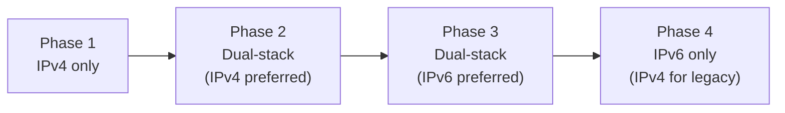

# How to Transition an IPv4 Address Plan to IPv6

Author: [nawazdhandala](https://www.github.com/nawazdhandala)

Tags: IPv6, IPv4, Migration, Dual-Stack, Address Planning

Description: Learn how to map your existing IPv4 address plan to an IPv6 equivalent, maintain dual-stack operation, and progressively transition to IPv6-first networking.

## Introduction

Transitioning from an IPv4 address plan to IPv6 does not mean discarding what you have — it means creating an IPv6 parallel that mirrors your existing structure, then gradually shifting preference from IPv4 to IPv6. The key is maintaining dual-stack operation during the transition so services remain accessible over both protocols.

## Mapping IPv4 to IPv6 Structure

```
IPv4 Plan Example:
  10.0.1.0/24    HQ User LAN      (VLAN 1)
  10.0.10.0/24   HQ Servers       (VLAN 10)
  10.0.20.0/24   HQ DMZ           (VLAN 20)
  192.168.1.0/24 Branch1 LAN
  192.168.2.0/24 Branch2 LAN

IPv6 Equivalent:
  2001:db8:corp:0001::/64  HQ User LAN  (VLAN 1)
  2001:db8:corp:000a::/64  HQ Servers   (VLAN 10)
  2001:db8:corp:0014::/64  HQ DMZ       (VLAN 20)
  2001:db8:corp:1100::/56  Branch 1 (/48-like, split to /64 per VLAN)
  2001:db8:corp:1200::/56  Branch 2
```

The VLAN ID is preserved in the IPv6 subnet number (decimal 10 = hex 0x0a), making the relationship between the IPv4 and IPv6 plans immediately apparent.

## Python: Generate IPv6 Plan from IPv4 Plan

```python
import ipaddress

def ipv4_to_ipv6_mapping(ipv6_48_prefix: str, ipv4_subnets: list) -> dict:
    """
    Generate IPv6 subnets corresponding to IPv4 subnets.
    Maps the IPv4 third-octet to the IPv6 subnet ID.
    """
    v6_base = ipaddress.IPv6Network(ipv6_48_prefix)
    v6_subnets = list(v6_base.subnets(new_prefix=64))
    mapping = {}

    for entry in ipv4_subnets:
        ipv4_net = ipaddress.IPv4Network(entry["prefix"])
        # Use the third octet as subnet ID
        third_octet = int(str(ipv4_net.network_address).split(".")[2])
        ipv6_subnet = v6_subnets[third_octet]
        mapping[entry["name"]] = {
            "ipv4": ipv4_net,
            "ipv6": ipv6_subnet,
            "vlan": entry.get("vlan"),
        }
    return mapping

ipv4_plan = [
    {"prefix": "10.0.1.0/24",  "name": "HQ Users",   "vlan": 1},
    {"prefix": "10.0.10.0/24", "name": "HQ Servers",  "vlan": 10},
    {"prefix": "10.0.20.0/24", "name": "HQ DMZ",      "vlan": 20},
]

mapping = ipv4_to_ipv6_mapping("2001:db8:corp::/48", ipv4_plan)
for name, info in mapping.items():
    print(f"{name:15s}: {str(info['ipv4']):18s} → {info['ipv6']}")
```

## Dual-Stack Transition Plan



### Phase 1: Preparation
- Obtain IPv6 prefix from ISP or RIR
- Design the IPv6 address plan mirroring IPv4 structure
- Test IPv6 connectivity on a lab VLAN

### Phase 2: Enable Dual-Stack

```bash
# Add IPv6 address alongside IPv4 on each interface
sudo ip addr add 192.168.1.1/24 dev eth0         # IPv4 (existing)
sudo ip -6 addr add 2001:db8:corp:1::1/64 dev eth0  # IPv6 (new)

# Enable IPv6 on interface
sudo sysctl -w net.ipv6.conf.eth0.disable_ipv6=0

# Start radvd for SLAAC
sudo systemctl start radvd
```

### Phase 3: Shift Preference to IPv6

```bash
# Linux: prefer IPv6 for outbound connections
# /etc/gai.conf
precedence ::1/128       50  # Loopback
precedence ::/0          40  # IPv6 preferred over IPv4
precedence 2002::/16     30  # 6to4
precedence ::ffff:0:0/96 10  # IPv4

# Ensure IPv6 DNS records exist for all services
# A records remain but AAAA records take precedence
```

### Phase 4: IPv4 Cleanup

```bash
# Move IPv4-only services to NAT64/DNS64
# Remove IPv4 from interfaces progressively
# Keep IPv4 in place for legacy devices that cannot use IPv6
```

## Static Address Mapping Convention

For servers with static IPv4 addresses, create predictable IPv6 equivalents:

```python
# Convention: embed the last two octets of IPv4 in the IPv6 IID
def ipv4_to_static_ipv6(ipv6_subnet: str, ipv4_addr: str) -> str:
    """
    Create a static IPv6 address by embedding the IPv4 address.
    e.g., 10.0.10.50 → 2001:db8:corp:a::10.50 → ::a:32
    """
    octets = ipv4_addr.split(".")
    # Use last two octets as hex in the IID
    third = int(octets[2])
    fourth = int(octets[3])
    iid = f"::{third:x}:{fourth:x}"
    net = ipv6_subnet.rstrip(":").rstrip("/64")
    return f"{net}{iid}"

print(ipv4_to_static_ipv6("2001:db8:corp:a::", "10.0.10.50"))
# Output: 2001:db8:corp:a::a:32
```

## Conclusion

Transitioning an IPv4 address plan to IPv6 is most successful when the IPv6 plan mirrors the IPv4 structure using VLAN IDs as subnet identifiers. Dual-stack operation allows a gradual transition without service disruption. Encode IPv4 last-octet conventions into static IPv6 addresses for servers to make the transition visible and reversible. The goal is to eventually prefer IPv6 for all traffic while maintaining IPv4 only for legacy devices that cannot be updated.
