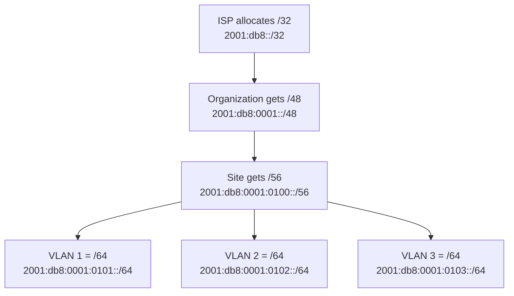

# How to Understand the /64 Boundary Convention in IPv6

Author: [nawazdhandala](https://www.github.com/nawazdhandala)

Tags: IPv6, Subnetting, SLAAC, Networking, Addressing

Description: Understand why IPv6 mandates a /64 prefix length for individual subnets, how it enables SLAAC, and the implications for address planning.

## Introduction

One of the most important conventions in IPv6 is that individual subnets (links) should always use a `/64` prefix. This is not merely a recommendation - many IPv6 features, including Stateless Address Autoconfiguration (SLAAC) and EUI-64, are designed around this fixed boundary. Understanding why the /64 boundary exists helps you design correct IPv6 address plans.

## The 128-Bit IPv6 Address Structure

Every IPv6 address is 128 bits. The /64 convention divides this cleanly in half:

```text
|<-------- 64 bits -------->|<-------- 64 bits -------->|
|      Network Prefix       |     Interface Identifier   |
|  /64 subnet prefix        |  EUI-64 or random bits     |
```

This split enables hosts to generate their own interface identifier without consulting a server, making SLAAC possible.

## Why /64 Is Required for SLAAC

SLAAC (RFC 4862) allows hosts to self-configure their IPv6 address:

1. Host receives a Router Advertisement with a /64 prefix (e.g., `2001:db8:1:2::/64`)
2. Host generates a 64-bit interface identifier (from MAC address via EUI-64, or randomly)
3. Host combines prefix + interface ID to form its full address

```text
Prefix:  2001:db8:0001:0002:0000:0000:0000:0000  (/64)
IID:     0000:0000:0000:0201:02ff:fe03:0405       (EUI-64 from MAC)
Result:  2001:db8:0001:0002:0201:02ff:fe03:0405
```

If the prefix is shorter than /64, there are not enough bits in the host portion for EUI-64 generation, breaking SLAAC.

## The /64 Convention in Address Hierarchy

A typical IPv6 address hierarchy from an ISP assignment:



From a /48, you get 65,536 individual /64 subnets - enough for any organization.

## Consequences of Breaking the /64 Boundary

Using a prefix longer than /64 (e.g., /80, /96) on a subnet breaks SLAAC:

```bash
# This is WRONG - using /80 on a subnet

# SLAAC will not work; hosts cannot auto-configure addresses
# You must use stateful DHCPv6 for all address assignment

# Correct: always use /64 for subnets
sudo ip -6 addr add 2001:db8:1:1::1/64 dev eth0  # Correct
sudo ip -6 addr add 2001:db8:1:1::1/80 dev eth0  # Wrong - breaks SLAAC
```

## Exceptions: Point-to-Point Links

The one common exception is point-to-point links between routers. RFC 6164 recommends using `/127` prefixes on these links to prevent certain attacks:

```text
# Router-to-router link can use /127
Router A: 2001:db8:ffff::0/127
Router B: 2001:db8:ffff::1/127

# Or even /128 for loopback addresses
Router loopback: 2001:db8::1/128
```

Using /127 on point-to-point links prevents the "ping-pong" attack where packets can loop between routers due to the subnet-router anycast address occupying the all-zeros address.

## Practical Configuration

```bash
# Correctly configure a /64 subnet on a Linux router interface
sudo ip -6 addr add 2001:db8:1:1::1/64 dev eth0

# Configure radvd to advertise the /64 prefix for SLAAC
cat /etc/radvd.conf
# interface eth0 {
#     AdvSendAdvert on;
#     prefix 2001:db8:1:1::/64 {
#         AdvOnLink on;
#         AdvAutonomous on;
#     };
# };

# Verify hosts receive the /64 prefix and auto-configure
ip -6 addr show  # Should show a 2001:db8:1:1:xxxx:xxxx:xxxx:xxxx/64 address
```

## Summary

| Prefix | Use Case | SLAAC |
|---|---|---|
| /64 | All subnets (LANs, VLANs, VPCs) | Works |
| /127 | Point-to-point router links | Not needed |
| /128 | Loopback, single host | Not needed |
| < /64 | Never use on subnets | Broken |

## Conclusion

The /64 boundary is a fundamental constraint in IPv6 design. Always assign /64 prefixes to subnets where hosts will auto-configure addresses. Reserve shorter prefixes (/32, /48, /56) for hierarchical routing, and use /127 or /128 only for infrastructure links and loopbacks. This convention simplifies address management while enabling the stateless autoconfiguration that makes IPv6 deployment scalable.
