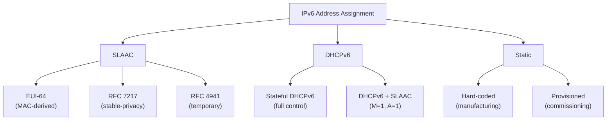

# How to Understand IPv6 Address Assignment for IoT Devices

Author: [nawazdhandala](https://www.github.com/nawazdhandala)

Tags: IPv6, IoT, Address Assignment, SLAAC, DHCPv6, Networking

Description: Understand the different IPv6 address assignment methods for IoT devices including EUI-64 SLAAC, stable privacy, DHCPv6, and static assignment, and when to use each.

## Introduction

IoT devices have unique address assignment requirements: some need fixed, predictable addresses for monitoring and access control; others benefit from SLAAC simplicity; constrained devices need minimal overhead. This guide covers all IPv6 address assignment methods and their tradeoffs for IoT use cases.

## Address Assignment Methods



## Method 1: EUI-64 SLAAC (Simple but Exposes MAC)

```bash
# Default behavior on most devices
# Pros: Zero-config, no server needed, collision-free
# Cons: Exposes hardware MAC, persistent cross-network identifier

# Verify EUI-64 is being used
# Check IID against MAC: if MAC is 00:11:22:33:44:55
# EUI-64 IID should be: 0211:22ff:fe33:4455
ip -6 addr show | grep "scope global"
```

Suitable for: Fixed industrial IoT devices, sensors in closed networks.

## Method 2: RFC 7217 Stable Privacy (Recommended for Most IoT)

```bash
# Set addr_gen_mode=2 for opaque but stable IIDs
sudo sysctl -w net.ipv6.conf.default.addr_gen_mode=2

# For NetworkManager-managed interfaces:
nmcli connection modify eth0 ipv6.addr-gen-mode stable-privacy
```

Suitable for: General IoT devices that need consistent addressing per network but privacy from external observers.

## Method 3: Temporary Addresses (RFC 4941) — Not Recommended for IoT

Temporary addresses rotate, making it hard to track devices for monitoring:
- Not suitable for most IoT: device cannot be reliably addressed for management
- Useful for privacy-sensitive consumer IoT devices (cameras, smart speakers)

## Method 4: DHCPv6 with Static Reservations

```text
# /etc/dhcp/dhcpd6.conf - DHCPv6 with reservations for IoT devices

subnet6 2001:db8:iot:1::/64 {
    # Dynamic pool for unregistered devices
    range6 2001:db8:iot:1::1000 2001:db8:iot:1::1fff;

    # Static reservation by DUID-LL (link-layer address type)
    host temperature-sensor-1 {
        # DUID-LL: type 3 (00:03), hardware type 1 (00:01), MAC
        host-identifier option dhcp6.client-id 00:03:00:01:00:11:22:33:44:55;
        fixed-address6 2001:db8:iot:1::sensor1;
    }

    host door-sensor-lobby {
        host-identifier option dhcp6.client-id 00:03:00:01:aa:bb:cc:dd:ee:ff;
        fixed-address6 2001:db8:iot:1::door1;
    }
}
```

Suitable for: Enterprise IoT where central address management and audit trails are required.

## Method 5: Manufacturing-Time Static Assignment

For the most constrained devices, addresses are assigned at manufacturing:

```c
// Embedded C: hard-coded IPv6 address for a constrained sensor
#include "net/ipv6/addr.h"

// In Contiki-NG or RIOT OS:
// Set the device's IPv6 address to a pre-provisioned value
static const ipv6_addr_t device_addr = {
    .u8 = {0x20, 0x01, 0x0d, 0xb8, 0x00, 0x01, 0x00, 0x01,
           0x00, 0x00, 0x00, 0x00, 0x00, 0x00, 0x00, 0x42}
    // This is 2001:db8:1:1::42
};

// Register the address on the interface
gnrc_netif_ipv6_addr_add(netif, &device_addr, 64,
                          GNRC_NETIF_IPV6_ADDRS_FLAGS_STATE_VALID);
```

## Choosing the Right Method

| Scenario | Recommended Method | Reason |
|---|---|---|
| Battery sensors, mesh | EUI-64 SLAAC | Zero-config, no server needed |
| Enterprise IoT fleet | DHCPv6 reservations | Centralized management, audit trail |
| Smart home devices | RFC 7217 stable-privacy | Privacy + stability |
| Industrial fixed assets | Static at commissioning | Predictable, no DHCP dependency |
| Consumer IoT (privacy-sensitive) | RFC 4941 temporary | Prevent tracking |
| 6LoWPAN constrained devices | EUI-64 or static | Minimal stack requirements |

## Tracking Addresses in IPAM

Regardless of assignment method, track IoT IPv6 addresses in an IPAM tool:

```bash
# Script to discover and record IoT device IPv6 addresses
#!/bin/bash
SUBNET="2001:db8:iot:1::/64"
OUTPUT_FILE="/var/lib/ipam/iot-devices.csv"

echo "IPv6 Address,MAC Address,Last Seen" > "$OUTPUT_FILE"

# Read from IPv6 neighbor cache on the border router
ip -6 neigh show dev lowpan0 | while read addr dev lladdr rest; do
    echo "$addr,$lladdr,$(date -u +%Y-%m-%dT%H:%M:%SZ)" >> "$OUTPUT_FILE"
done
```

## Conclusion

IPv6 address assignment for IoT devices spans from simple EUI-64 SLAAC (zero-config, stateless) to DHCPv6 with reservations (centralized, auditable) to static commissioning (deterministic, offline-resilient). The right choice depends on the device class, network management requirements, and privacy considerations. For most enterprise IoT deployments, DHCPv6 with static reservations provides the best balance of control and manageability.
