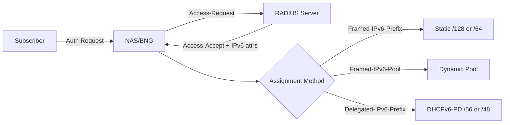

# How to Assign IPv6 Addresses via RADIUS

Author: [nawazdhandala](https://www.github.com/nawazdhandala)

Tags: RADIUS, IPv6, Address Assignment, DHCPv6, FreeRADIUS, AAA, Networking

Description: Implement IPv6 address assignment via RADIUS using static per-user assignments, dynamic pools, and integration with DHCPv6 for complete subscriber IPv6 provisioning.

## IPv6 Assignment Methods via RADIUS



## Method 1: Static Per-User Assignment

```
# /etc/freeradius/3.0/users
# Fixed IPv6 address per user

alice  Cleartext-Password := "secret"
       Framed-IPv6-Prefix = "2001:db8:1::10/128",
       Framed-IPv6-Route = "2001:db8:1::/64 ::",
       Delegated-IPv6-Prefix = "2001:db8:home:a::/56",
       DNS-Server-IPv6-Address = "2001:db8::53"
```

```sql
-- SQL database approach
INSERT INTO radreply (username, attribute, op, value) VALUES
('alice', 'Framed-IPv6-Prefix',    '=', '2001:db8:1::10/128'),
('alice', 'Framed-IPv6-Route',     '=', '2001:db8:1::/64 ::'),
('alice', 'Delegated-IPv6-Prefix', '=', '2001:db8:home:a::/56');
```

## Method 2: Dynamic Pool Assignment

```bash
# /etc/freeradius/3.0/mods-enabled/ippool_v6
# Assign /128 from a dynamic pool

ippool ipv6_pool {
    backend = redis

    redis {
        server = "[::1]:6379"
        database = 1
        prefix = "ipv6pool_"
    }

    # Pool range for user WAN addresses
    range-start = 2001:db8:wan::1
    range-stop  = 2001:db8:wan::ffff
    prefix-len  = 128

    # Sticky allocation (same address on reconnect)
    key = "%{User-Name}"
    lease-duration = 86400
    return-on-no-address = yes
}
```

```
# Unlang policy: use pool for dynamic users
# /etc/freeradius/3.0/sites-enabled/default

authorize {
    sql

    # If no static Framed-IPv6-Prefix in SQL, allocate from pool
    if (!reply:Framed-IPv6-Prefix) {
        ipv6_pool
    }
}
```

## Method 3: Group-Based Assignment

```sql
-- radgroupreply: assign prefix pool by user group
INSERT INTO radgroupreply (groupname, attribute, op, value) VALUES
('residential', 'Framed-IPv6-Pool',       '=', 'residential_v6'),
('business',    'Framed-IPv6-Pool',       '=', 'business_v6'),
('premium',     'Delegated-IPv6-Prefix',  '=', '2001:db8:premium::/48');

-- radusergroup: assign users to groups
INSERT INTO radusergroup (username, groupname, priority) VALUES
('alice', 'residential', 1),
('corp1', 'business', 1),
('vip1',  'premium', 1);
```

## DHCPv6 Integration with RADIUS

```bash
# Complete IPv6 provisioning flow:
# 1. PPPoE/IPoE auth → RADIUS → returns Framed-IPv6-Prefix + Delegated-IPv6-Prefix
# 2. BNG assigns WAN address from Framed-IPv6-Prefix
# 3. BNG performs DHCPv6-PD toward CPE using Delegated-IPv6-Prefix

# Kea DHCPv6 with RADIUS integration
# /etc/kea/kea-dhcp6.conf

{
    "Dhcp6": {
        "hooks-libraries": [{
            "library": "/usr/lib/kea/hooks/libdhcp_radius.so",
            "parameters": {
                "server": "2001:db8::radius",
                "port": 1812,
                "secret": "secret",
                "nas-identifier": "bng1",
                "extract-duid": true,
                "attributes": [
                    {
                        "name": "Delegated-IPv6-Prefix",
                        "data": "%{DELEGATED_PREFIX}"
                    }
                ]
            }
        }]
    }
}
```

## Framed-IPv6-Route for Routing

```
# Return Framed-IPv6-Route to install static route at NAS
# Format: <prefix> <nexthop>

alice  Cleartext-Password := "secret"
       Framed-IPv6-Prefix = "2001:db8:1::10/128",

       # Route for user's delegated prefix via user's WAN address
       Framed-IPv6-Route = "2001:db8:home:a::/56 2001:db8:1::10",

       # Multiple routes are supported
       Framed-IPv6-Route += "2001:db8:vpn:a::/48 ::"
```

## RADIUS Change of Authorization (CoA): Update IPv6

```bash
# Change user's IPv6 prefix dynamically via CoA
# RFC 5176 — Disconnect Message and CoA

cat > /tmp/coa-request.txt << 'EOF'
User-Name = "alice"
Framed-IPv6-Prefix = "2001:db8:1::20/128"
Delegated-IPv6-Prefix = "2001:db8:home:b::/56"
Event-Timestamp = 1709000000
EOF

# Send CoA to NAS (not RADIUS server)
radclient -x [2001:db8:nas::1]:3799 coa testing123 < /tmp/coa-request.txt
# NAS applies new IPv6 prefix to subscriber session
```

## Complete Assignment Verification

```bash
#!/bin/bash
# verify-ipv6-assignment.sh

USERNAME="alice"
RADIUS_SERVER="2001:db8::radius"
SECRET="testing123"

echo "Testing IPv6 assignment for user: ${USERNAME}"

RESPONSE=$(radclient -x "[${RADIUS_SERVER}]":1812 auth "${SECRET}" << EOF
User-Name = "${USERNAME}"
User-Password = "secret"
NAS-IPv6-Address = "2001:db8:nas::1"
NAS-Port = 1
Service-Type = Framed-User
EOF
)

echo "RADIUS Response:"
echo "${RESPONSE}"

# Extract assigned prefix
PREFIX=$(echo "${RESPONSE}" | grep "Framed-IPv6-Prefix" | awk '{print $3}')
DELEGATED=$(echo "${RESPONSE}" | grep "Delegated-IPv6-Prefix" | awk '{print $3}')

echo ""
echo "WAN Prefix:       ${PREFIX:-NOT_ASSIGNED}"
echo "Delegated Prefix: ${DELEGATED:-NOT_ASSIGNED}"

if [ -z "${PREFIX}" ]; then
    echo "ERROR: No IPv6 prefix assigned"
    exit 1
fi
echo "PASS: IPv6 assignment successful"
```

## Conclusion

RADIUS-based IPv6 address assignment uses three main attributes: `Framed-IPv6-Prefix` for the user's WAN address, `Delegated-IPv6-Prefix` for the home network prefix (DHCPv6-PD), and `Framed-IPv6-Route` to install routing table entries on the NAS. Choose static SQL assignments for fixed-address users, the `ippool` module for dynamic allocation, or group-based assignments for tiered service. The BNG applies these attributes to create subscriber interfaces and DHCPv6-PD sessions automatically. Use RADIUS CoA (RFC 5176) to change a subscriber's IPv6 prefix dynamically without forcing re-authentication.
