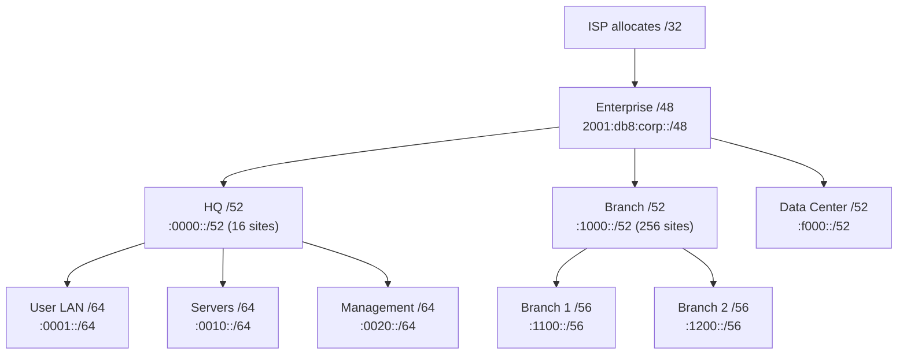

# How to Plan an IPv6 Address Hierarchy for an Enterprise Network

Author: [nawazdhandala](https://www.github.com/nawazdhandala)

Tags: IPv6, Address Planning, Enterprise Networking, Subnetting, IPAM

Description: Design a scalable IPv6 address hierarchy for enterprise networks using a /48 allocation, with structured site, building, VLAN, and function-based numbering.

## Introduction

Planning an IPv6 address hierarchy for an enterprise network requires balancing scalability, readability, and summarization efficiency. With a /48 allocation (65,536 /64 subnets), you have ample space to encode site, function, and VLAN information directly into the subnet ID. A well-designed hierarchy makes routing simpler and troubleshooting faster.

## Design Principles

1. **Encode meaning into the subnet ID**: Use bits 49-64 to convey site, zone, and VLAN
2. **Align to nibble boundaries**: Hex digits are 4 bits; align groupings to 4-bit boundaries for readability
3. **Plan for growth**: Leave gaps in numbering for future expansion
4. **Enable route summarization**: Group subnets so a single prefix covers related networks

## Recommended Enterprise Hierarchy



## Subnet Numbering Scheme

Using the format `FSZZ` (Function-Site-Zone-Zone):

```
Prefix: 2001:db8:corp::/48

Bits 49-52 (first nibble): Region/Type
  0 = Headquarters
  1-e = Branch offices (1=NA, 2=EU, 3=APAC)
  f = Data center / special

Bits 53-56 (second nibble): Site within region
  00-ff = up to 16 sites per region

Bits 57-60 (third nibble): Function/Zone
  0 = Infrastructure / management
  1 = User LAN
  2 = Servers
  3 = VoIP
  4 = IoT / facilities
  5 = Guest
  f = Point-to-point links

Bits 61-64 (fourth nibble): VLAN within zone
  0-f = up to 16 VLANs per zone
```

## Example Address Plan

```
HQ (Region 0, Site 0):
  2001:db8:corp:0010::/64  → HQ User LAN (VLAN 0)
  2001:db8:corp:0011::/64  → HQ User LAN (VLAN 1)
  2001:db8:corp:0020::/64  → HQ Servers
  2001:db8:corp:0021::/64  → HQ Servers (DMZ)
  2001:db8:corp:0030::/64  → HQ VoIP
  2001:db8:corp:0050::/64  → HQ Guest WiFi
  2001:db8:corp:00f0::/64  → HQ Router p2p links

Branch 1 (Region 1, Site 1):
  2001:db8:corp:1110::/64  → Branch1 User LAN
  2001:db8:corp:1120::/64  → Branch1 Servers
  2001:db8:corp:1130::/64  → Branch1 VoIP
  2001:db8:corp:11f0::/64  → Branch1 Router p2p links

Branch 2 (Region 1, Site 2):
  2001:db8:corp:1210::/64  → Branch2 User LAN
  2001:db8:corp:12f0::/64  → Branch2 Router p2p links

Data Center:
  2001:db8:corp:f010::/64  → DC Production (Tier 1)
  2001:db8:corp:f020::/64  → DC Production (Tier 2)
  2001:db8:corp:f030::/64  → DC Development
  2001:db8:corp:f0f0::/64  → DC Management / OOB
```

## Route Summarization Benefits

With this scheme, you can summarize entire regions:

```bash
# HQ: all subnets summarize to
2001:db8:corp::/52   (covers :0000: to :0fff:)

# Branch NA (Region 1): all branches summarize to
2001:db8:corp:1000::/52  (covers :1000: to :1fff:)

# Branch 1 specifically:
2001:db8:corp:1100::/56  (covers :1100: to :11ff:)

# Data Center:
2001:db8:corp:f000::/52  (covers :f000: to :ffff:)
```

## IPAM Documentation Template

```python
# Python: generate subnet documentation
import ipaddress

ENTERPRISE_PREFIX = "2001:db8:corp::/48"

def define_subnet(hex_id, description, site, function, vlan_id=None):
    base = ipaddress.IPv6Network(ENTERPRISE_PREFIX)
    subnet_id = int(hex_id, 16)
    subnets = list(base.subnets(new_prefix=64))
    subnet = subnets[subnet_id]
    return {
        "subnet_id": hex_id,
        "prefix": str(subnet),
        "description": description,
        "site": site,
        "function": function,
        "vlan": vlan_id,
    }

plan = [
    define_subnet("0010", "HQ User LAN", "HQ", "users", 10),
    define_subnet("0020", "HQ Servers", "HQ", "servers", 20),
    define_subnet("1110", "Branch1 User LAN", "Branch1", "users", 10),
]

for entry in plan:
    print(f"{entry['prefix']:<30} {entry['description']}")
```

## Conclusion

A well-planned enterprise IPv6 address hierarchy encodes location, function, and VLAN information into the 16-bit subnet ID, enabling automatic route summarization and making network diagrams self-documenting. Align your structure to nibble boundaries, reserve capacity for growth, and document your scheme in an IPAM tool before deploying. The investment in upfront planning pays dividends in simplified routing, faster troubleshooting, and easier network expansion.
