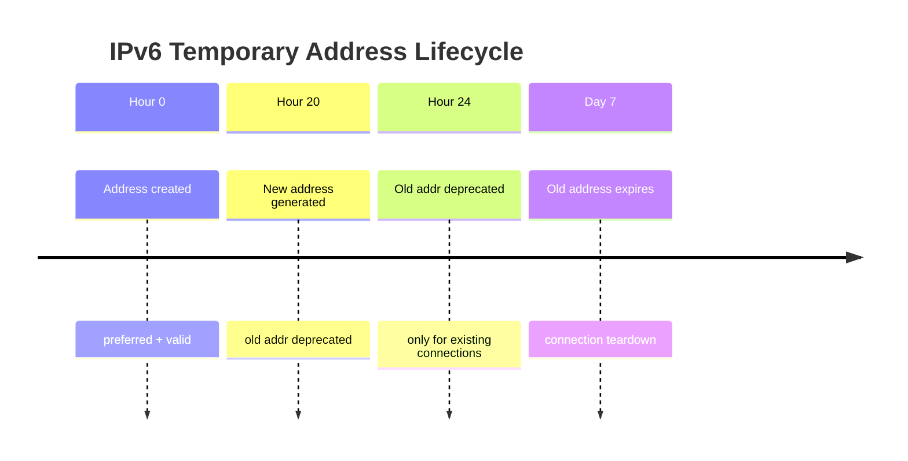

# How to Configure IPv6 Address Lifetime for Privacy

Author: [nawazdhandala](https://www.github.com/nawazdhandala)

Tags: IPv6, Privacy, Address Lifetime, RFC4941, Linux, Networking

Description: Configure IPv6 address preferred and valid lifetimes to optimize privacy by controlling how long temporary addresses remain active and when they are replaced.

## Introduction

IPv6 temporary addresses (RFC 4941/RFC 8981) have two key lifetime values: the **preferred lifetime** (how long the address is used for new connections) and the **valid lifetime** (how long existing connections using that address remain valid). Tuning these values balances privacy (shorter lifetimes) against connection stability (longer lifetimes).

## Understanding Address Lifetimes



- **Preferred lifetime**: During this period, the address is used for new outgoing connections
- **Valid lifetime**: After preferred expires, the address still works for established connections but no new ones are initiated from it
- **REGEN_ADVANCE**: Linux generates the next temporary address before the current one expires to ensure seamless transitions

## Default Linux Values

The defaults from RFC 4941 are:

| Parameter | Default | sysctl key |
|---|---|---|
| Preferred lifetime | 86400s (1 day) | `temp_prefered_lft` |
| Valid lifetime | 604800s (7 days) | `temp_valid_lft` |
| Regeneration advance | 5 seconds | `regen_max_retry` |
| Regeneration retries | 3 | `regen_max_retry` |

## Viewing Current Lifetime Settings

```bash
# Show all IPv6 privacy-related sysctl values for eth0
sysctl -a | grep -E "eth0.*(temp|addr_gen|use_temp)"

# Show lifetimes for all interfaces
sysctl net.ipv6.conf.eth0.temp_prefered_lft
sysctl net.ipv6.conf.eth0.temp_valid_lft
```

## Configuring Shorter Lifetimes for Higher Privacy

For higher privacy (at the cost of more address churn):

```bash
# /etc/sysctl.d/60-ipv6-privacy-strict.conf

# Enable temporary addresses and prefer them
net.ipv6.conf.default.use_tempaddr = 2
net.ipv6.conf.all.use_tempaddr = 2

# Preferred lifetime: 4 hours (14400 seconds)
net.ipv6.conf.default.temp_prefered_lft = 14400
net.ipv6.conf.all.temp_prefered_lft = 14400

# Valid lifetime: 24 hours (86400 seconds)
net.ipv6.conf.default.temp_valid_lft = 86400
net.ipv6.conf.all.temp_valid_lft = 86400
```

Apply the settings:

```bash
sudo sysctl -p /etc/sysctl.d/60-ipv6-privacy-strict.conf
```

## Configuring Longer Lifetimes for Stability

For server-like workloads where connection stability is more important:

```bash
# /etc/sysctl.d/60-ipv6-privacy-stable.conf

net.ipv6.conf.default.use_tempaddr = 2
net.ipv6.conf.all.use_tempaddr = 2

# Preferred lifetime: 3 days
net.ipv6.conf.default.temp_prefered_lft = 259200
net.ipv6.conf.all.temp_prefered_lft = 259200

# Valid lifetime: 14 days
net.ipv6.conf.default.temp_valid_lft = 1209600
net.ipv6.conf.all.temp_valid_lft = 1209600
```

## How the Router Advertisement Affects Lifetimes

The actual lifetime used is the **minimum** of the router-advertised prefix lifetime and the locally configured value:

```bash
# Monitor incoming Router Advertisements to see advertised prefix lifetimes
sudo rdisc6 eth0

# Or use tcpdump to capture RA packets
sudo tcpdump -i eth0 -v "icmp6 and ip6[40] == 134"
```

If the RA advertises a shorter preferred lifetime than your sysctl setting, the RA value takes precedence.

## Checking Current Address Lifetimes

```bash
# Show addresses with their remaining lifetimes
ip -6 addr show eth0

# Example output:
# inet6 2001:db8::a1b2:c3d4:e5f6:7890/64 scope global temporary dynamic
#    valid_lft 72000sec preferred_lft 3600sec
# The address will be preferred for 1 hour more, valid for 20 hours more
```

## Verifying Lifetime Changes Take Effect

```bash
# Force a new temporary address to be generated immediately
# by cycling the privacy extension
sudo sysctl -w net.ipv6.conf.eth0.use_tempaddr=0
sudo sysctl -w net.ipv6.conf.eth0.use_tempaddr=2

# Check that new addresses appear with the correct lifetimes
ip -6 addr show eth0 | grep temporary
```

## Conclusion

IPv6 address lifetimes are a key tunable in the privacy/stability tradeoff. Shorter preferred lifetimes rotate your visible address more frequently, reducing the window for cross-session correlation. Longer valid lifetimes ensure that existing connections (downloads, VPN sessions, SSH) are not abruptly terminated. Configure these values based on your threat model and workload type, and always verify that router-advertised prefix lifetimes are compatible with your local settings.
