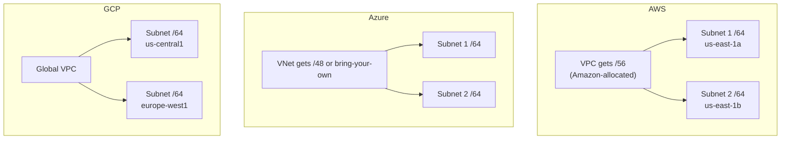

# How to Plan IPv6 Addressing for Cloud VPCs

Author: [nawazdhandala](https://www.github.com/nawazdhandala)

Tags: IPv6, Cloud, AWS, Azure, GCP, VPC, Networking

Description: Plan IPv6 addressing for cloud Virtual Private Clouds (VPCs) across AWS, Azure, and GCP, including allocation strategies and hybrid connectivity considerations.

## Introduction

Cloud providers offer native IPv6 support for VPCs, but the addressing model differs between AWS, Azure, and GCP. Understanding how each platform allocates IPv6 prefixes and how to structure them for multi-cloud or hybrid deployments is essential for modern cloud networking.

## Cloud Provider IPv6 Models



## AWS VPC IPv6

AWS assigns a /56 from their own IPv6 address space to each VPC. You then carve out /64 subnets:

```python
# AWS assigns a /56 like 2600:1f18:1234:5600::/56

# You create /64 subnets from it

# Example AWS VPC structure
AWS_VPC_PREFIX = "2600:1f18:1234:5600::/56"  # AWS-assigned /56

def aws_subnet_plan(vpc_prefix_56):
    """Plan /64 subnets for an AWS VPC."""
    import ipaddress
    vpc = ipaddress.IPv6Network(vpc_prefix_56)
    subnets = list(vpc.subnets(new_prefix=64))

    # AWS us-east-1 has 6 AZs (a-f)
    az_plan = {
        "us-east-1a Public":   subnets[0],
        "us-east-1b Public":   subnets[1],
        "us-east-1c Public":   subnets[2],
        "us-east-1a Private":  subnets[16],  # Separate range for private
        "us-east-1b Private":  subnets[17],
        "us-east-1c Private":  subnets[18],
    }

    for name, subnet in az_plan.items():
        print(f"  {name:28s}: {subnet}")

aws_subnet_plan(AWS_VPC_PREFIX)
```

## Azure VNet IPv6

Azure supports both Azure-allocated and bring-your-own IPv6 prefixes (BYOIP):

```bash
# Azure CLI: create VNet with IPv6
az network vnet create \
  --resource-group myRG \
  --name myVNet \
  --address-prefixes 10.0.0.0/16 "2001:db8::/48" \
  --location eastus

# Add dual-stack subnet
az network vnet subnet create \
  --resource-group myRG \
  --vnet-name myVNet \
  --name mySubnet \
  --address-prefixes 10.0.1.0/24 "2001:db8:0:1::/64"

# Enable IPv6 on a NIC
az network nic ip-config update \
  --resource-group myRG \
  --nic-name myNIC \
  --name ipconfig1 \
  --private-ip-address-version IPv6 \
  --private-ip-address "2001:db8:0:1::4"
```

## GCP VPC IPv6

GCP supports dual-stack VPCs with per-subnet /64 allocations:

```bash
# GCP: create VPC with internal IPv6
gcloud compute networks create my-network \
  --subnet-mode=custom \
  --bgp-routing-mode=regional

# Create dual-stack subnet
gcloud compute networks subnets create my-subnet \
  --network=my-network \
  --region=us-central1 \
  --range=10.0.0.0/24 \
  --stack-type=IPV4_IPV6 \
  --ipv6-access-type=INTERNAL  # or EXTERNAL for public IPv6

# Check assigned IPv6 range
gcloud compute networks subnets describe my-subnet \
  --region=us-central1 \
  --format="get(ipv6CidrRange)"
```

## Bring Your Own IP (BYOIP) for Multi-Cloud Consistency

For organizations that want consistent IPv6 addressing across clouds:

```text
Organization /40: 2001:db8:a::/40

Cloud regions:
  AWS US-East:      2001:db8:a:e100::/56  → /64 per subnet
  AWS EU-West:      2001:db8:a:e200::/56
  Azure East US:    2001:db8:a:e300::/56
  GCP US-Central:   2001:db8:a:e400::/56
  On-premises:      2001:db8:a:0100::/48
```

## Terraform: IPv6 VPC Configuration

```hcl
# AWS VPC with IPv6
resource "aws_vpc" "main" {
  cidr_block                       = "10.0.0.0/16"
  assign_generated_ipv6_cidr_block = true  # AWS assigns /56

  tags = {
    Name = "main-vpc"
  }
}

# Subnet using a /64 from the VPC's /56
resource "aws_subnet" "public_a" {
  vpc_id          = aws_vpc.main.id
  cidr_block      = "10.0.1.0/24"
  # Use subnet index 0 from the /56 (creates :xx00::/64)
  ipv6_cidr_block = cidrsubnet(aws_vpc.main.ipv6_cidr_block, 8, 0)
  assign_ipv6_address_on_creation = true

  availability_zone = "us-east-1a"
}
```

## Conclusion

Cloud VPC IPv6 addressing follows the same /64-per-subnet principle as on-premises networks. AWS provides a /56 per VPC (256 subnets), Azure and GCP offer more flexibility with BYOIP. For multi-cloud deployments, using bring-your-own prefixes with a structured organizational hierarchy ensures consistent addressing, simplifies firewall policies, and enables clean routing between cloud regions and on-premises infrastructure.
